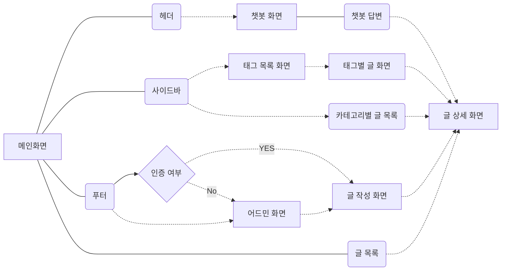

# Toris 블로그 만들기

## Mermaid 플로우 차트

```mermaid
flowchart LR
  Home[메인화면]
  SideBar(사이드바)
  Header(헤더)
  Footer(푸터)
  List(글 목록)

  Home --- Header
  Home --- Footer
  Home --- SideBar
  Home --- List

  Create[글 작성 화면]
  Admin[어드민 화면]
  Chatbot[챗봇 화면]
  ChatbotResult(챗봇 답변)
  Detail[글 상세 화면]

  Authorize{인증 여부}

  TagList[태그 목록 화면]
  Tag[태그별 글 화면]
  Category(카테고리별 글 목록)

  Header -.-> Chatbot --- ChatbotResult -.-> Detail
  SideBar -.-> TagList -.-> Tag -.-> Detail
  SideBar -.-> Category -.-> Detail
  Footer --> Authorize -.->|YES|Create -.-> Detail
  Authorize -.->|No|Admin
  Footer -.-> Admin -.-> Create

  List -.-> Detail
```
