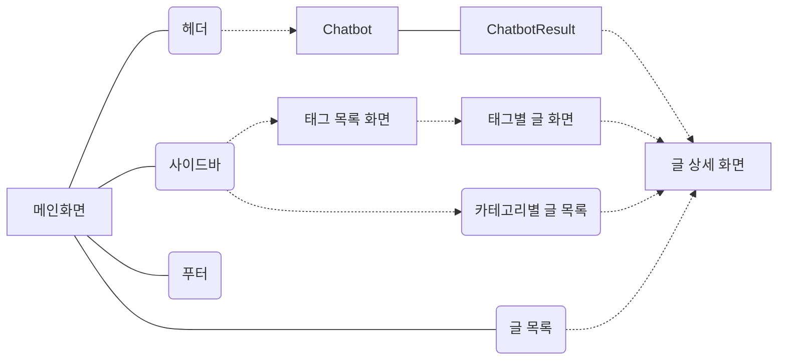
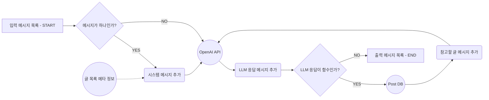

# Toris 블로그 만들기

## Mermaid 블로그 플로우 차트



---

### Open AI 챗봇

## Mermaid AI 챗봇 차트



---

### 기술스택

- `Next.JS 14`
- `TypeScript v5`
- `Open AI API`
- `tailwind-css`, `tailwind-merge`, `class-variance-authority`
- `tanstack/react-query`
- `@uiw/react-md-editor` & `@uiw/react-markdown-preview`
- `Supabase`
<div style="display:flex; flex-direction:row; gap:0.5rem">
    
    
    
    
    
    
    
    
    
</div>

---

**OpenAI API Context**

- 메시지 필드는 새로고침시 저장
- 메시지 목록 렌더링 채팅을 함에 따라 메시지 컴포넌트를 추가해서 렌더링 하는데 활용
  - 저장이 된다면, 유저 단위로 되어야 하지 않을까? O
  - 페이지가 새로고침 되었을 때 저장되어야 할까? O
  - 서버에서 DB로 관리해야 할까? X
  - 클라이언트에서 상태로 관리해야 할까? -> O

---

### 성능 최적화

**트러블슈팅**

- 웹 애플리케이션을 잘 만들려면 무엇을 신경써야 할까?
  - LCP
  - CLS
  - FID
  - NextJS 에서 SSR SSG ISR 을 효율적으로 사용!!
- 테스트 코드를 잘 작성하려면 무엇을 신경써야 할까?
  - 반복되는 일을 자동화 하기위해서 테스트 코드 작성
  - 작성한 코드가 잘 동작하는지 테스트
  - 코드가 변경될 때마다 해야하는 테스트를 자동화
  - 요구사항이 변경될 때마다 신경써야 하는 코드가 증가
- NextJS에 최적화 된 인프라는 어떻게 구성되어야 할까?
  - SSR 웹 애플리케이션 배포할 때 정적리소스와 동적리소스를 분리해서 배포.
    - CDN 서버 설정 AWS CloudFront(Edge Function) CDN 캐시가 만료될 때마다 동적 리소스 사용 요청
    - 동적 리소스 Scaling, Rolling Update
- NextJS에 맞는 프로젝트 구조는 어떻게 생겼을까?
  - client component, server components 적절한 분리

---

### 개선할 점

- [x] 적절한 캐싱작업
- [ ] 플립효과(앞:제목, 카테고리, 태그 뒤:본문)
- [ ] 비회원(작성 시 ID,PWD 입력) 작성할 수 있게 댓글 기능 구현 (CRUD)
  - 수정, 삭제시 입력했던 ID,PWD 입력
- [ ] 방문록 기능 구현 (CR)

  - [ ] 작성 시 닉네임만 작성
  - [ ] 삭제, 수정 불가

- [ ] 위에 기능 구현 후 실시간 채팅 구현

---

### 최근 변경 사항 (2025년 7월 12일)

- **기능 제거 및 구조 개선**:
  - 기존 포트폴리오, 관리자, 방명록, 인증 관련 기능 및 파일들을 제거하여 프로젝트를 간소화했습니다.
  - 마크다운 콘텐츠 구조를 재정비하여 `public/markdown` 디렉토리 아래에 `Archive`, `Career`, `Design`, `Learning`, `Personal`, `Projects`와 같은 새로운 카테고리별 디렉토리를 도입했습니다.
- **E2E 테스트 강화**:
  - Cypress를 사용하여 주요 페이지 및 기능에 대한 E2E 테스트 코드를 업데이트 및 추가했습니다.
  - `cypress/e2e/portfolio.cy.ts` 파일을 제거했습니다.
  - `cypress/e2e/about.cy.ts` 및 `cypress/e2e/contact.cy.ts` 파일을 새로 추가하여 About 페이지와 Contact 폼의 동작을 테스트합니다.
  - `cypress/e2e/home.cy.ts`, `cypress/e2e/navigation.cy.ts`, `cypress/e2e/blog.cy.ts`, `cypress/e2e/search.cy.ts` 파일들을 현재 애플리케이션 구조와 기능에 맞춰 업데이트했습니다.

---

### 실행 방법

- `.env` 파일 생성 후 아래 변수들을 설정합니다:
  `NEXT_PUBLIC_SUPABASE_URL=`
  `NEXT_PUBLIC_SUPABASE_ANON_KEY=`
  `NEXT_PUBLIC_OPENAI_API=`
  `NEXT_PUBLIC_ORGANIZATION_API=`

- 프로젝트 의존성 설치:
  ```shell
  pnpm install
  ```

- 개발 서버 실행:
  ```shell
  pnpm dev
  ```

- **Cypress E2E 테스트 실행**:
  애플리케이션이 `http://localhost:3000`에서 실행 중인 상태에서 다음 명령어를 사용합니다.

  - **Cypress 테스트 러너 UI 열기 (테스트 개발 및 디버깅용):**
    ```shell
    pnpm cypress:open
    ```
  - **모든 E2E 테스트 헤드리스 모드로 실행 (CI/CD 환경에 적합):**
    ```shell
    pnpm cypress:run
    ```
  - **특정 E2E 테스트 파일 실행 (예: `home.cy.ts`):**
    ```shell
    pnpm cypress:run --spec 'cypress/e2e/home.cy.ts'
    ```
    (다른 테스트 파일들도 `--spec` 옵션 뒤에 경로를 지정하여 실행할 수 있습니다.)

