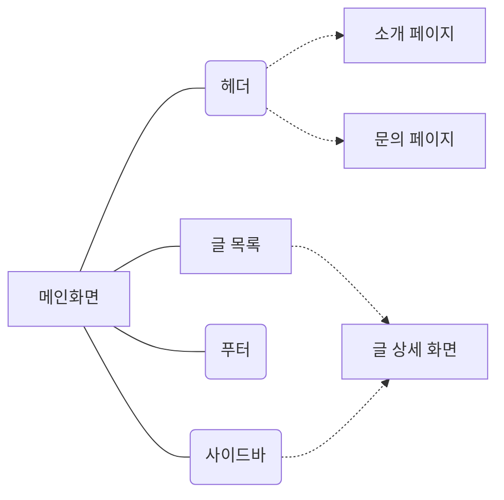

# Toris 블로그

Next.js 15와 React 19를 기반으로 한 모던한 기술 블로그입니다. 마크다운 파일 기반의 정적 블로그로, 카테고리별 포스트 관리, 검색 기능, 다크모드 등을 지원합니다.

## 📋 목차

- [주요 기능](#주요-기능)
- [기술 스택](#기술-스택)
- [프로젝트 구조](#프로젝트-구조)
- [실행 방법](#실행-방법)
- [E2E 테스트](#e2e-테스트)
- [성능 최적화](#성능-최적화)
- [개선할 점](#개선할-점)

---

## 🎯 주요 기능

### 페이지 구조



### 핵심 기능

- ✅ **마크다운 기반 블로그**: `public/markdown` 디렉토리의 마크다운 파일을 자동으로 읽어 포스트로 변환
- ✅ **카테고리별 분류**: Archive, Career, Design, Learning, Personal, Projects 등 카테고리별 포스트 관리
- ✅ **검색 기능**: 제목, 설명, 태그 기반 포스트 검색
- ✅ **다크모드**: 사용자 선호도에 따른 라이트/다크 모드 전환
- ✅ **반응형 디자인**: 모바일, 태블릿, 데스크톱 모든 기기 지원
- ✅ **SEO 최적화**: 메타 태그, 구조화된 데이터, sitemap, robots.txt 지원
- ✅ **RSS Feed**: `/feed.xml` 엔드포인트로 RSS 피드 제공
- ✅ **접근성 개선**: ARIA 속성, 색상 대비, 링크 접근성 최적화

---

## 🛠️ 기술 스택

### Core

- **Next.js 15.3.5** - React 프레임워크 (App Router)
- **React 19.1.0** - UI 라이브러리
- **TypeScript 5.3** - 타입 안정성

### Styling & UI

- **Tailwind CSS** - 유틸리티 기반 CSS 프레임워크
- **Framer Motion** - 애니메이션 라이브러리
- **next-themes** - 다크모드 지원
- **tailwind-merge** - Tailwind 클래스 병합
- **class-variance-authority** - 컴포넌트 변형 관리

### Data & State

- **@tanstack/react-query** - 서버 상태 관리
- **React Hooks** - 클라이언트 상태 관리

### Markdown

- **@uiw/react-md-editor** - 마크다운 에디터
- **@uiw/react-markdown-preview** - 마크다운 프리뷰
- **react-markdown** - 마크다운 렌더링
- **remark-gfm** - GitHub Flavored Markdown 지원
- **rehype-highlight** - 코드 하이라이팅

### Testing

- **Cypress** - E2E 테스트

### Analytics & SEO

- **Google Tag Manager** - 분석 도구
- **Structured Data** - SEO 구조화된 데이터

### 기타

- **dayjs** - 날짜 처리
- **octokit** - GitHub API 클라이언트 (선택적)

<div style="display:flex; flex-direction:row; gap:0.5rem; flex-wrap:wrap; margin-top:1rem">
    
    
    
    
    
    
</div>

---

## 📁 프로젝트 구조

```
Toris_Blog/
├── public/
│   └── markdown/          # 마크다운 포스트 파일들
│       ├── Archive/       # 아카이브 카테고리
│       ├── Career/        # 커리어 관련 포스트
│       ├── Design/        # 디자인 관련 포스트
│       ├── Learning/      # 학습 자료
│       ├── Personal/      # 개인 관련 포스트
│       └── Projects/      # 프로젝트 관련 포스트
├── src/
│   ├── app/              # Next.js App Router 페이지
│   │   ├── about/        # 소개 페이지
│   │   ├── contact/      # 문의 페이지
│   │   ├── posts/        # 블로그 포스트 페이지
│   │   │   ├── [id]/     # 포스트 상세 페이지
│   │   │   └── page.tsx  # 포스트 목록 페이지
│   │   ├── api/          # API 라우트
│   │   ├── feed.xml/     # RSS Feed
│   │   ├── layout.tsx    # 루트 레이아웃
│   │   └── page.tsx      # 홈 페이지
│   ├── components/       # React 컴포넌트
│   │   ├── blog/         # 블로그 관련 컴포넌트
│   │   ├── common/       # 공통 컴포넌트 (Header, Footer 등)
│   │   ├── forms/        # 폼 컴포넌트
│   │   ├── seo/          # SEO 관련 컴포넌트
│   │   └── ui/           # UI 컴포넌트
│   ├── styles/           # 전역 스타일
│   ├── types/            # TypeScript 타입 정의
│   └── utils/            # 유틸리티 함수
├── cypress/              # E2E 테스트
│   └── e2e/              # 테스트 파일들
└── README.md
```

---

## 🚀 실행 방법

### 1. 환경 변수 설정

프로젝트 루트에 `.env.local` 파일을 생성하고 다음 변수들을 설정합니다:

```env
# 선택적: GitHub API 토큰 (마크다운 파일을 GitHub에서 가져올 경우)
GITHUB_TOKEN=your_github_token

# 선택적: 사이트 URL
NEXT_PUBLIC_SITE_URL=https://your-domain.com
```

### 2. 의존성 설치

```bash
pnpm install
```

### 3. 개발 서버 실행

```bash
pnpm dev
```

개발 서버가 `http://localhost:3000`에서 실행됩니다.

### 4. 프로덕션 빌드

```bash
pnpm build
pnpm start
```

---

## 🧪 E2E 테스트

Cypress를 사용하여 E2E 테스트를 실행할 수 있습니다.

### 테스트 러너 UI 열기 (개발 및 디버깅용)

```bash
pnpm cypress:open
```

### 헤드리스 모드로 모든 테스트 실행 (CI/CD 환경에 적합)

```bash
pnpm cypress:run
```

### 특정 테스트 파일 실행

```bash
# 네비게이션 테스트
pnpm cypress:run:navigation

# 블로그 테스트
pnpm cypress:run:blog

# 반응형 테스트
pnpm cypress:run:responsive

# 검색 테스트
pnpm cypress:run:search
```

### 테스트 파일 목록

- `about.cy.ts` - 소개 페이지 테스트
- `blog.cy.ts` - 블로그 포스트 테스트
- `contact.cy.ts` - 문의 폼 테스트
- `home.cy.ts` - 홈 페이지 테스트
- `navigation.cy.ts` - 네비게이션 테스트
- `responsive.cy.ts` - 반응형 디자인 테스트
- `search.cy.ts` - 검색 기능 테스트

---

## ⚡ 성능 최적화

### Next.js 최적화 기능 활용

- **ISR (Incremental Static Regeneration)**: 포스트 데이터를 6시간마다 재생성
- **Server Components**: 서버 컴포넌트를 활용한 성능 최적화
- **Image Optimization**: Next.js Image 컴포넌트 사용
- **Code Splitting**: 자동 코드 분할

### 웹 성능 지표 (Lighthouse)

- ✅ **LCP (Largest Contentful Paint)** 최적화
- ✅ **CLS (Cumulative Layout Shift)** 최소화
- ✅ **FID (First Input Delay)** 개선
- ✅ **접근성 (Accessibility)** 개선
  - ARIA 속성 최적화
  - 색상 대비 비율 개선
  - 링크 접근성 향상

### 트러블슈팅

웹 애플리케이션을 잘 만들기 위해 다음을 신경써야 합니다:

- **LCP**: 초기 로딩 성능 최적화
- **CLS**: 레이아웃 시프트 방지
- **FID**: 인터랙션 응답성 개선
- **Next.js 렌더링 전략**: SSR, SSG, ISR을 효율적으로 사용

---

## 📝 개선할 점

### 계획된 기능

- [ ] 플립 효과 (앞: 제목, 카테고리, 태그 / 뒤: 본문)
- [ ] 비회원 댓글 기능 구현 (CRUD)
  - 작성 시 ID, PWD 입력
  - 수정, 삭제 시 입력했던 ID, PWD 확인
- [ ] 방명록 기능 구현 (CR)
  - 작성 시 닉네임만 작성
  - 삭제, 수정 불가
- [ ] 실시간 채팅 구현

### 완료된 개선 사항

- [x] 적절한 캐싱 작업
- [x] 접근성 개선 (ARIA 속성, 색상 대비, 링크 접근성)
- [x] SEO 최적화 (메타 태그, 구조화된 데이터)
- [x] E2E 테스트 강화

---

## 📅 최근 변경 사항

### 2025년 1월

- **접근성 개선**: Lighthouse 경고 해결
  - 금지된 ARIA 속성 수정
  - 색상 대비 비율 개선
  - 링크 접근성 향상
- **프로젝트 구조 개선**: 마크다운 기반 블로그로 전환
- **E2E 테스트 강화**: Cypress 테스트 코드 업데이트

### 2024년 7월 12일

- **기능 제거 및 구조 개선**:
  - 기존 포트폴리오, 관리자, 방명록, 인증 관련 기능 제거
  - 마크다운 콘텐츠 구조 재정비
  - `public/markdown` 디렉토리 아래 카테고리별 디렉토리 도입
- **E2E 테스트 강화**:
  - Cypress를 사용한 주요 페이지 및 기능 테스트 코드 업데이트

---

## 📄 라이선스

이 프로젝트는 개인 프로젝트입니다.

---

## 👤 작성자

**토리스 (Toris)**

- GitHub: [@toris-dev](https://github.com/toris-dev)
- 블로그: [Toris Blog](https://toris-dev.vercel.app)

---


