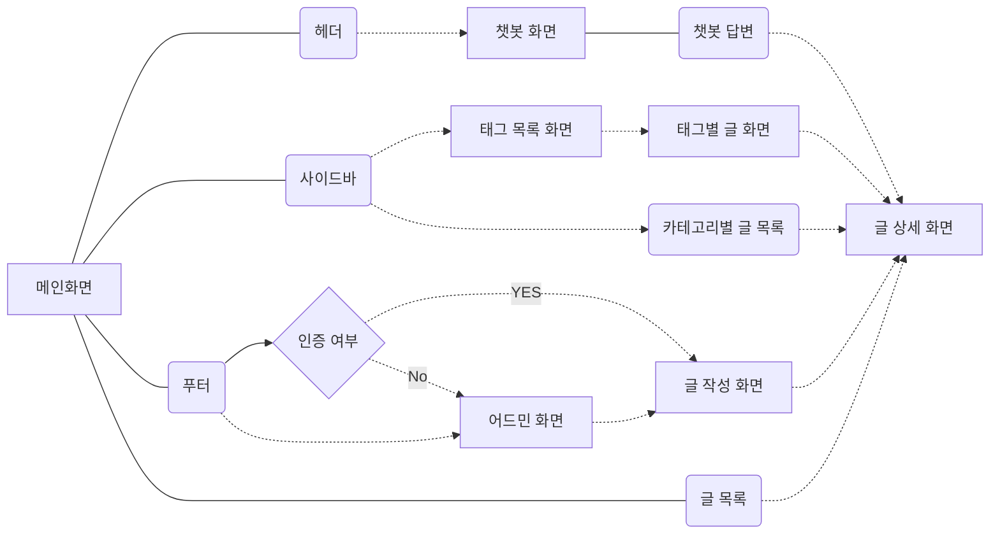
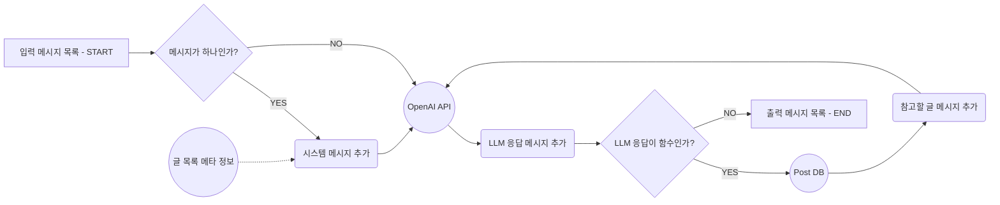

# Toris 블로그 만들기

## Mermaid 블로그 플로우 차트



---

### Open AI 챗봇

## Mermaid AI 챗봇 차트



---

### 기술스택

- `Next.JS 14`
- `TypeScript v5`
- `Open AI API`
- `tailwind-css`, `tailwind-merge`, `class-variance-authority`
- `tanstack/react-query`
- `@uiw/react-md-editor` & `@uiw/react-markdown-preview`
- `Supabase`
<div style="display:flex; flex-direction:row; gap:0.5rem">
    
    
    
    
    
    
    
    
    
</div>

---

**OpenAI API Context**

- 메시지 필드는 새로고침시 저장
- 메시지 목록 렌더링 채팅을 함에 따라 메시지 컴포넌트를 추가해서 렌더링 하는데 활용
  - 저장이 된다면, 유저 단위로 되어야 하지 않을까? O
  - 페이지가 새로고침 되었을 때 저장되어야 할까? O
  - 서버에서 DB로 관리해야 할까? X
  - 클라이언트에서 상태로 관리해야 할까? -> O

---

### 성능 최적화

**트러블슈팅**

- 웹 애플리케이션을 잘 만들려면 무엇을 신경써야 할까?
  - LCP
  - CLS
  - FID
  - NextJS 에서 SSR SSG ISR 을 효율적으로 사용!!
- 테스트 코드를 잘 작성하려면 무엇을 신경써야 할까?
  - 반복되는 일을 자동화 하기위해서 테스트 코드 작성
  - 작성한 코드가 잘 동작하는지 테스트
  - 코드가 변경될 때마다 해야하는 테스트를 자동화
  - 요구사항이 변경될 때마다 신경써야 하는 코드가 증가
- NextJS에 최적화 된 인프라는 어떻게 구성되어야 할까?
  - SSR 웹 애플리케이션 배포할 때 정적리소스와 동적리소스를 분리해서 배포.
    - CDN 서버 설정 AWS CloudFront(Edge Function) CDN 캐시가 만료될 때마다 동적 리소스 사용 요청
    - 동적 리소스 Scaling, Rolling Update
- NextJS에 맞는 프로젝트 구조는 어떻게 생겼을까?

### 실행방법

- .env 파일 생성 후
  `NEXT_PUBLIC_SUPABASE_URL=`
  `NEXT_PUBLIC_SUPABASE_ANON_KEY=`
  `NEXT_PUBLIC_OPENAI_API=`
  `NEXT_PUBLIC_ORGANIZATION_API=`

위의 4개의 .env 를 만들어서 키 값을 넣어주시면 됩니다.

```shell
yarn install

yarn dev
```
