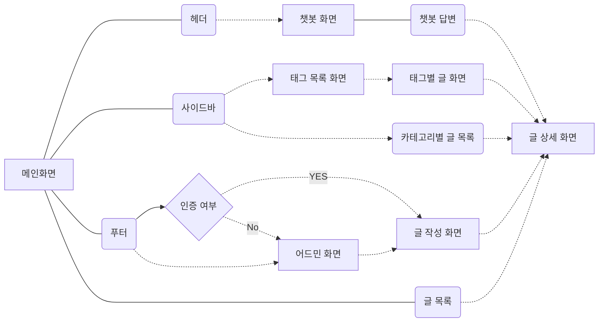

# Toris 블로그 만들기

## Mermaid 플로우 차트



### Open AI 챗봇

**OpenAI API Context**

- 메시지 필드는 새로고침시 저장
- 메시지 목록 렌더링 채팅을 함에 따라 메시지 컴포넌트를 추가해서 렌더링 하는데 활용
  - 저장이 된다면, 유저 단위로 되어야 하지 않을까? O
  - 페이지가 새로고침 되었을 때 저장되어야 할까? X
  - 서버에서 DB로 관리해야 할까? O
  - 클라이언트에서 상태로 관리해야 할까? -> O

### 실행방법

- .env 파일 생성 후
  `NEXT_PUBLIC_SUPABASE_URL=`
  `NEXT_PUBLIC_SUPABASE_ANON_KEY=`
  `NEXT_PUBLIC_OPENAI_API=`
  `NEXT_PUBLIC_ORGANIZATION_API=`

위의 4개의 .env 를 만들어서 키 값을 넣어주시면 됩니다.

```shell
yarn install

yarn dev
```
