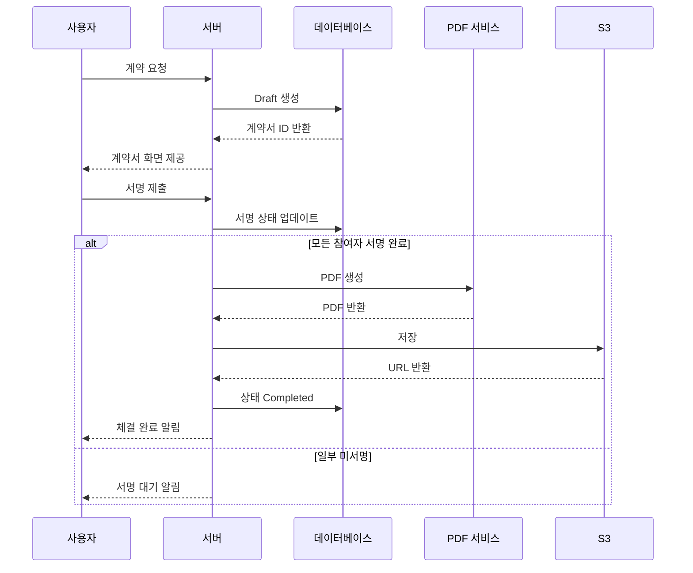

# 21앤(21n) — 병원 시술 전자계약 플랫폼

> GitHub: [21n-korea/21n_apps](https://github.com/21n-korea/21n_apps) (private) · vault: [[21n_apps]]

> 병원과 모델(사용자)을 연결하고, **전자계약**·**포인트·쿠폰**·알림을 한곳에서 다루는 B2B2C 올인원 서비스입니다.  
> 저는 **풀스택 개발자**로 **React Native(Expo) 앱**, **NestJS 기반 API**, **Next.js 관리자 웹**, 그리고 **Terraform 기반 인프라**를 맡아 개발하고 있습니다. 입사 **약 3개월차** 시점에서 구조와 배운 점을 정리했습니다.

## 사용자 그룹과 제품 방향

| 구분 | 플랫폼 | 핵심 |
| --- | --- | --- |
| **사용자(모델)** | React Native 앱 | 전자서명·계약 확인, 캘린더, 초대코드 포인트, 계좌 송금 신청·조회, SNS 연동, 마이페이지, 알림, 소셜 로그인(네이버·카카오·페이스북·구글) |
| **병원 관리자** | 웹 | 병원·의사 정보, 계약서(초상권·지불각서 등), 모델 연결, 쿠폰, 정산·환급, 엑셀 |
| **통합 관리자(21앤)** | 웹 | 대시보드, 병원·신청·사용자·쿠폰, 포인트·송금 추적, 설정, 지표 |

**과금 플랜·일반 PG 없이**, 은행 채널 중심으로 가는 정책이라 **KB국민은행 API**(계좌 조회·송금)와 계약·포인트 도메인이 잘 맞물리도록 설계하는 일이 중요합니다.

## PG 없이 가는 이유 (요약)

카드 PG로 “결제 한 방”을 붙이는 그림은, **의료·시술·중개가 겹인 도메인**에서는 쉽지 않았습니다.

- **규제·사업 검토**: 서비스 성격이 단순 이커머스와 달라, **의료 관련 법령·광고·중개** 등과 어떻게 맞닿는지 사업·법무와 함께 키워드를 정리하는 과정이 필요했습니다. (법률 해석은 전문가 영역이고, 개발은 **허용된 정산·증빙 방식**에 맞춰 시스템을 설계하는 쪽에 집중했습니다.)
- **PG사 정책**: 업종·상품·정산 구조에 따라 **가입 제한·심사 보류**가 걸릴 수 있어, “PG부터 붙이고 보자”는 선택이 항상 열려 있지 않았습니다.
- **결론**: **PG 없이** 포인트·계좌·계약 흐름을 맞추고, 실제 송금·조회는 **은행 API**, 법적 효력이 필요한 **전자서명**은 아래 **모두싸인** 연동으로 가져가는 방향으로 맞췄습니다.

자세한 검토·고민 과정은 [회고 글](/posts/21n-fullstack-year-one-reflection)에 적었습니다.

## 전자서명: 모두싸인 신청·등록·연동

전자계약서·전자서명은 자체 구현만으로는 감사·분쟁 대비가 부담되어, **모두싸인** 쪽으로 **기업 가입·인증·템플릿·API·웹훅**까지 준비한 뒤 백엔드·앱·어드민에 녹였습니다. API 키·웹훅 시크릿·템플릿 ID는 **환경별**로 나누고, 콜백은 **멱등·상태 전이**를 우리 DB와 맞춰 두는 것이 핵심입니다.

## 비용·운영을 같이 보는 이유

전자서명 SaaS·클라우드·은행 연동은 **건당·월정액**이 붙습니다. 기능만 만든 뒤 비용을 보면 곡선이 깨지기 쉬워, **단계적 롤아웃**(플래그·환경 변수)·**비동기·재시도**로 불필요한 외부 호출을 줄이는 식으로 설계합니다. 숫자 표와 트레이드오프 기록은 [회고 글](/posts/21n-fullstack-year-one-reflection) §4와 이어집니다.

## 조직 맥락: 마케팅 DNA와 개발자

21앤은 **마케팅에 강한 배경**을 가진 조직에서 출발한 면도 있고, 저는 그 안에서 **개발자**로 일하고 있습니다. 일정·언어가 맞지 않을 때도 있지만, 비즈니스 설명력과 문서화는 그만큼 빨리 늘었습니다. 힘든 점·배운 점·이룬 점은 역시 [회고 글](/posts/21n-fullstack-year-one-reflection) §9를 참고하면 됩니다.

## 기술 스택과 모노레포

| 영역 | 스택 | 비고 |
| --- | --- | --- |
| 앱 | React Native, **Expo** | `react-native-calendars`, **Noto Sans KR**(`@expo-google-fonts/noto-sans-kr`, `expo-font`) |
| API | **NestJS**, tRPC, Docker | 전자서명·PDF·알림 등 도메인 API |
| 관리자 | **Next.js** | 통합·병원 어드민 |
| DB | **PostgreSQL**(RDS Multi-AZ) | |
| 파일 | S3 / 클라우드 스토리지 | 계약 PDF, 프로필 등 |
| 인프라 | **ECS Fargate**, ALB, **Terraform**, CloudWatch, WAF | |

**모노레포 예시**

- `apps/admin` — 관리자 웹(Next.js)
- `apps/api` — 백엔드(NestJS)
- `apps/user-app` — 사용자 앱(Expo)
- `packages/*` — DB·공유 모듈 등
- `docs/*` — 앱·인프라 문서

로컬은 루트 `docker-compose.yml`로 admin·api·postgres를 한 번에 띄울 수 있게 맞춰 두었고, `.env.example` → `.env.development` 복사 후 기동하는 흐름입니다.

## 전자서명·PDF 쪽에서 신경 쓰는 것

- HTML 템플릿 기반 계약 → **PDF 변환·버전 관리**, 타임스탬프·해시 등 **감사 가능성**
- **Puppeteer** 등으로 PDF 파이프라인 구성, 가능하면 **큐 기반 비동기 처리**로 API 응답·워커 부하를 분리
- **모두싸인** 연동: 웹훅·템플릿 ID·서명 방식 등은 환경 변수로 분리해 dev/stage/prod 배포를 단순화

아래는 제가 팀과 맞춰 가고 있는 **체결 플로우**를 단순화한 시퀀스입니다.

## 포인트·쿠폰·SNS

- 포인트는 **초대코드 입력 시 지급**(관리자 배정) 등 규칙이 명확해야 합니다.
- 쿠폰은 **병원별 발급·사용 추적**.
- SNS는 YouTube·TikTok·네이버 블로그 등 **OAuth 2.0** 연동을 전제로 하고, 인스타그램은 정책상 범위를 좁혀 두었습니다.

## 3개월차 짧은 소감

- **한 도메인을 앱·API·어드민·인프라까지** 이어 붙이려면, 계약 상태·포인트·송금 같은 **상태 머신과 권한 모델**을 먼저 그려 두는 것이 이후 모든 화면·API를 빠르게 만듭니다.
- 전자계약·PDF·은행 연동은 **실패 시나리오·재시도·멱등**을 초기에 넣지 않으면 운영 단계에서 비용이 커집니다.
- 모노레포에서는 **공유 타입·DB 마이그레이션·환경 변수 네이밍**을 팀 규칙으로 고정해 두는 것이 merge 비용을 줄입니다.

## 앞으로

- 커뮤니티, 병원별 거래 모니터링, 분석·리포팅 등 로드맵이 있어, 지표·이벤트 설계를 API와 어드민에 녹여 나갈 예정입니다.

**이어 읽기**: [1년 차 풀스택 회고 — 고충과 배운 점](/posts/21n-fullstack-year-one-reflection)

---

_이 글은 서비스 세부 계약·보안에 민감한 내용은 제외하고, 제 커리어·기술 스택 공유 목적으로 작성했습니다._
