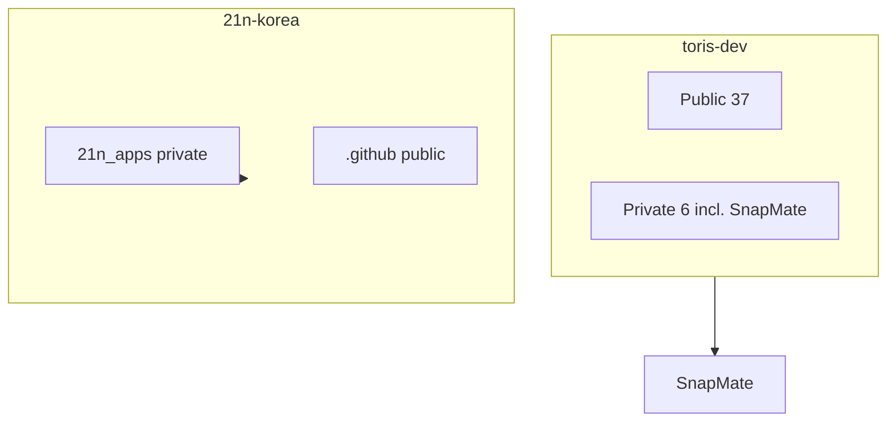

---
tags:
  - github
  - org
updated: 2026-06-01
---

# GitHub Organizations

## 21n-korea

| | |
|---|---|
| URL | https://github.com/21n-korea |
| 내 역할 | 풀스택 — RN(Expo)·NestJS·Next·PostgreSQL·AWS·Terraform |

### 레포 (gh, 2026-06-01)

| 레포 | Visibility | 갱신 | 설명 |
|------|------------|------|------|
| [21n_apps](https://github.com/21n-korea/21n_apps) | **private** | 2026-05-28 | 모델 계약서/후기 업로드 앱·웹·백엔드 **모노레포** |
| [.github](https://github.com/21n-korea/.github) | public | 2026-05-03 | 조직 assets |

Generated: [[orgs.generated]]

### Vault 문서 (코드 대신)

- [[21n-econtract-platform]]
- [[21n-fullstack-year-one-reflection]]
- [[회사-프로젝트-개발-후기]]

## 개인 vs 조직

## 관련

- [[repos-private]] · [[Portfolio]] · [[GitHub]]
