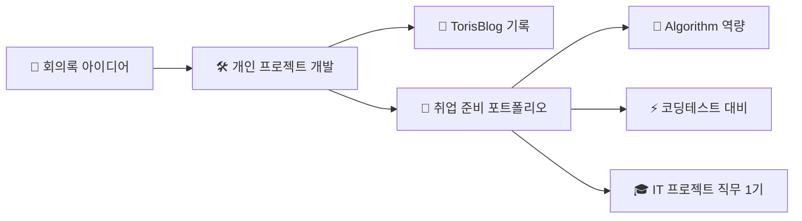

## 🔗 프로젝트 연결 맵

### 📋 현재 진행/완성된 프로젝트와의 연계

- **DevCV 프로젝트**: 이력서 필터링 서비스 → [[개인 프로젝트/README|완성된 프로젝트]]로 발전
- **기술 블로그**: 개발 과정 → [[TorisBlog/README|TorisBlog]]에서 정리
- **면접 연습 서비스**: → [[취업 준비/README|취업 준비]] 면접 대비 전략에 활용
- **알고리즘 기반 매칭**: → [[Algorithm/README|Algorithm]] + [[코딩테스트/README|코딩테스트]] 역량 적용

### 프로젝트 주제 선별

- 판매자가 프롬프트를 이용해서 이미지를 생성하여 판매자에게 판매하면 프롬프트 이미지 마켓 프로젝트 의견.
- 사용자 아바타를 만들어 이모티콘, 폰트로 꾸며 SNS 공유 서비스
- **이력서에 받은 후 기업의 인재상에 따라 필터링 서비스**. ← **✅ DevCV로 실현**
  - 포트폴리오를 통해 커피챗, 인재채용, 템플릿 내보내기 서비스
- 면접 연습할 때 면접에 대한 질문응답을 할 수 있는 서비스. ← **🎯 [[취업 준비/README|취업 준비]] 연계**
- 아이들 동화, TPS 음성지원, 자연어 처리

# 포트폴리오 매칭 사이트

## 서비스 설명

- 기업의 인재상을 빠르게 찾기 위한 서비스

## 요구사항

- 기업이 원하는 인재상과 맞는 개인이 필터링 되었는가?
- 개인이 원하는 기업상과 맞는 기업이 필터링 되었는가?
- 개인의 포트폴리오가 올바르게 노출되었는가?
- 개인에 맞는 기업이 올바르게 추천되었는가?
- 개인의 스펙이 올바르게 노출되었는가?
- 기업의 워드클라우드가 올바르게 작성되었는가?
-

## 기획의도

## 기대효과

## 타겟층

- 구직자

## 구성

## 유저플로우

## 기능

- role은 개인으로 구분
- 포트폴리오에 템플릿을 가져올 수 있게 템플릿을 일정 갯수 넘게 가져올 시 결제시스템
- 포트폴리오에 대한 피드백을 판매.
- ***

- 메인페이지
- 로그인페이지
- 사용자페이지
- 기업페이지
- 이력서, 포트폴리오, 직무/기술스택 입력 페이지
- 이력서/포트폴리오 판매리스트 페이지
- 이력서/포트폴리오 View 페이지

---

## 🔄 프로젝트 생태계 연결

### 💡 아이디어 → 실행 → 포트폴리오 파이프라인

### 🎯 각 프로젝트 폴더와의 연계점

- **[[개인 프로젝트/README|💡 개인 프로젝트]]**: 회의록 아이디어를 실제 구현으로
- **[[TorisBlog/README|📝 TorisBlog]]**: 개발 과정과 기술적 인사이트 공유
- **[[취업 준비/README|🎯 취업 준비]]**: 프로젝트 경험을 면접 스토리로 활용
- **[[Algorithm/README|🧮 Algorithm]]**: 매칭 알고리즘, 추천 시스템 기술 적용
- **[[코딩테스트/README|⚡ 코딩테스트]]**: 알고리즘 역량 면접에서 어필
- **[[IT 프로젝트 직무 1기/README|🎓 IT 프로젝트 직무 1기]]**: 실무 교육 경험과 연계

### 📈 성장 트랙

1. **기획** (회의록) → **학습** (Algorithm/코딩테스트) → **개발** (개인 프로젝트)
2. **완성** (포트폴리오) → **정리** (TorisBlog) → **취업** (취업 준비)
3. **교육** (IT 프로젝트 직무) → **개인 발전** → **실무 프로젝트** 선순환
