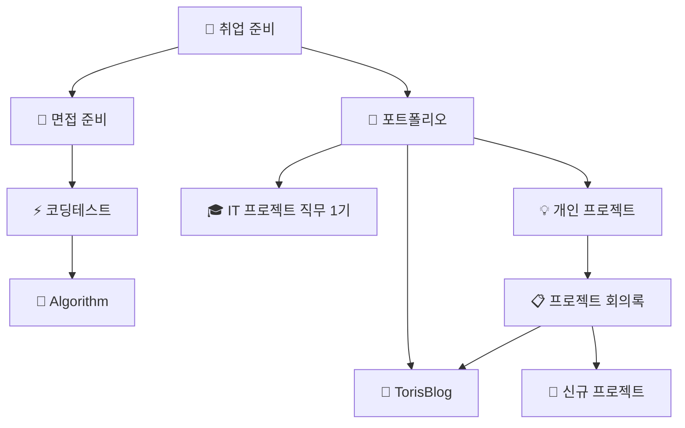

# 🚀 Project Hub

> 현재 진행 중인 프로젝트와 목표들의 중심지

## 🎯 현재 진행 중인 프로젝트

### 🏆 취업 준비 (최우선)

- **목표**: 금융/이커머스 프론트엔드 개발자
- **진행 상황**: 자소서 작성, 포트폴리오 정리, 면접 준비
- **핵심 역량**: TypeScript, React, 팀 협업, 실무 경험

### 💡 개인 프로젝트 구상

- **아이디어 단계**: 지역 기반 공동구매 플랫폼
- **기술 검토**: PWA, 실시간 채팅, 결제 시스템
- **차별화 포인트**: 지역 커뮤니티 + 소상공인 지원

## 📁 프로젝트 생태계 맵

### 🔄 전체 프로젝트 연결 구조

### 🎓 기술 역량 강화 트랙

#### 📚 알고리즘 마스터리 (연결된 학습)

- **[[Algorithm/README|🧮 Algorithm]]** ↔ **[[코딩테스트/README|⚡ 코딩테스트]]**
  - 이론 학습 → 실전 문제 풀이 → 면접 대비
  - **상호 피드백**: Algorithm에서 배운 개념을 코딩테스트에서 실전 적용
  - **성장 추적**: [[취업 준비/README|취업 준비]]에서 역량 발전 과정 기록

#### 💻 실무 프로젝트 경험 (포트폴리오 구축)

- **[[IT 프로젝트 직무 1기/README|🎓 IT 프로젝트 직무 1기]]** → **[[TorisBlog/README|📝 TorisBlog]]** → **[[개인 프로젝트/README|💡 개인 프로젝트]]**
  - 교육 프로젝트 경험 → 개인 블로그 개발 → 창의적 프로젝트 도전
  - **기술 스택 진화**: JSP/Spring → Next.js/TypeScript → 최신 기술 도입
  - **포트폴리오 다양성**: [[취업 준비/README|취업 준비]]에서 각 프로젝트별 어필 포인트 정리

### 🚀 프로젝트 기획 및 실행 트랙

#### 💡 아이디어 → 실행 파이프라인

- **[[프로젝트 회의록]]** → **[[개인 프로젝트/README|💡 개인 프로젝트]]** → **[[TorisBlog/README|📝 TorisBlog]]**
  - 기획 회의 → 프로젝트 개발 → 블로그 정리/공유
  - **실현 사례**: 포트폴리오 매칭 사이트 기획 → DevCV 프로젝트 실행
  - **기술 블로그**: 개발 과정과 학습 내용을 TorisBlog에서 정리

#### 🎯 취업 연계 전략

- **모든 프로젝트** → **[[취업 준비/README|🎯 취업 준비]]** → **면접 스토리 완성**
  - 각 프로젝트에서 얻은 경험을 취업 준비에서 어필 포인트로 정리
  - **차별화 포인트**: Algorithm + 실무 프로젝트 + 개인 블로그의 시너지

## 🔗 다른 영역과의 연결

### 📚 학습 연계

- **기술 스택 확장**: [[📚 학습 자료실|03-Resource]] 학습 자료 활용
- **실무 적용**: 학습한 내용을 프로젝트에 즉시 적용
- **문제 해결**: 프로젝트 중 만난 문제들을 체계적으로 정리

### 💡 아이디어 발전

- **개인적 관심**: [[🌱 개인 성장 영역|02-Area]] 투자, 에세이 등에서 프로젝트 아이디어 도출
- **일일 기록**: [[📅 일일 작업 허브|task]] 매일의 작업 진행 상황 추적
- **과거 경험**: [[📁 아카이브 보관소|04-Archive]] 이전 프로젝트 경험 활용

### 🎨 시각적 정리

- **프로젝트 설계**: [[🎨 시각화 허브|Excalidraw]] 시스템 아키텍처 시각화
- **워크플로우**: [[📝 템플릿 허브|template]] 프로젝트 관리 템플릿 활용
- **시각 자료**: [[📸 이미지 허브|images]] 프로젝트 스크린샷과 포트폴리오 자료

## 🎯 진행 전략

### 📊 통합 취업 준비 로드맵

#### 1️⃣ 포트폴리오 완성 (프로젝트 간 시너지)

**완료된 프로젝트들**:

- **Inssiders**: PWA 기반 트렌드 큐레이션 플랫폼 ← [[IT 프로젝트 직무 1기/README|실무 교육]] 경험 활용
- **DevCV**: 개발자 이력서 공유 플랫폼 ← [[프로젝트 회의록|회의록 아이디어]] 실현
- **TorisBlog**: 기술 블로그 ← [[TorisBlog/README|모든 프로젝트]] 정리 허브

**각 프로젝트의 상호 보완**:

- DevCV (백엔드 중심) + Inssiders (프론트엔드 중심) + TorisBlog (풀스택) = **완전한 역량 증명**

#### 2️⃣ 신규 프로젝트 (기존 경험 융합)

**지역 기반 공동구매 플랫폼**:

- [[Algorithm/README|Algorithm]] + [[코딩테스트/README|코딩테스트]] → **매칭 알고리즘** 설계
- [[개인 프로젝트/README|개인 프로젝트]] → **프로토타입** 개발
- [[TorisBlog/README|TorisBlog]] → **개발 과정** 기록 및 홍보

#### 3️⃣ 기술 역량 강화 (통합 학습)

**현재 기술 스택**: TypeScript, React, Java, Spring + JSP
**목표 기술 스택**: 금융/이커머스 도메인 전문성

**학습 → 적용 → 정리 사이클**:

- [[Algorithm/README|Algorithm]] 학습 → [[코딩테스트/README|실전 문제]] → [[개인 프로젝트/README|프로젝트 적용]] → [[TorisBlog/README|블로그 정리]]

### 💰 프로젝트 우선순위

1. **즉시 실행**: 취업 준비 관련 작업 (자소서, 포트폴리오)
2. **병행 진행**: 새로운 프로젝트 기획 및 프로토타입
3. **지속적 개선**: 기존 프로젝트 유지보수 및 기능 개선

## 📈 성과 지표

### 🎯 완료된 프로젝트 (검증된 역량)

- **3개의 완성된 프로젝트**: 기획부터 배포까지 전 과정 경험
- **다양한 기술 스택**: TypeScript, React, Java, microservices
- **실무 경험**: 팀 협업, 이벤트 관리, 디자이너/기획자 협업

### 🚀 현재 진행 상황

- **매일 업데이트**: [[📅 일일 작업 허브|일일 기록]]으로 진행 상황 추적
- **체계적 관리**: 프로젝트별 상세 기록 및 회고
- **지속적 개선**: 피드백 반영 및 프로세스 최적화

---

_현재 진행 중인 모든 프로젝트의 허브이자, 미래를 향한 발걸음들이 모이는 곳입니다! 🚀_

#허브 #프로젝트 #개발 #포트폴리오 #취업준비 #성장
