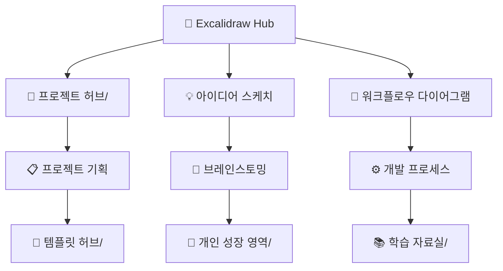
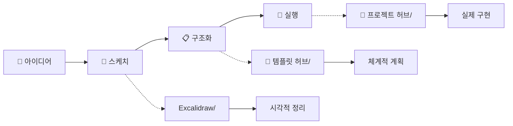
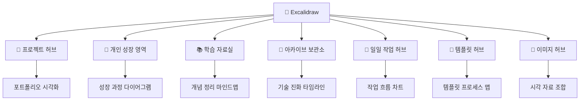

# 🎨 Visual Thinking Hub

> 아이디어를 시각화하는 창작 공간 - 생각을 그림으로, 개념을 다이어그램으로

## 🖼️ 시각 자료 아카이브

### 📊 현재 다이어그램

- **[[Drawing 2024-01-02 13.46.59.excalidraw]]** - 주요 아이디어 맵 (27KB, 대규모 작업)
  - 연결: [[🚀 프로젝트 허브|프로젝트]] 기획 단계 시각화
  - 활용: [[🌱 개인 성장 영역|개인 성장]] 사고 과정 정리

## 🔗 다른 영역과의 시각적 연결

### 🚀 프로젝트 기획 시각화



### 🎯 시각적 사고 워크플로우

- **개념 정리** → [[🎨 시각화 허브|시각화]] → [[🚀 프로젝트 허브|개인 프로젝트 구상]]
- **학습 내용** → [[📚 학습 자료실|Resource]] → **마인드맵** → [[🎨 시각화 허브|다이어그램]]
- **회고/성찰** → [[🌱 개인 성장 영역|Area]] → **시각적 정리** → [[🎨 시각화 허브|드로잉]]

### 📈 지식 연결망 구축

- **기술 아키텍처** → [[🚀 프로젝트 허브|프로젝트]] ↔ **시스템 설계도** → [[🎨 시각화 허브|다이어그램]]
- **학습 로드맵** → [[📚 학습 자료실|학습 자료]] ↔ **진행 상황** → [[📅 일일 작업 허브|일일 기록]]
- **커리어 패스** → [[🌱 개인 성장 영역|개인 성장]] ↔ **목표 시각화** → [[🎨 시각화 허브|비전 보드]]

## 🎨 활용 시나리오

### 🏗️ 프로젝트 아키텍처 설계

1. **[[🚀 프로젝트 허브|개인 프로젝트 구상]]**에서 아이디어 정리
2. **Excalidraw**로 시스템 구조 시각화
3. **[[📚 학습 자료실|기술 자료]]** 참고하여 세부 설계
4. **[[📅 일일 작업 허브|일일 기록]]**으로 구현 과정 추적

### 💭 아이디어 발전 과정

1. **[[🌱 개인 성장 영역|노트장]]**에서 초기 아이디어 메모
2. **Excalidraw**로 개념 구조화 및 시각화
3. **[[📝 템플릿 허브|🏆 Project|프로젝트 템플릿]]**으로 실행 계획 수립
4. **[[🚀 프로젝트 허브|실제 프로젝트]]**로 구현

### 📚 학습 내용 정리

1. **[[📚 학습 자료실|학습 자료]]** 수집 및 정리
2. **Excalidraw**로 개념 간 관계 다이어그램 작성
3. **[[📅 일일 작업 허브|일일 학습]]** 기록으로 진도 추적
4. **[[🌱 개인 성장 영역|개인 성장]]**에 통찰 정리

## 🔄 시각적 사고 프로세스

### 📊 아이디어 → 실행 파이프라인



### 🧠 지식 연결 네트워크

- **중앙 허브**: [[🧠 디지털 두뇌|🧠 디지털 두뇌]] ↔ **시각적 표현** ↔ [[🎨 시각화 허브|🎨 Visual Hub]]
- **학습 순환**: [[📚 학습 자료실|📚 학습]] → **시각화** → [[🌱 개인 성장 영역|💡 성장]] → **새로운 학습**
- **창작 과정**: [[📝 템플릿 허브|📝 템플릿]] → **아이디어 스케치** → [[🚀 프로젝트 허브|🚀 프로젝트]]

## 📊 시각적 자료 관리 (Dataview)

### 🎨 크리에이티브 작업 현황

```dataview
TABLE WITHOUT ID
  file.link as "🖼️ 작품",
  file.size as "📊 복잡도",
  file.mtime as "📅 최종 작업일"
FROM "Excalidraw"
WHERE file.name != "README"
SORT file.mtime DESC
```

### 📈 창작 활동 통계

```dataview
TABLE WITHOUT ID
  substring(file.name, 0, 7) as "📅 시기",
  count(rows) as "🎨 작품 수",
  sum(file.size) as "📊 총 크기"
FROM "Excalidraw"
WHERE file.name != "README"
GROUP BY substring(file.name, 0, 7)
SORT substring(file.name, 0, 7) DESC
```

## 🌟 그래프 뷰 최적화

### 🎯 핵심 시각화 태그

- `#시각화` - 모든 다이어그램/드로잉
- `#아키텍처` - 시스템 설계 관련
- `#브레인스토밍` - 아이디어 발전 과정
- `#마인드맵` - 개념 연결도

### 🔗 연결 강화 요소

- **프로젝트 연결**: `#프로젝트설계` - 01-Project 폴더 연동
- **학습 연결**: `#학습시각화` - 03-Resource 폴더 연동
- **성장 연결**: `#성찰다이어그램` - 02-Area 폴더 연동
- **워크플로우**: `#프로세스맵` - template 폴더 연동

## 🎨 창작 도구 연계

### 🖼️ 디지털 아트 생태계

- **Excalidraw** (개념/다이어그램) ↔ **[[📚 학습 자료실|블로그]]** (설명 글)
- **아이디어 스케치** ↔ **[[📝 템플릿 허브|🔮 Blog|블로그 템플릿]]** (포스트 작성)
- **프로젝트 설계도** ↔ **[[🚀 프로젝트 허브|프로젝트 회의록]]** (의사결정 기록)

### 🔄 시각적 피드백 루프

**스케치 → 검토 → 개선 → 적용 → 새로운 아이디어** 의 지속적 창작 사이클

### 📸 [[📸 이미지 허브|Images]]와 시너지

- **스케치 → 스크린샷**: Excalidraw 아이디어 → images 실제 구현 결과
- **다이어그램 → 포트폴리오**: 시스템 설계도 → 프로젝트 시각 자료
- **과정 기록**: [[📅 일일 작업 허브|일일 기록]]에서 Excalidraw 스케치와 images 스크린샷 함께 활용

### 🔗 전체 폴더 시각적 연결



---

_생각을 시각화하면 아이디어가 명확해지고, 복잡한 개념도 쉽게 이해할 수 있습니다! 🎨✨_

#허브 #시각화 #창작 #다이어그램 #프로젝트 #아이디어
