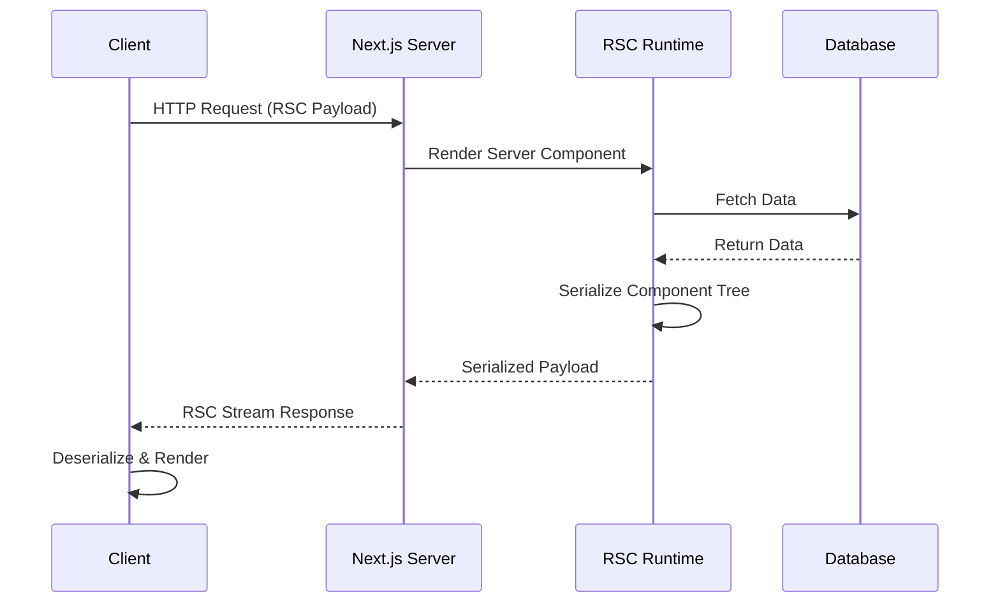
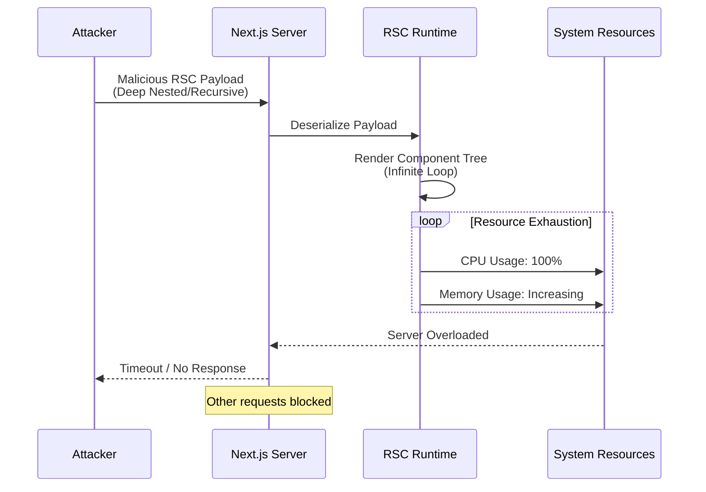
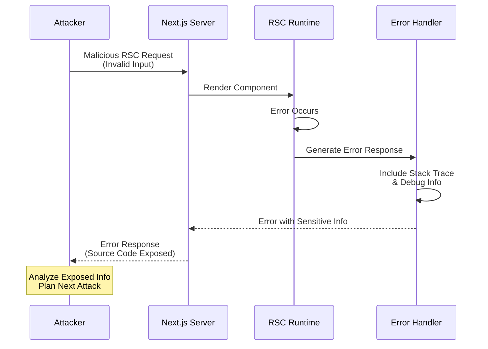
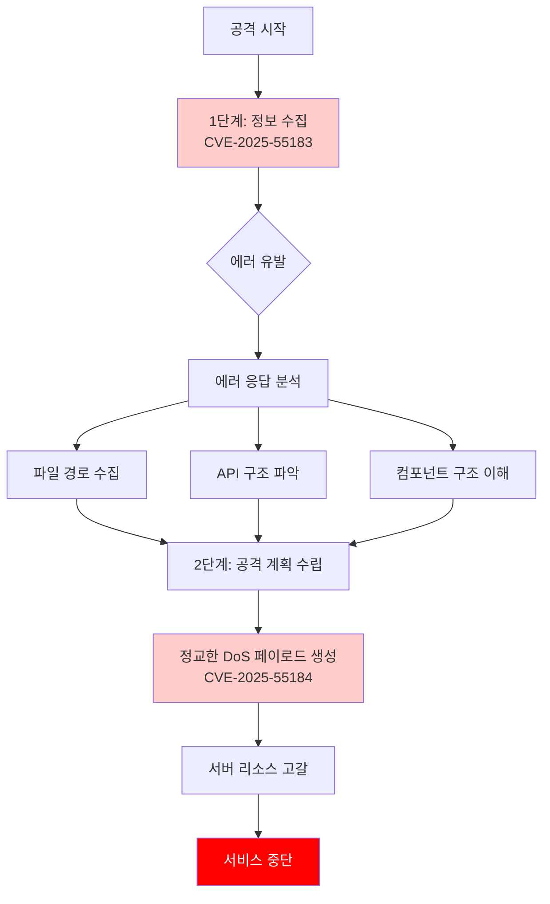
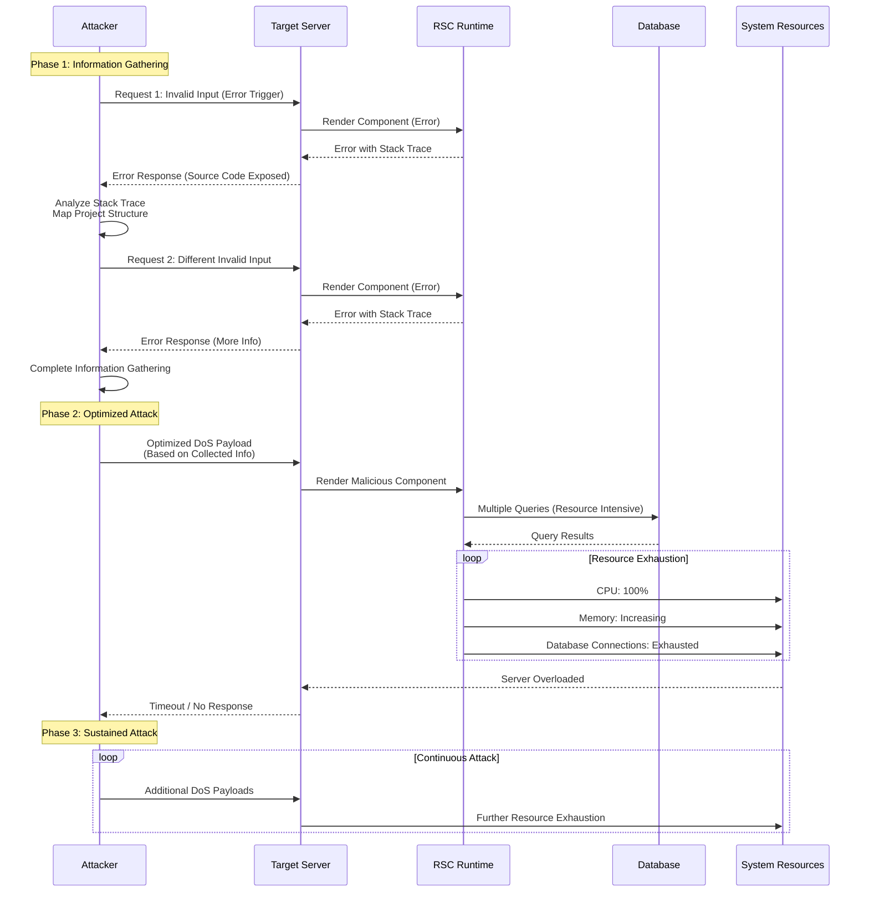

## 🚨 React Server Components 새로운 보안 취약점 공개

2025년 12월, React 팀이 React Server Components에서 발견된 **두 가지 새로운 보안 취약점**을 공개했습니다. 이 취약점들은 **Reac2Shell**이라는 공격 벡터와 연관되어 있어, 개발자들이 즉시 인지하고 대응해야 할 중요한 보안 이슈입니다.

### 공개된 취약점

- **CVE-2025-55184**: Denial of Service (DoS) - **High** 심각도
- **CVE-2025-55183**: Source Code Exposure - **Medium** 심각도

이 두 취약점은 단독으로도 위험하지만, **Reac2Shell** 공격 벡터를 통해 결합될 경우 더욱 심각한 보안 위협이 될 수 있습니다.

## 🔍 Reac2Shell이란?

**Reac2Shell**은 React Server Components의 보안 취약점을 악용하는 공격 벡터입니다. 이 공격 벡터는 두 가지 취약점을 결합하여 사용합니다:

1. **정보 수집 단계**: CVE-2025-55183 (Source Code Exposure)를 통해 애플리케이션의 내부 구조, 파일 경로, 디버그 정보 등을 수집
2. **공격 실행 단계**: 수집한 정보를 바탕으로 CVE-2025-55184 (DoS)를 활용하여 서버 리소스를 고갈시키거나 더 정교한 공격 수행

### React Server Components 동작 원리

Reac2Shell을 이해하기 위해서는 먼저 React Server Components의 기본 동작 원리를 이해해야 합니다:



**핵심 과정**:

1. **서버 렌더링**: Server Component가 서버에서 실행되어 데이터를 가져옴
2. **직렬화 (Serialization)**: 렌더링된 컴포넌트 트리를 JSON 형태로 직렬화
3. **스트림 전송**: 직렬화된 페이로드를 스트림으로 클라이언트에 전송
4. **역직렬화 (Deserialization)**: 클라이언트에서 페이로드를 역직렬화하여 렌더링

이 과정에서 발생할 수 있는 취약점들이 바로 CVE-2025-55184와 CVE-2025-55183입니다.

## 🛑 CVE-2025-55184: Denial of Service (DoS) - High

### 취약점 개요

CVE-2025-55184는 React Server Components의 직렬화/역직렬화 과정에서 발생하는 **서비스 거부(DoS) 취약점**입니다. 공격자가 특수하게 조작된 RSC 페이로드를 전송하면, 서버가 무한 루프나 과도한 재귀 렌더링에 빠져 CPU와 메모리 리소스가 고갈될 수 있습니다.

**CVSS 점수**: High (정확한 점수는 공식 발표 대기)

### 기술적 원리

#### 1. RSC 직렬화 메커니즘

React Server Components는 컴포넌트 트리를 직렬화할 때 다음과 같은 과정을 거칩니다:

```typescript
// React 내부 직렬화 과정 (간소화)
function serializeComponent(component: ReactElement): string {
  const type = component.type;
  const props = component.props;
  const children = component.children;

  // 재귀적으로 자식 컴포넌트 직렬화
  const serializedChildren = children.map((child) => serializeComponent(child));

  return JSON.stringify({
    type,
    props,
    children: serializedChildren
  });
}
```

#### 2. 취약점 발생 시나리오

**시나리오 1: 순환 참조 (Circular Reference)**

```typescript
// 취약한 컴포넌트 예제
function MaliciousComponent({ depth = 0, maxDepth = 1000000 }) {
  // 공격자가 매우 큰 maxDepth 값을 전달
  if (depth < maxDepth) {
    return (
      <div>
        <MaliciousComponent depth={depth + 1} maxDepth={maxDepth} />
        <MaliciousComponent depth={depth + 1} maxDepth={maxDepth} />
      </div>
    );
  }
  return <div>End</div>;
}
```

공격자가 `maxDepth`를 매우 큰 값(예: 1,000,000)으로 설정하면, 서버는 수백만 개의 컴포넌트를 렌더링하려고 시도하게 됩니다. 이로 인해:

- **메모리 고갈**: 각 컴포넌트 인스턴스가 메모리를 점유
- **CPU 고갈**: 직렬화 과정에서 CPU 사용률이 100%에 도달
- **서버 응답 불가**: 다른 요청을 처리할 수 없게 됨

**시나리오 2: 무한 루프 컴포넌트**

```typescript
// 무한 루프를 유발하는 컴포넌트
function InfiniteLoopComponent({ data }) {
  // data가 순환 참조를 포함하는 경우
  const processed = processData(data); // 무한 루프 발생 가능

  return (
    <div>
      {processed.map(item => (
        <InfiniteLoopComponent data={item.children} />
      ))}
    </div>
  );
}
```

#### 3. 공격 페이로드 예제

공격자는 다음과 같은 악의적인 페이로드를 전송할 수 있습니다:

```json
{
  "type": "MaliciousComponent",
  "props": {
    "depth": 0,
    "maxDepth": 10000000,
    "children": [
      {
        "type": "MaliciousComponent",
        "props": {
          "depth": 1,
          "maxDepth": 10000000,
          "children": [
            /* ... 무한 반복 ... */
          ]
        }
      }
    ]
  }
}
```

### 영향받는 버전

다음 React Server Components 관련 패키지의 특정 버전에서 취약점이 발견되었습니다:

- **react-server-dom-webpack**: 19.0.0 ~ 19.2.0 (일부 버전)
- **react-server-dom-turbopack**: 19.0.0 ~ 19.2.0 (일부 버전)
- **react-server-dom-parcel**: 19.0.0 ~ 19.2.0 (일부 버전)

**수정된 버전**:

- 19.0.1 이상
- 19.1.2 이상
- 19.2.1 이상

### 영향받는 프레임워크

- **Next.js**: 15.0.0 ~ 15.5.x (일부 버전)
- **React Router**: RSC 기능을 사용하는 경우
- **Waku**: RSC를 지원하는 모든 버전
- **기타 RSC를 지원하는 프레임워크**

### 공격 시나리오



### 취약점 탐지 방법

다음과 같은 증상이 나타나면 CVE-2025-55184 공격을 받고 있을 수 있습니다:

1. **서버 CPU 사용률이 갑자기 100%에 도달**
2. **메모리 사용량이 지속적으로 증가**
3. **RSC 엔드포인트로의 요청이 타임아웃**
4. **서버 로그에 "Maximum call stack size exceeded" 에러**
5. **다른 API 엔드포인트의 응답 시간이 급격히 증가**

### 임시 완화 조치 (패치 전)

패치를 적용하기 전까지 다음 조치를 취할 수 있습니다:

1. **Rate Limiting 적용**: RSC 엔드포인트에 요청 제한 설정
2. **페이로드 크기 제한**: 요청 본문의 최대 크기 제한
3. **렌더링 깊이 제한**: 컴포넌트 트리의 최대 깊이 제한
4. **타임아웃 설정**: RSC 렌더링에 타임아웃 적용
5. **모니터링 강화**: CPU/메모리 사용률 모니터링 및 알림 설정

## 📂 CVE-2025-55183: Source Code Exposure - Medium

### 취약점 개요

CVE-2025-55183는 React Server Components의 에러 처리 과정에서 발생하는 **소스 코드 노출 취약점**입니다. RSC 렌더링 중 에러가 발생하면, 에러 메시지와 스택 트레이스에 애플리케이션의 내부 구조, 파일 경로, 함수 이름, 변수 값 등이 노출될 수 있습니다.

**CVSS 점수**: Medium (정확한 점수는 공식 발표 대기)

### 기술적 원리

#### 1. RSC 에러 처리 메커니즘

React Server Components는 서버에서 컴포넌트를 렌더링하는 동안 에러가 발생하면, 에러 정보를 클라이언트로 전송합니다:

```typescript
// React 내부 에러 처리 (간소화)
try {
  const result = renderServerComponent(component);
  return serialize(result);
} catch (error) {
  // 에러 정보를 직렬화하여 클라이언트로 전송
  return serializeError({
    message: error.message,
    stack: error.stack, // ⚠️ 취약점: 스택 트레이스 노출
    componentStack: error.componentStack
    // ... 기타 디버그 정보
  });
}
```

#### 2. 취약점 발생 시나리오

**시나리오 1: 스택 트레이스 노출**

```typescript
// 취약한 Server Component
async function UserProfile({ userId }) {
  // 데이터베이스에서 사용자 정보 조회
  const user = await db.query(
    `SELECT * FROM users WHERE id = ${userId}` // SQL Injection 취약점도 있지만, 여기서는 에러 처리에 집중
  );

  if (!user) {
    throw new Error(`User not found: ${userId}`); // ⚠️ userId 값이 노출됨
  }

  return <div>{user.name}</div>;
}
```

에러가 발생하면 다음과 같은 정보가 노출될 수 있습니다:

```json
{
  "error": {
    "message": "User not found: 12345",
    "stack": "Error: User not found: 12345\n    at UserProfile (/app/src/components/UserProfile.tsx:15:23)\n    at renderServerComponent (/app/node_modules/react-server-dom-webpack/server.js:123:45)",
    "componentStack": "UserProfile\n  at App (/app/src/app/page.tsx:10:5)"
  }
}
```

**노출되는 정보**:

- 파일 경로: `/app/src/components/UserProfile.tsx`
- 함수 이름: `UserProfile`
- 라인 번호: `15:23`
- 변수 값: `userId = 12345`
- 프로젝트 구조: `/app/src/` 디렉토리 구조

**시나리오 2: 환경 변수 및 설정 정보 노출**

```typescript
// 취약한 Server Component
async function DatabaseConnection() {
  try {
    const connection = await connect({
      host: process.env.DB_HOST,      // ⚠️ 환경 변수 값이 에러에 포함될 수 있음
      port: process.env.DB_PORT,
      database: process.env.DB_NAME,
      password: process.env.DB_PASSWORD
    });
    return <div>Connected</div>;
  } catch (error) {
    // 에러 메시지에 민감한 정보가 포함될 수 있음
    throw new Error(`Database connection failed: ${error.message}`);
  }
}
```

**시나리오 3: 디버그 정보 노출**

```typescript
// 개발 환경에서만 사용해야 하는 디버그 정보
function DebugComponent({ data }) {
  if (process.env.NODE_ENV === 'development') {
    console.log('Debug info:', data);
  }

  // 프로덕션에서도 에러 발생 시 디버그 정보가 노출될 수 있음
  if (!data) {
    throw new Error(`Data is missing. Debug: ${JSON.stringify(data)}`);
  }

  return <div>{data.content}</div>;
}
```

### 영향받는 버전

CVE-2025-55183는 다음 버전에서 발견되었습니다:

- **react-server-dom-webpack**: 19.0.0 ~ 19.2.0 (일부 버전)
- **react-server-dom-turbopack**: 19.0.0 ~ 19.2.0 (일부 버전)
- **react-server-dom-parcel**: 19.0.0 ~ 19.2.0 (일부 버전)

**수정된 버전**:

- 19.0.1 이상
- 19.1.2 이상
- 19.2.1 이상

### 공격 시나리오



### 노출될 수 있는 정보

1. **파일 시스템 구조**

   - 프로젝트 디렉토리 구조
   - 파일 경로 및 이름
   - 소스 코드 위치

2. **애플리케이션 내부 정보**

   - 함수 및 클래스 이름
   - 변수 값 및 상태
   - 데이터베이스 쿼리 구조

3. **환경 설정 정보**

   - 환경 변수 이름 (값은 보통 노출되지 않지만, 이름 자체도 유용한 정보)
   - 설정 파일 경로
   - 서버 구조

4. **디버그 정보**
   - 개발 중 사용한 디버그 메시지
   - 로그 레벨 정보
   - 테스트 코드 경로

### 실제 공격 예제

공격자는 다음과 같은 방법으로 정보를 수집할 수 있습니다:

**1단계: 의도적 에러 유발**

```bash
# 악의적인 요청 전송
curl -X POST https://example.com/api/rsc \
  -H "Content-Type: application/json" \
  -d '{
    "component": "UserProfile",
    "props": {
      "userId": null  // null 값을 전달하여 에러 유발
    }
  }'
```

**2단계: 에러 응답 분석**

```json
{
  "error": {
    "message": "Cannot read property 'name' of null",
    "stack": "TypeError: Cannot read property 'name' of null\n    at UserProfile (/app/src/components/profiles/UserProfile.tsx:42:15)\n    at renderServerComponent (/app/node_modules/react-server-dom-webpack/server.js:123:45)\n    at processRequest (/app/src/app/api/rsc/route.ts:56:12)",
    "componentStack": "UserProfile\n  at App (/app/src/app/page.tsx:10:5)\n  at RootLayout (/app/src/app/layout.tsx:15:8)"
  }
}
```

**3단계: 수집한 정보 활용**

공격자는 수집한 정보를 바탕으로:

- 파일 경로 구조 파악: `/app/src/components/profiles/`
- API 엔드포인트 발견: `/app/src/app/api/rsc/route.ts`
- 컴포넌트 구조 이해: `UserProfile`, `App`, `RootLayout`
- 더 정교한 공격 계획 수립

### 취약점 탐지 방법

다음과 같은 증상이 나타나면 CVE-2025-55183 공격을 받고 있을 수 있습니다:

1. **에러 응답에 상세한 스택 트레이스 포함**
2. **파일 경로 및 함수 이름이 클라이언트에 노출**
3. **개발 환경 정보가 프로덕션에서 노출**
4. **의도적으로 에러를 유발하는 요청 패턴 감지**
5. **에러 로그에 반복적인 동일한 에러 발생**

### 임시 완화 조치 (패치 전)

1. **에러 메시지 필터링**: 프로덕션 환경에서 상세한 에러 정보 제거
2. **커스텀 에러 핸들러**: RSC 에러를 처리하는 커스텀 핸들러 구현
3. **에러 로깅**: 클라이언트에 전송하기 전에 에러 정보를 로그로만 기록
4. **환경 변수 검증**: 에러 메시지에 환경 변수가 포함되지 않도록 검증
5. **민감 정보 마스킹**: 에러 메시지에서 민감한 정보 제거 또는 마스킹

## 🎯 Reac2Shell 공격 벡터

Reac2Shell은 CVE-2025-55183 (Source Code Exposure)와 CVE-2025-55184 (DoS)를 결합하여 사용하는 공격 벡터입니다. 단독으로 사용할 때보다 두 취약점을 결합하면 더욱 정교하고 효과적인 공격이 가능합니다.

### 공격 단계

Reac2Shell 공격은 다음과 같은 단계로 진행됩니다:



### 1단계: 정보 수집 (CVE-2025-55183 활용)

공격자는 먼저 CVE-2025-55183을 활용하여 애플리케이션의 내부 구조를 파악합니다:

**정보 수집 전략**:

1. **의도적 에러 유발**: 다양한 입력값으로 에러를 유발하여 스택 트레이스를 수집
2. **에러 패턴 분석**: 수집한 에러 메시지를 분석하여 애플리케이션 구조 파악
3. **파일 경로 매핑**: 스택 트레이스에서 파일 경로를 추출하여 프로젝트 구조 재구성
4. **API 엔드포인트 발견**: 에러 메시지에서 API 라우트 및 엔드포인트 정보 수집

**수집되는 정보 예시**:

```json
{
  "collected_info": {
    "project_structure": {
      "root": "/app/src",
      "components": "/app/src/components",
      "api": "/app/src/app/api",
      "pages": "/app/src/app"
    },
    "api_endpoints": [
      "/app/src/app/api/rsc/route.ts",
      "/app/src/app/api/users/route.ts"
    ],
    "component_hierarchy": {
      "UserProfile": {
        "path": "/app/src/components/profiles/UserProfile.tsx",
        "dependencies": ["db", "auth"]
      }
    },
    "error_patterns": {
      "database_errors": "Connection timeout",
      "auth_errors": "Unauthorized access"
    }
  }
}
```

### 2단계: 정교한 공격 실행 (CVE-2025-55184 활용)

수집한 정보를 바탕으로 공격자는 더 정교한 DoS 공격을 수행합니다:

**공격 최적화 전략**:

1. **타겟 컴포넌트 식별**: 수집한 정보를 바탕으로 리소스를 가장 많이 소비하는 컴포넌트 식별
2. **최적 페이로드 생성**: 애플리케이션 구조를 이해한 상태에서 최대 효과를 내는 페이로드 생성
3. **다중 벡터 공격**: 여러 엔드포인트에 동시에 공격하여 서버 리소스 완전 고갈
4. **지속적 공격**: 서버가 복구되는 것을 방지하기 위한 지속적 공격

**정교한 공격 페이로드 예시**:

```typescript
// 1단계에서 수집한 정보를 바탕으로 생성된 공격 페이로드
const attackPayload = {
  // UserProfile 컴포넌트가 데이터베이스 쿼리를 수행한다는 것을 알고
  // 이를 악용하여 더 많은 리소스를 소비하도록 설계
  component: 'UserProfile',
  props: {
    userId: 'valid_id', // 유효한 ID로 정상 요청처럼 보이게 함
    children: generateDeepNestedTree(1000000), // 매우 깊은 중첩 트리
    // 수집한 정보를 바탕으로 최적화된 공격 구조
    attackVector: {
      depth: 10000000,
      branchingFactor: 2, // 각 노드마다 2개의 자식
      // UserProfile이 데이터베이스 쿼리를 수행한다는 것을 알고
      // 각 렌더링마다 DB 쿼리가 발생하도록 설계
      triggerDatabaseQuery: true
    }
  }
};
```

### 공격 시나리오: 전체 흐름



### Reac2Shell의 위험성

Reac2Shell 공격 벡터는 단순한 DoS 공격보다 훨씬 위험합니다:

1. **정보 기반 공격**: 애플리케이션 구조를 이해한 상태에서 공격하므로 더 효과적
2. **다중 취약점 악용**: 두 가지 취약점을 결합하여 단일 취약점보다 큰 피해
3. **지속적 공격**: 수집한 정보를 바탕으로 지속적이고 정교한 공격 가능
4. **탐지 회피**: 정상 요청처럼 보이게 하여 탐지 회피 가능
5. **확장성**: 수집한 정보를 바탕으로 다른 공격 벡터로 확장 가능

### 방어 전략

Reac2Shell 공격을 방어하기 위해서는 두 취약점 모두를 해결해야 합니다:

1. **CVE-2025-55183 패치**: 소스 코드 노출을 방지하여 정보 수집 단계 차단
2. **CVE-2025-55184 패치**: DoS 취약점을 해결하여 공격 실행 단계 차단
3. **에러 처리 강화**: 프로덕션 환경에서 상세한 에러 정보 노출 방지
4. **모니터링**: 의도적 에러 유발 패턴 탐지
5. **Rate Limiting**: RSC 엔드포인트에 요청 제한 적용
6. **리소스 제한**: 컴포넌트 렌더링 깊이 및 리소스 사용량 제한

## 📦 즉시 조치 및 업데이트 방법

이 취약점들은 **즉시 업데이트가 필요**합니다. 특히 프로덕션 환경에서는 가능한 한 빨리 패치를 적용해야 합니다.

### Next.js 업데이트

Next.js를 사용하는 경우, 현재 사용 중인 릴리스 라인의 최신 패치 버전으로 업데이트하세요:

```bash
# Next.js 15.0.x
npm install next@15.0.5

# Next.js 15.1.x
npm install next@15.1.9

# Next.js 15.2.x
npm install next@15.2.6

# Next.js 15.3.x
npm install next@15.3.6

# Next.js 15.4.x
npm install next@15.4.8

# Next.js 15.5.x
npm install next@15.5.7

# Next.js 16.0.x (현재 권장)
npm install next@16.0.7
```

**pnpm 사용 시**:

```bash
pnpm update next@latest
```

**yarn 사용 시**:

```bash
yarn upgrade next@latest
```

### React 및 React DOM 업데이트

React와 React DOM을 최신 버전으로 업데이트하세요:

```bash
npm install react@19.2.1 react-dom@19.2.1
```

또는 pnpm을 사용하는 경우:

```bash
pnpm update react@19.2.1 react-dom@19.2.1
```

### React Server Components 관련 패키지

프로젝트에서 직접 사용하는 경우 다음 패키지들도 업데이트하세요:

```bash
# react-server-dom-webpack
npm install react-server-dom-webpack@latest

# react-server-dom-parcel
npm install react-server-dom-parcel@latest

# react-server-dom-turbopack
npm install react-server-dom-turbopack@latest
```

### 기타 프레임워크

#### React Router

React Router의 RSC 기능을 사용하는 경우:

```bash
npm install react@latest react-dom@latest
npm install react-server-dom-parcel@latest
npm install react-server-dom-webpack@latest
npm install @vitejs/plugin-rsc@latest
```

#### Waku

```bash
npm install react@latest react-dom@latest react-server-dom-webpack@latest waku@latest
```

#### @vitejs/plugin-rsc

```bash
npm install react@latest react-dom@latest @vitejs/plugin-rsc@latest
```

### 업데이트 후 확인 사항

업데이트 후 다음을 확인하세요:

1. **의존성 확인**: `npm list react react-dom` 또는 `pnpm list react react-dom`으로 버전 확인
2. **빌드 테스트**: `npm run build` 또는 `pnpm build`로 빌드 성공 확인
3. **기능 테스트**: RSC 기능이 정상적으로 작동하는지 확인
4. **에러 로그 확인**: 업데이트 후 발생하는 에러가 없는지 확인

## 🛡️ 완화 조치 (패치 전 임시 방어)

패치를 즉시 적용할 수 없는 경우, 다음 완화 조치를 적용하세요:

### 1. 에러 처리 강화 (CVE-2025-55183 완화)

프로덕션 환경에서 상세한 에러 정보가 노출되지 않도록 커스텀 에러 핸들러를 구현하세요:

```typescript
// app/api/rsc/route.ts 또는 middleware
export async function POST(request: Request) {
  try {
    // RSC 렌더링 로직
    const result = await renderRSC(component);
    return Response.json(result);
  } catch (error) {
    // 프로덕션 환경에서 상세한 에러 정보 제거
    if (process.env.NODE_ENV === 'production') {
      // 에러를 로그에만 기록
      console.error('RSC Error:', error);

      // 클라이언트에는 일반적인 에러 메시지만 전송
      return Response.json(
        { error: 'An error occurred while processing your request' },
        { status: 500 }
      );
    }

    // 개발 환경에서는 상세한 에러 정보 제공
    return Response.json(
      { error: error.message, stack: error.stack },
      { status: 500 }
    );
  }
}
```

### 2. Rate Limiting 적용 (CVE-2025-55184 완화)

RSC 엔드포인트에 Rate Limiting을 적용하여 DoS 공격을 완화하세요:

```typescript
// middleware.ts 또는 API route
import { Ratelimit } from '@upstash/ratelimit';
import { Redis } from '@upstash/redis';

const ratelimit = new Ratelimit({
  redis: Redis.fromEnv(),
  limiter: Ratelimit.slidingWindow(10, '10 s') // 10초에 10회 요청 제한
});

export async function POST(request: Request) {
  const ip = request.headers.get('x-forwarded-for') || 'unknown';
  const { success } = await ratelimit.limit(ip);

  if (!success) {
    return Response.json({ error: 'Too many requests' }, { status: 429 });
  }

  // RSC 렌더링 로직
}
```

### 3. 페이로드 크기 제한

요청 본문의 최대 크기를 제한하여 과도한 페이로드 공격을 방지하세요:

```typescript
// next.config.js
module.exports = {
  // 요청 본문 최대 크기 제한 (예: 1MB)
  serverRuntimeConfig: {
    maxRequestBodySize: 1024 * 1024 // 1MB
  }
};
```

### 4. 렌더링 깊이 제한

컴포넌트 트리의 최대 깊이를 제한하여 재귀적 공격을 방지하세요:

```typescript
// RSC 렌더링 시 깊이 제한
const MAX_DEPTH = 100;

function renderWithDepthLimit(component, depth = 0) {
  if (depth > MAX_DEPTH) {
    throw new Error('Maximum component depth exceeded');
  }

  // 렌더링 로직
  return renderComponent(component, depth + 1);
}
```

### 5. 타임아웃 설정

RSC 렌더링에 타임아웃을 설정하여 무한 루프를 방지하세요:

```typescript
// RSC 렌더링에 타임아웃 적용
async function renderRSCWithTimeout(component, timeout = 5000) {
  return Promise.race([
    renderRSC(component),
    new Promise((_, reject) =>
      setTimeout(() => reject(new Error('Rendering timeout')), timeout)
    )
  ]);
}
```

### 6. 모니터링 및 알림

다음과 같은 모니터링을 설정하여 공격을 조기에 탐지하세요:

- **CPU 사용률 모니터링**: CPU 사용률이 90% 이상 지속되면 알림
- **메모리 사용률 모니터링**: 메모리 사용률이 급격히 증가하면 알림
- **에러 발생 빈도 모니터링**: 동일한 에러가 반복적으로 발생하면 알림
- **요청 패턴 분석**: 의도적으로 에러를 유발하는 요청 패턴 탐지

### 7. 리소스 제한 (서버 레벨)

서버 레벨에서 리소스 제한을 설정하세요:

- **Node.js 메모리 제한**: `--max-old-space-size` 옵션으로 메모리 제한
- **프로세스 제한**: PM2 등으로 프로세스 재시작 설정
- **로드 밸런서 설정**: 과도한 트래픽을 차단하는 설정

```bash
# Node.js 메모리 제한 예시
node --max-old-space-size=2048 server.js
```

### 완화 조치 적용 체크리스트

- [ ] 프로덕션 환경에서 에러 메시지 필터링 적용
- [ ] RSC 엔드포인트에 Rate Limiting 적용
- [ ] 페이로드 크기 제한 설정
- [ ] 렌더링 깊이 제한 구현
- [ ] 타임아웃 설정 적용
- [ ] 모니터링 및 알림 설정
- [ ] 서버 레벨 리소스 제한 설정
- [ ] 정기적인 보안 감사 스케줄 수립

## 🔒 보안 모범 사례

이러한 취약점을 예방하고 향후 유사한 보안 이슈를 방지하기 위해 다음 모범 사례를 준수하세요:

### RSC 사용 시 보안 체크리스트

#### 1. 에러 처리

- [ ] **프로덕션 환경에서 상세한 에러 정보 노출 방지**

  ```typescript
  // ❌ 나쁜 예
  catch (error) {
    return Response.json({ error: error.message, stack: error.stack });
  }

  // ✅ 좋은 예
  catch (error) {
    if (process.env.NODE_ENV === 'production') {
      console.error('Error:', error);
      return Response.json({ error: 'An error occurred' });
    }
    return Response.json({ error: error.message });
  }
  ```

- [ ] **에러 메시지에 민감한 정보 포함 금지**
  - 환경 변수 값
  - 데이터베이스 연결 정보
  - 파일 시스템 경로
  - 사용자 입력값 (특히 ID, 토큰 등)

#### 2. 입력 검증

- [ ] **모든 사용자 입력 검증**

  ```typescript
  // ✅ 좋은 예
  function UserProfile({ userId }: { userId: string }) {
    // 입력 검증
    if (!userId || typeof userId !== 'string' || userId.length > 100) {
      throw new Error('Invalid userId');
    }

    // 안전한 쿼리 수행
    const user = await db.query('SELECT * FROM users WHERE id = ?', [userId]);
    return <div>{user.name}</div>;
  }
  ```

- [ ] **페이로드 크기 제한**
- [ ] **컴포넌트 깊이 제한**
- [ ] **재귀적 구조 검증**

#### 3. 리소스 관리

- [ ] **Rate Limiting 적용**
- [ ] **타임아웃 설정**
- [ ] **메모리 사용량 모니터링**
- [ ] **CPU 사용률 모니터링**

#### 4. 의존성 관리

- [ ] **정기적인 의존성 업데이트**

  ```bash
  # 주기적으로 실행
  npm audit
  npm audit fix
  ```

- [ ] **보안 알림 구독**
  - React 공식 블로그
  - Next.js 보안 공지
  - GitHub Security Advisories

### 코드 리뷰 시 확인 사항

코드 리뷰 시 다음 사항을 반드시 확인하세요:

1. **에러 처리**: 프로덕션 환경에서 민감한 정보가 노출되지 않는지
2. **입력 검증**: 모든 사용자 입력이 적절히 검증되는지
3. **리소스 제한**: 무한 루프나 과도한 재귀가 발생할 수 있는지
4. **의존성 버전**: 최신 보안 패치가 적용되었는지
5. **로깅**: 민감한 정보가 로그에 기록되지 않는지

### 정기적인 보안 감사

다음과 같은 정기적인 보안 감사를 수행하세요:

#### 1. 주간 감사

- 의존성 취약점 스캔 (`npm audit`)
- 에러 로그 검토
- 모니터링 알림 확인

#### 2. 월간 감사

- 코드 보안 검토
- 에러 처리 로직 점검
- Rate Limiting 및 리소스 제한 설정 확인

#### 3. 분기별 감사

- 전체 보안 정책 검토
- 보안 모범 사례 준수 여부 확인
- 외부 보안 감사 고려

### 의존성 취약점 스캔

정기적으로 의존성 취약점을 스캔하세요:

```bash
# npm audit 실행
npm audit

# 자동 수정 가능한 취약점 수정
npm audit fix

# 심각한 취약점 상세 정보
npm audit --audit-level=high

# JSON 형식으로 출력
npm audit --json
```

**pnpm 사용 시**:

```bash
pnpm audit
pnpm audit --fix
```

**yarn 사용 시**:

```bash
yarn audit
yarn audit --fix
```

### 보안 모니터링

다음과 같은 모니터링을 설정하세요:

1. **실시간 모니터링**

   - CPU/메모리 사용률
   - 에러 발생 빈도
   - 요청 패턴 분석

2. **알림 설정**

   - CPU 사용률 90% 이상
   - 메모리 사용률 급격한 증가
   - 반복적인 에러 발생
   - 의심스러운 요청 패턴

3. **로그 분석**
   - 에러 로그 정기적 검토
   - 접근 패턴 분석
   - 이상 행위 탐지

### 보안 교육

팀원들에게 다음 사항을 교육하세요:

1. **보안 인식**: 보안 취약점의 심각성 이해
2. **모범 사례**: 안전한 코드 작성 방법
3. **사고 대응**: 보안 사고 발생 시 대응 절차
4. **정기 업데이트**: 보안 패치의 중요성

## 📚 참고 자료

### 공식 보안 공지

- [React 공식 블로그 - Security Advisories](https://react.dev/blog)
- [Next.js Security Advisories](https://github.com/vercel/next.js/security/advisories)
- [React GitHub Security](https://github.com/facebook/react/security)

### CVE 상세 정보

- **CVE-2025-55184**: [CVE Details](https://cve.mitre.org/cgi-bin/cvename.cgi?name=CVE-2025-55184) (공식 발표 후 업데이트 예정)
- **CVE-2025-55183**: [CVE Details](https://cve.mitre.org/cgi-bin/cvename.cgi?name=CVE-2025-55183) (공식 발표 후 업데이트 예정)

### 관련 문서

- [React Server Components 공식 문서](https://react.dev/reference/rsc/server-components)
- [Next.js App Router 문서](https://nextjs.org/docs/app)
- [OWASP Top 10](https://owasp.org/www-project-top-ten/)

### 보안 도구

- **npm audit**: Node.js 패키지 취약점 스캔
- **Snyk**: 오픈소스 보안 스캔
- **Dependabot**: GitHub 의존성 업데이트 자동화
- **Renovate**: 의존성 업데이트 자동화

## 🎯 결론

React Server Components의 두 가지 새로운 보안 취약점(CVE-2025-55184, CVE-2025-55183)과 Reac2Shell 공격 벡터는 심각한 보안 위협입니다. 특히 Reac2Shell은 두 취약점을 결합하여 사용하므로 더욱 위험합니다.

**즉시 조치 사항**:

1. ✅ **최신 패치 버전으로 업데이트** (최우선)
2. ✅ **프로덕션 환경에서 에러 정보 노출 방지**
3. ✅ **Rate Limiting 및 리소스 제한 적용**
4. ✅ **정기적인 보안 감사 및 모니터링**

**장기적 조치**:

1. ✅ **보안 모범 사례 준수**
2. ✅ **정기적인 의존성 취약점 스캔**
3. ✅ **팀원 보안 교육**
4. ✅ **보안 인식 문화 구축**

보안은 한 번의 조치로 끝나는 것이 아닙니다. 지속적인 모니터링과 개선을 통해 애플리케이션을 보호하세요.

---

**업데이트 날짜**: 2025년 12월 12일  
**작성자**: 토리스  
**카테고리**: React, Security

> ⚠️ **중요**: 이 포스팅은 공개된 보안 취약점 정보를 바탕으로 작성되었습니다. 최신 정보는 React 공식 보안 공지를 확인하세요.
