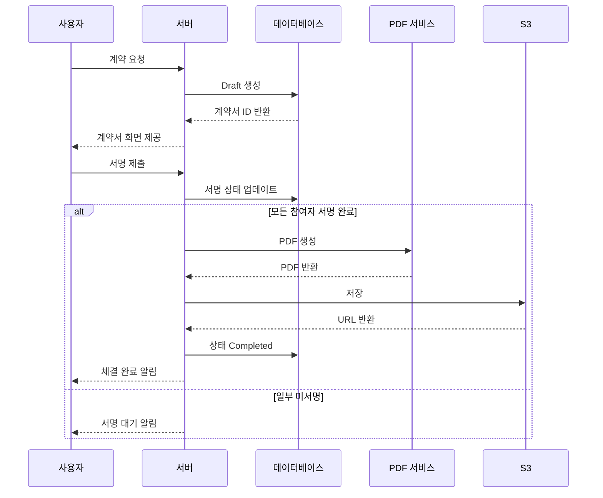

# 21앤 전자계약 플랫폼 — PG 없이 설계한 B2B2C 계약·정산 시스템

> 이 글은 토리스 대표가 21앤(21n) 재직 중 풀스택 개발자로 수행한 프로젝트를 케이스 스터디 형식으로 정리한 것입니다. 서비스 세부 계약·보안에 민감한 내용은 제외했으며, 실무 과정과 설계 판단을 중심으로 기록합니다.

## 1. 의뢰 배경 — 누구의 어떤 문제였나

21앤은 병원과 모델(사용자)을 연결하는 B2B2C 서비스를 만들고 있었습니다. 병원은 시술 모델을 모집하고, 모델은 시술을 받는 대신 초상권 제공 등의 계약을 체결하는 구조입니다. 이 거래가 성립하려면 최소 세 가지가 한 시스템 안에서 맞물려야 했습니다.

- **법적 효력이 있는 계약**: 초상권 동의서, 지불각서 같은 문서를 종이 없이 체결하고, 분쟁·감사에 대비해 추적 가능해야 합니다.
- **돈의 흐름**: 포인트 지급, 쿠폰, 계좌 송금 신청·조회 등 정산이 계약 상태와 어긋나지 않아야 합니다.
- **세 종류의 사용자**: 모델, 병원 관리자, 플랫폼 운영자(21앤)가 각자 다른 화면과 권한으로 같은 데이터를 봐야 합니다.

사용자 그룹별 요구를 정리하면 다음과 같습니다.

| 구분 | 플랫폼 | 핵심 기능 |
| --- | --- | --- |
| **사용자(모델)** | React Native 앱 | 전자서명·계약 확인, 캘린더, 초대코드 포인트, 계좌 송금 신청·조회, SNS 연동, 마이페이지, 알림, 소셜 로그인(네이버·카카오·페이스북·구글) |
| **병원 관리자** | 웹 | 병원·의사 정보, 계약서(초상권·지불각서 등) 관리, 모델 연결, 쿠폰, 정산·환급, 엑셀 다운로드 |
| **통합 관리자(21앤)** | 웹 | 대시보드, 병원·신청·사용자·쿠폰 관리, 포인트·송금 추적, 설정, 지표 |

저는 이 세 갈래 제품 전체 — React Native(Expo) 앱, NestJS 기반 API, Next.js 관리자 웹, Terraform 기반 인프라 — 를 풀스택으로 담당했습니다.

## 2. 제약 조건 — 왜 "PG 붙이면 끝"이 아니었나

이 프로젝트의 가장 큰 제약은 기술이 아니라 **도메인과 규제**였습니다.

### 2.1 의료·시술·중개가 겹치는 도메인

서비스가 단순 이커머스가 아니라 의료·시술·계약과 맞닿아 있었기 때문에, 의료법·의료광고·중개 관련 규정과 어떻게 겹치는지를 사업·법무와 함께 하나씩 짚어야 했습니다. 법률 해석은 전문가의 영역이므로, 개발 쪽에서는 "어떤 결제·정산 방식이 허용되는 그림인지"를 질문하고 문서로 남기는 역할에 집중했습니다.

### 2.2 PG사 정책

PG는 업종·상품·정산 구조에 따라 가입 제한이나 심사 보류가 걸릴 수 있습니다. 의료·미용·중개 성격이 섞인 우리 도메인에서는 "PG부터 붙이고 보자"는 선택지가 항상 열려 있지 않았습니다.

### 2.3 얇은 개발 조직

21앤은 마케팅에 강한 배경을 가진 조직에서 출발했고, 개발 인력은 한정적이었습니다. 풀스택 한 명이 앱·API·어드민·인프라를 동시에 봐야 하는 조건에서, 유지보수 부담이 큰 자체 구현(예: 전자서명 자체 개발)은 처음부터 후보에서 제외해야 했습니다.

### 2.4 제약이 만든 설계 결론

법·사업·PG 세 축이 동시에 YES여야 하는데 우리 도메인에서는 그것이 쉽지 않았습니다. 결론은 다음과 같았습니다.

- **PG 없이** 포인트·계좌·계약 흐름을 설계한다.
- 실제 송금·조회는 **KB국민은행 API**(계좌 조회·송금)로 처리한다.
- 법적 효력이 필요한 **전자서명은 모두싸인** 연동으로 가져간다.

검토·설득의 상세 과정은 [운영 회고 글](/posts/21n-fullstack-year-one-reflection)에 별도로 정리했습니다.

## 3. 기술 설계와 트레이드오프

### 3.1 스택 선택

| 영역 | 스택 | 선택 이유 / 비고 |
| --- | --- | --- |
| 앱 | React Native, **Expo** | 한 명이 iOS·Android를 동시에 커버. `react-native-calendars`, Noto Sans KR(`@expo-google-fonts/noto-sans-kr`, `expo-font`) |
| API | **NestJS**, tRPC, Docker | 전자서명·PDF·알림 등 도메인 API. tRPC로 프론트와 타입 공유 |
| 관리자 | **Next.js** | 통합 어드민·병원 어드민 |
| DB | **PostgreSQL**(RDS Multi-AZ) | 계약·포인트처럼 정합성이 중요한 도메인 |
| 파일 | S3 | 계약 PDF, 프로필 이미지 등 |
| 인프라 | **ECS Fargate**, ALB, **Terraform**, CloudWatch, WAF | 코드로 관리되는 인프라, 얇은 팀에 맞는 관리형 서비스 위주 |

### 3.2 모노레포 — 편의와 파급 리스크의 교환

앱·API·어드민이 같은 도메인 타입을 공유해야 했기 때문에 모노레포를 선택했습니다.

- `apps/admin` — 관리자 웹(Next.js)
- `apps/api` — 백엔드(NestJS)
- `apps/user-app` — 사용자 앱(Expo)
- `packages/*` — DB·공유 모듈 등
- `docs/*` — 앱·인프라 문서

로컬 개발은 루트 `docker-compose.yml`로 admin·api·postgres를 한 번에 띄우고, `.env.example`을 `.env.development`로 복사해 기동하는 흐름으로 표준화했습니다.

트레이드오프는 명확했습니다. 타입·상수 공유는 편하지만, 공유 모듈의 실수 하나가 세 앱에 동시에 파급됩니다. 그래서 "공유는 최소한만"을 원칙으로 삼았습니다. 완벽한 DRY보다 배포 리스크가 낮은 구조를 우선한 것입니다.

### 3.3 전자서명 — 자체 구현을 버리고 모두싸인을 택한 이유

전자계약서·전자서명을 자체 구현하면 초기 비용은 아낄 수 있지만, 법적 효력·감사 추적·분쟁 대응까지 자체 부담이 됩니다. 얇은 개발 조직에서 감당할 리스크가 아니라고 판단해, 모두싸인의 기업 가입·인증·템플릿·API·웹훅까지 준비한 뒤 백엔드·앱·어드민에 녹였습니다. 연동 설계에서 지킨 원칙은 세 가지입니다.

- **환경 분리**: API 키·웹훅 시크릿·템플릿 ID를 dev/stage/prod로 나눠, 실수로 운영 템플릿을 건드리지 않게 구성
- **웹훅 멱등**: 동일 이벤트가 여러 번 와도 상태가 한 번만 전이되도록 우리 DB의 상태 머신과 맞춰 처리
- **상태의 원천 합의**: 서명 진행 중간 상태를 우리 DB에 둘지, 모두싸인 상태만 신뢰할지를 팀과 명시적으로 합의

### 3.4 PDF 파이프라인 — 동기 API를 버리고 큐를 선택

HTML 템플릿 기반 계약을 PDF로 변환하고, 타임스탬프·해시 등으로 감사 가능성을 확보해야 했습니다. Puppeteer 기반 PDF 생성은 무겁고 비용(시간·과금)이 동시에 나가는 작업이라, 동기 API로 붙이지 않고 큐 기반 비동기 처리로 API 응답과 워커 부하를 분리했습니다.

체결 플로우를 단순화한 시퀀스입니다.

### 3.5 포인트·쿠폰·SNS — 규칙을 코드보다 먼저 고정

- **포인트**: 초대코드 입력 시 지급(관리자 배정) 등 지급 규칙을 먼저 명문화하고, 지급이 정확히 한 번만 일어나도록 멱등 처리
- **쿠폰**: 병원별 발급·사용 추적이 가능한 구조
- **SNS 연동**: YouTube·TikTok·네이버 블로그는 OAuth 2.0 연동을 전제로 하되, 인스타그램은 플랫폼 정책상 범위를 좁혀 설계

### 3.6 비용을 설계 변수로 취급

전자서명 SaaS·클라우드·은행 연동에는 건당·월정액 과금이 붙습니다. 기능을 다 만든 뒤 비용을 확인하면 곡선이 예상과 어긋나기 쉽기 때문에, 처음부터 두 가지를 설계에 포함했습니다.

- **단계적 롤아웃**: MVP 구간에 꼭 필요한 API·템플릿만 켜고, 나머지는 플래그·환경 변수로 막아 "나중에 필요하면 연다"를 코드와 설정으로 명시
- **비동기·재시도 정책**: 불필요한 외부 호출을 줄여 과금과 장애 리스크를 동시에 관리

수치 정리와 트레이드오프 기록 방식은 [회고 글](/posts/21n-fullstack-year-one-reflection) §4에 이어집니다.

## 4. 이해관계자와의 조율 — 이 프로젝트의 실제 난이도

기술 스택보다 어려웠던 것은 사람과 조직 간의 언어를 맞추는 일이었습니다.

### 4.1 사업·법무와: 규제를 문서로 좁히기

"PG를 왜 못 붙이는가"는 개발자 혼자 결론 낼 수 있는 문제가 아니었습니다. 의료법·의료광고·중개 관련 키워드를 사업·법무와 함께 하나씩 짚으며, 개발 입장에서는 "허용되는 결제·정산의 그림"을 질문하고 그 답을 문서로 남겼습니다. 이렇게 "왜 PG가 안 되는지"를 한 페이지로 정리해 두자, 이후 합류하는 구성원이나 외부 파트너에게 같은 설명을 반복하지 않아도 되었습니다.

### 4.2 마케팅 중심 조직과: 일정과 언어의 간극

21앤은 캠페인·브랜딩·클라이언트 커뮤니케이션에 익숙한 구성원이 다수인 조직입니다. "빨리 런칭"이 마케팅 일정과 맞물릴 때 기술 부채·보안·테스트의 필요성을 설명하는 데 에너지가 들었고, "이거 간단하지?"라는 요청이 데이터·권한·외부 연동까지 얽혀 있어 간단하지 않다는 것을 풀어 설명해야 하는 일이 반복됐습니다.

이 간극을 줄인 방법은 기능을 "API 엔드포인트"가 아니라 **고객 여정과 전환**의 언어로 설명하는 것, 그리고 비용·과금·롤아웃 판단을 표와 설정으로 남겨 반복 설명을 없애는 것이었습니다. 결과적으로 비즈니스 설명력과 문서화 역량이 이 조율 과정에서 가장 빠르게 늘었습니다.

### 4.3 외부 파트너와: 신청은 시작일 뿐

모두싸인은 기업 가입·인증·템플릿 등록을 거쳐야 실제 API를 쓸 수 있습니다. "신청했다"에서 끝이 아니라 등록 이후에야 진짜 연동 개발이 시작되며, 서명 실패·타임아웃이 발생했을 때 어디까지가 우리 버그이고 어디부터가 외부 이슈인지 로그로 구분할 수 있어야 파트너와의 커뮤니케이션이 성립합니다.

## 5. 결과와 운영

- 병원·모델·운영자 세 사용자 그룹이 각자의 채널(앱·병원 어드민·통합 어드민)에서 **하나의 계약·포인트·정산 도메인**을 다루는 구조가 만들어졌습니다.
- PG 없이도 서비스 요구를 만족시키는 계약 → 서명 → PDF 보관 → 포인트·송금 흐름이 코드와 인프라로 끝까지 이어졌습니다.
- 환경 변수 기반 배포(dev/stage/prod), Terraform 코드화, docker-compose 로컬 환경으로 얇은 팀에서도 배포·온보딩 비용을 낮췄습니다.
- 커뮤니티, 병원별 거래 모니터링, 분석·리포팅이 로드맵에 있어, 지표·이벤트 설계를 API와 어드민에 녹여 가는 단계였습니다.

## 6. 재사용 가능한 교훈

1. **상태 머신과 권한 모델을 화면보다 먼저 그린다.** 한 도메인을 앱·API·어드민·인프라까지 이어 붙이려면, 계약 상태·포인트·송금 같은 상태 전이와 권한을 먼저 고정해 두는 것이 이후 모든 화면·API 개발 속도를 결정합니다.
2. **외부 연동은 실패 시나리오부터 설계한다.** 전자계약·PDF·은행 연동에 실패·재시도·멱등을 초기에 넣지 않으면 운영 단계에서 비용이 훨씬 커집니다.
3. **규제 제약은 기능보다 먼저 확인한다.** 기능을 만들고 규제를 끼워 맞추면 비용이 폭발합니다. "왜 안 되는지"를 한 페이지로 남기는 것이 팀의 속도입니다.
4. **모노레포의 공유는 최소한만.** 공유 타입·DB 마이그레이션·환경 변수 네이밍을 팀 규칙으로 고정하면 merge 비용이 줄고, 과도한 공유는 배포 리스크가 됩니다.
5. **비용은 기획의 일이 아니라 설계 변수다.** 건당 과금이 붙는 외부 서비스는 플래그·큐·재시도 정책과 함께 설계해야 곡선이 무너지지 않습니다.

**이어 읽기**: [마케팅 조직의 풀스택 1년 — 운영 회고](/posts/21n-fullstack-year-one-reflection)

---

_이 글은 재직 당시의 경험을 바탕으로 한 케이스 스터디이며, 서비스 세부 계약·보안에 민감한 내용은 포함하지 않았습니다._
