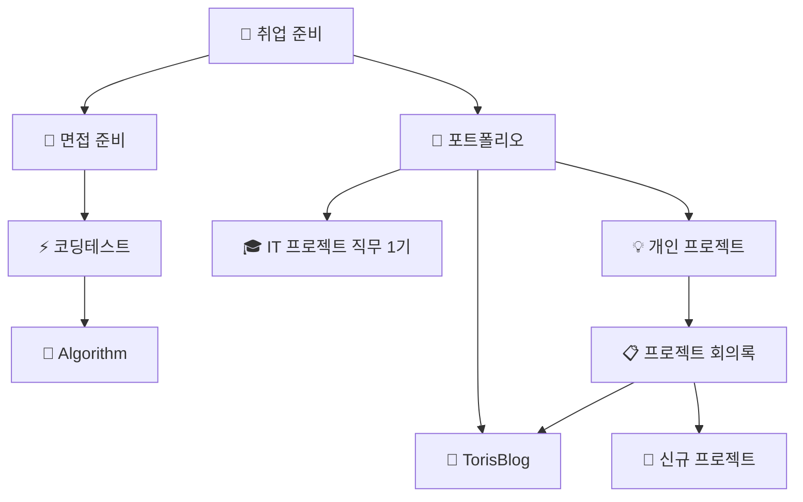

# 🚀 개발 프로젝트 허브

> 현재 진행 중인 프로젝트와 포트폴리오의 중심지

## 🎯 현재 진행 중인 프로젝트

### 🏆 **취업 준비 (최우선)**

- **목표**: 풀스택 개발자 (프론트엔드 중심)
- **진행 상황**: 포트폴리오 정리, 기술 면접 준비, 코딩테스트 대비
- **핵심 역량**: TypeScript, React, Node.js, 팀 협업, 실무 경험

### 💡 **개인 프로젝트 구상**

- **아이디어 단계**: 지역 기반 공동구매 플랫폼
- **기술 검토**: PWA, 실시간 채팅, 결제 시스템
- **차별화 포인트**: 지역 커뮤니티 + 소상공인 지원

## 📁 프로젝트 생태계 맵

### 🔄 **전체 프로젝트 연결 구조**

### 🎓 **기술 역량 강화 트랙**

#### 📚 **알고리즘 마스터리**

- **알고리즘 기초** ↔ **코딩테스트 실전**
  - 이론 학습 → 실전 문제 풀이 → 면접 대비
  - 상호 피드백: 알고리즘 개념을 코딩테스트에서 실전 적용
  - 성장 추적: 취업 준비 과정에서 역량 발전 기록

#### 💻 **실무 프로젝트 경험**

- **교육 프로젝트** → **개인 블로그** → **창의적 프로젝트**
  - IT 프로젝트 직무 1기 → TorisBlog → 개인 프로젝트
  - 기술 스택 진화: JSP/Spring → Next.js/TypeScript → 최신 기술 도입
  - 포트폴리오 다양성: 각 프로젝트별 어필 포인트 정리

### 🚀 **프로젝트 기획 및 실행 트랙**

#### 💡 **아이디어 → 실행 파이프라인**

- **프로젝트 회의록** → **개인 프로젝트** → **TorisBlog**
  - 기획 회의 → 프로젝트 개발 → 블로그 정리/공유
  - 실현 사례: 포트폴리오 매칭 사이트 기획 → DevCV 프로젝트 실행
  - 기술 블로그: 개발 과정과 학습 내용을 TorisBlog에서 정리

#### 🎯 **취업 연계 전략**

- **모든 프로젝트** → **취업 준비** → **면접 스토리 완성**
  - 각 프로젝트에서 얻은 경험을 취업 준비에서 어필 포인트로 정리
  - 차별화 포인트: Algorithm + 실무 프로젝트 + 개인 블로그의 시너지

## 🔗 개발 영역과의 연결

### 📚 **기술 학습 연계**

- **기술 스택 확장**: 학습 자료를 프로젝트에 즉시 적용
- **실무 적용**: 학습한 내용을 실제 프로젝트에서 검증
- **문제 해결**: 프로젝트 중 만난 문제들을 체계적으로 정리

### 💡 **아이디어 발전**

- **개발 경험**: 일일 작업 진행 상황 추적
- **과거 경험**: 이전 프로젝트 경험 활용 및 개선
- **기술 트렌드**: 최신 기술 동향을 프로젝트에 반영

### 🎨 **개발 도구 활용**

- **시스템 설계**: 아키텍처 시각화 및 설계 문서
- **프로젝트 관리**: 개발 템플릿 및 워크플로우 활용
- **포트폴리오 자료**: 프로젝트 스크린샷 및 시연 자료

## 🎯 진행 전략

### 📊 **통합 취업 준비 로드맵**

#### 1️⃣ **포트폴리오 완성 (프로젝트 간 시너지)**

**완료된 프로젝트들**:

- **Inssiders**: PWA 기반 트렌드 큐레이션 플랫폼 ← 실무 교육 경험 활용
- **DevCV**: 개발자 이력서 공유 플랫폼 ← 회의록 아이디어 실현
- **TorisBlog**: 기술 블로그 ← 모든 프로젝트 정리 허브

**각 프로젝트의 상호 보완**:

- DevCV (백엔드 중심) + Inssiders (프론트엔드 중심) + TorisBlog (풀스택) = **완전한 역량 증명**

#### 2️⃣ **신규 프로젝트 (기존 경험 융합)**

**지역 기반 공동구매 플랫폼**:

- 알고리즘 + 코딩테스트 → **매칭 알고리즘** 설계
- 개인 프로젝트 → **프로토타입** 개발
- TorisBlog → **개발 과정** 기록 및 홍보

#### 3️⃣ **기술 역량 강화 (통합 학습)**

**현재 기술 스택**: TypeScript, React, Java, Spring + JSP
**목표 기술 스택**: 풀스택 개발자 (프론트엔드 중심)

**학습 → 적용 → 정리 사이클**:

- 알고리즘 학습 → 코딩테스트 실전 → 프로젝트 적용 → 블로그 정리

### 💰 **프로젝트 우선순위**

1. **즉시 실행**: 취업 준비 관련 작업 (포트폴리오, 면접 준비)
2. **병행 진행**: 새로운 프로젝트 기획 및 프로토타입
3. **지속적 개선**: 기존 프로젝트 유지보수 및 기능 개선

## 📈 성과 지표

### 🎯 **완료된 프로젝트 (검증된 역량)**

- **3개의 완성된 프로젝트**: 기획부터 배포까지 전 과정 경험
- **다양한 기술 스택**: TypeScript, React, Java, microservices
- **실무 경험**: 팀 협업, 이벤트 관리, 디자이너/기획자 협업

### 🚀 **현재 진행 상황**

- **매일 업데이트**: 일일 기록으로 진행 상황 추적
- **체계적 관리**: 프로젝트별 상세 기록 및 회고
- **지속적 개선**: 피드백 반영 및 프로세스 최적화

### 🔧 **기술 성장 지표**

- **코딩테스트 성과**: 알고리즘 문제 해결 능력 향상
- **프로젝트 완성도**: 배포 가능한 수준의 프로젝트 완성
- **기술 블로그**: 학습 내용 및 경험 공유

## 🛠️ 개발 프로젝트 관리

### **프로젝트 라이프사이클**

1. **기획 단계**: 요구사항 분석, 기술 스택 선정
2. **개발 단계**: 기능 구현, 테스트 작성
3. **배포 단계**: 프로덕션 배포, 운영 모니터링
4. **회고 단계**: 성과 분석, 개선점 도출

### **기술 스택 관리**

- **Frontend**: React, TypeScript, Next.js
- **Backend**: Node.js, Express, Spring Boot
- **Database**: MongoDB, PostgreSQL
- **DevOps**: Docker, AWS, Vercel

### **협업 도구**

- **버전 관리**: Git, GitHub
- **프로젝트 관리**: Notion, Jira
- **커뮤니케이션**: Slack, Discord

## 🎯 미래 계획

### **단기 목표 (3개월)**

- 취업 준비 완료 및 면접 통과
- 신규 프로젝트 프로토타입 완성
- 기술 블로그 정기 포스팅

### **중기 목표 (6개월)**

- 풀스택 개발자로 입사 및 적응
- 개인 프로젝트 서비스 런칭
- 기술 커뮤니티 활동 참여

### **장기 목표 (1년)**

- 시니어 개발자로 성장
- 오픈소스 프로젝트 기여
- 개발 강의 또는 멘토링 활동

---

_현재 진행 중인 모든 개발 프로젝트의 허브이자, 풀스택 개발자로 성장하는 여정의 기록! 🚀_

#DevProject #Portfolio #FullStack #TechStack #Career #Development
