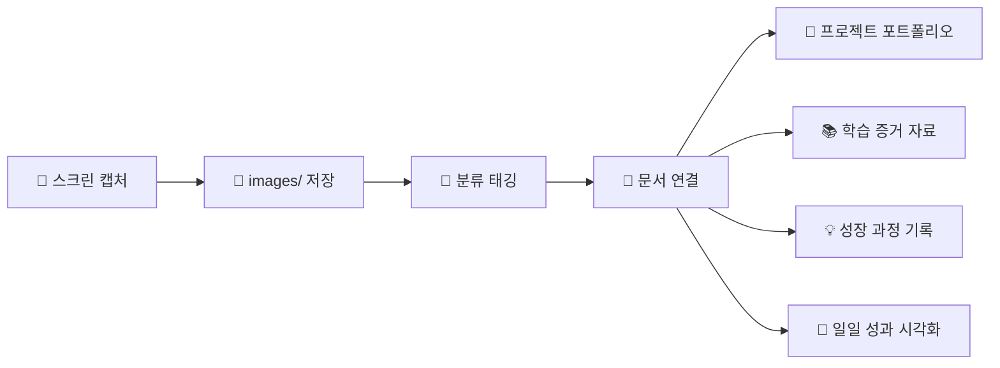

# 📸 Visual Assets Hub

> 모든 프로젝트와 학습이 시각적으로 기록되고 활용되는 곳

## 📁 이미지 활용 체계

### 🚀 프로젝트별 시각 자료

```dataview
LIST
FROM "images"
WHERE file.name != "README"
SORT file.name DESC
```

### 📊 이미지 사용 현황 (자동)

```dataview
TABLE WITHOUT ID
  file.link as "📸 이미지",
  file.size as "📊 크기",
  file.mtime as "📅 추가일"
FROM "images"
WHERE file.name != "README"
SORT file.size DESC
LIMIT 10
```

### 🎯 프로젝트별 이미지 분류 (자동)

```dataview
TABLE WITHOUT ID
  choice(contains(file.name, "project"), "🚀 프로젝트", choice(contains(file.name, "learn"), "📚 학습", choice(contains(file.name, "ui"), "🎨 UI/UX", "📝 일반"))) as "📂 카테고리",
  count(rows) as "📊 수량"
FROM "images"
WHERE file.name != "README"
GROUP BY choice(contains(file.name, "project"), "🚀 프로젝트", choice(contains(file.name, "learn"), "📚 학습", choice(contains(file.name, "ui"), "🎨 UI/UX", "📝 일반")))
```

## 🔗 전체 폴더 연결망

### 🚀 **[[🚀 프로젝트 허브|01-Project]]** 연결

**프로젝트 포트폴리오 시각화**:

- **[[🚀 프로젝트 허브|TorisBlog]]** 스크린샷 → 기술 블로그 시연 이미지
- **[[🚀 프로젝트 허브|DevCV]]** UI 캡처 → 개발자 이력서 플랫폼 화면
- **[[🚀 프로젝트 허브|Inssiders]]** 데모 → PWA 트렌드 큐레이션 결과물
- **[[🚀 프로젝트 허브|취업 준비]]** 자료 → 포트폴리오 이미지 및 증명 자료

**실제 활용**:

```dataview
LIST
FROM "images"
WHERE contains(file.name, "project") OR contains(file.name, "portfolio")
```

### 🌱 **[[🌱 개인 성장 영역|02-Area]]** 연결

**개인 성장 시각 기록**:

- **[[🌱 개인 성장 영역|에쎄이]]** 삽화 → 개발 경험담에 스크린샷 증거 추가
- **[[🌱 개인 성장 영역|투자]]** 차트 → 금융 학습 결과 및 투자 성과 이미지
- **[[🌱 개인 성장 영역|노트장]]** 아이디어 → 스케치나 참고 이미지
- **[[🌱 개인 성장 영역|가치관 일기]]** 비전 → 목표 시각화 및 동기 부여 이미지

**성장 과정 기록**:

- Before & After 스크린샷으로 기술 발전 과정 시각화
- 학습 인증서, 수료증 등 성취 기록
- 개발 환경 변화 스크린샷 (과거 vs 현재)

### 📚 **[[📚 학습 자료실|03-Resource]]** 연결

**학습 증거 수집**:

- **[[📚 학습 자료실|react]]** 실습 → 컴포넌트 구현 스크린샷
- **[[📚 학습 자료실|css]]** 연습 → 스타일링 결과 캡처
- **[[📚 학습 자료실|블록체인]]** 학습 → DeFi 인터페이스, 거래 화면
- **[[📚 학습 자료실|Devops]]** 구축 → CI/CD 파이프라인, 배포 과정 이미지
- **[[📚 학습 자료실|Blog]]** 작성 → 블로그 포스트 썸네일, 조회수 등

**학습 과정 시각화**:

- 에러 화면 → 해결 과정 → 성공 결과의 3단계 기록
- 코드 실행 결과 비교 (개선 전후)
- 새로운 도구/프레임워크 학습 진행 과정

### 📁 **[[📁 아카이브 보관소|04-Archive]]** 연결

**과거 자료 시각 보존**:

- **[[📁 아카이브 보관소|Java]]** 프로젝트 → 과거 Java 애플리케이션 UI
- **[[📁 아카이브 보관소|image]]** → 기존 이미지들과 현재 images 폴더 연계
- **[[📁 아카이브 보관소|neovim]]** → 과거 개발 환경 설정 스크린샷

**기술 진화 비교**:

- 과거 프로젝트 vs 현재 프로젝트 UI 발전 과정
- 개발 도구 변화 (neovim → VSCode 등)
- 기술 스택 업그레이드 시각 비교

### 🎨 **[[🎨 시각화 허브|Excalidraw]]** 연결

**창작 과정 시너지**:

- **Excalidraw 스케치** → **구현 결과** → **Images 스크린샷**
- 아이디어 다이어그램 → 실제 개발 → 완성 화면 순서로 기록
- 프로젝트 아키텍처 설계도 → 구현 과정 → 최종 결과물

**아이디어 → 현실 변환**:

- [[🎨 시각화 허브|Drawing 2024-01-02 13.46.59.excalidraw]] 기획 → 실제 구현 스크린샷
- 와이어프레임 → 목업 → 실제 개발 결과 비교
- UX 플로우 다이어그램 → 실제 사용자 경험 화면

### 📅 **[[📅 일일 작업 허브|task]]** 연결

**일일 성과 시각적 기록**:

- **매일의 작업 결과** → 스크린샷으로 진행 상황 증명
- **[[📅 일일 작업 허브|2024-07-03]]** 같은 대용량 기록 → 주요 성취 이미지
- **학습 인증** → 새로 배운 기술의 실행 결과 화면
- **문제 해결** → 에러 → 해결 과정의 시각적 기록

**성장 추적**:

- 일일 커밋 그래프, 코드 통계 등 개발 활동 지표
- 새로운 도구 사용법 학습 과정
- 프로젝트 진행 단계별 스크린샷

### 📝 **[[📝 템플릿 허브|template]]** 연결

**템플릿 시각적 활용**:

- **[[📝 템플릿 허브|📖 Todo-List]]** → 할일 완료 스크린샷, 진행 상황 이미지
- **[[📝 템플릿 허브|🔮 Blog]]** → 블로그 포스트 썸네일, 조회수 등 성과 이미지
- **[[📝 템플릿 허브|🏆 Project]]** → 프로젝트 단계별 결과물 이미지

**템플릿 강화**:

- 각 템플릿에 관련 이미지 삽입으로 문서 품질 향상
- 시각적 가이드라인 제공
- 실제 사용 사례 이미지로 템플릿 설명 보완

## 🎯 이미지 워크플로우

### 📸 캡처 → 정리 → 활용 파이프라인



### 🔄 시각 자료 순환 체계

- **아이디어** (📝 [[🌱 개인 성장 영역|노트장]]) → **스케치** ([[🎨 시각화 허브|Excalidraw]]) → **구현** → **결과 캡처** ([[📸 이미지 허브|images]]) → **포트폴리오** ([[🚀 프로젝트 허브|프로젝트]])

### 📊 실시간 이미지 활용 현황

```dataview
TABLE WITHOUT ID
  substring(file.name, 0, 10) as "📅 날짜",
  count(rows) as "📊 이미지 수",
  sum(file.size) as "💾 총 용량"
FROM "images"
WHERE file.name != "README"
GROUP BY substring(file.name, 0, 10)
SORT substring(file.name, 0, 10) DESC
LIMIT 10
```

## 🎨 시각적 스토리텔링

### 📱 UI/UX 포트폴리오 구성

1. **와이어프레임** ([[🎨 시각화 허브|Excalidraw]])
2. **구현 과정** ([[📅 일일 작업 허브|일일 기록]])
3. **최종 결과** ([[📸 이미지 허브|images]])
4. **사용자 피드백** ([[🌱 개인 성장 영역|에쎄이]])

### 🚀 프로젝트 발전 과정

- **초기 버전** → **개선 과정** → **최종 완성** 의 시각적 스토리
- Before & After 비교로 개발 역량 성장 증명
- 문제 상황 → 분석 → 해결 과정의 단계별 기록

### 📈 학습 성과 시각화

- **새로운 기술 첫 실행** → **연습 과정** → **프로젝트 적용** → **마스터리 달성**
- 에러 화면 컬렉션 → 문제 해결 능력 증명
- 도구 사용법 익히기 → 효율성 개선 과정

## 🔧 이미지 관리 자동화

### 📂 자동 분류 시스템

```markdown
이미지 파일명 규칙:

- project*프로젝트명*날짜.png
- learn*기술명*날짜.png
- ui*프로젝트명*날짜.png
- achievement*성취내용*날짜.png
```

### 🏷️ 태그 시스템

- `#스크린샷` - 실제 작업 결과 화면
- `#포트폴리오` - 프로젝트 시연용 이미지
- `#학습증거` - 새로 배운 내용 실행 결과
- `#성장기록` - 발전 과정을 보여주는 비교 이미지
- `#문제해결` - 에러 해결 과정 기록

---

_모든 프로젝트와 학습이 시각적으로 기록되고 활용되는 곳입니다! 📸✨_

#허브 #시각화 #프로젝트 #포트폴리오 #스크린샷 #증거
