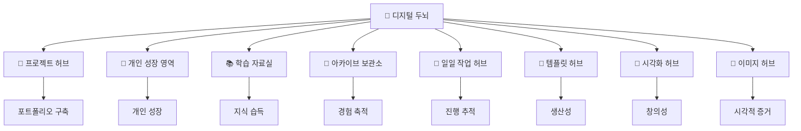

# 🧠 Digital Brain - PARA Knowledge System

> 프로젝트, 학습, 성장이 유기적으로 연결되는 지식 관리 허브

## 🗂️ 폴더 구조 및 연결망



## 📁 폴더별 세부 역할

### 🚀 **[[01-Project/🚀 프로젝트 허브]]** - Project Hub

**현재 진행 프로젝트의 중심지**

- **취업 준비** (최우선): 포트폴리오, 자소서, 면접 준비
- **TorisBlog**: 기술 블로그 운영 및 개발
- **개인 프로젝트**: 창의적 아이디어 실현
- **기술 역량**: Algorithm, 코딩테스트 마스터리

### 🌱 **[[02-Area/🌱 개인 성장 영역]]** - Personal Growth

**개인적 관심사와 성장 기록**

- **투자 지식**: 금융 이해도 및 투자 경험
- **에세이 작성**: 개발 경험 글로 정리
- **가치관 정립**: 개발자로서의 철학과 방향성
- **일상 아이디어**: 창의적 사고와 메모

### 📚 **[[03-Resource/📚 학습 자료실]]** - Learning Center

**기술 학습과 자료 보관소**

- **React/TypeScript**: 프론트엔드 전문성
- **DevOps**: 배포 및 운영 기술
- **블록체인**: 미래 기술 대비
- **글쓰기**: 블로그 운영 및 소통 능력

### 📁 **[[04-Archive/📁 아카이브 보관소]]** - Knowledge Archive

**과거 경험과 자료 보존**

- **Java 프로젝트**: 과거 개발 경험
- **개발 환경**: 도구 설정 및 최적화 기록
- **시각 자료**: 과거 프로젝트 이미지들
- **성장 과정**: 기술 발전 추적

### 📅 **[[task/📅 일일 작업 허브]]** - Daily Progress

**일일 작업 기록과 성장 추적**

- **Dataview 자동화**: 실시간 진행 상황 업데이트
- **템플릿 연동**: 구조화된 기록 관리
- **성과 분석**: 작업 패턴 및 성장 추이
- **목표 달성**: 단계별 진행 상황 모니터링

### 📝 **[[template/📝 템플릿 허브]]** - Productivity Templates

**생산성 극대화 도구**

- **Todo-List**: 체계적 할일 관리
- **Blog**: 구조화된 글쓰기
- **Project**: 프로젝트 관리 템플릿
- **워크플로우**: 일관된 작업 프로세스

### 🎨 **[[Excalidraw/🎨 시각화 허브]]** - Visual Thinking

**아이디어 시각화 공간**

- **프로젝트 설계**: 시스템 아키텍처 다이어그램
- **개념 정리**: 복잡한 아이디어 구조화
- **학습 도구**: 마인드맵 및 플로우차트
- **창작 도구**: 브레인스토밍 및 기획

### 📸 **[[images/📸 이미지 허브]]** - Visual Assets

**시각적 자료 저장소**

- **프로젝트 스크린샷**: 개발 결과물 시연
- **학습 증거**: 기술 습득 과정 기록
- **성장 기록**: Before & After 비교
- **포트폴리오**: 시각적 어필 자료

## 📊 주요 워크플로우

### 💡 아이디어 → 실현 파이프라인

```
💡 아이디어: Areas → Excalidraw → Projects
📚 학습: Resources → images → Projects
📝 기록: Templates → Task → Growth
🎨 시각화: Excalidraw → images → Portfolio
📁 보관: Projects → Archive → Knowledge
🔄 순환: Task → Template → Project → Area
```

### 🔄 지속적 개선 사이클

**Plan** ([[📝 템플릿 허브|Templates]]) → **Do** ([[🚀 프로젝트 허브|Projects]]) → **Check** ([[📅 일일 작업 허브|Tasks]]) → **Act** ([[🌱 개인 성장 영역|Areas]])

## 🎯 실제 활용 예시

### 💰 금융 프로젝트 개발 과정

1. **[[🌱 개인 성장 영역|투자]]** 지식 습득 → **[[🎨 시각화 허브|Excalidraw]]** 설계
2. **[[📚 학습 자료실|블록체인]]** 기술 학습 → **[[🚀 프로젝트 허브|개인 프로젝트]]** 구현
3. **[[📅 일일 작업 허브|일일 기록]]** 진행 추적 → **[[📸 이미지 허브|images]]** 결과 캡처

### 📝 포트폴리오 구축 전략

1. **[[📁 아카이브 보관소|과거 경험]]** 정리 → **[[🌱 개인 성장 영역|에세이]]** 경험담 작성
2. **[[🚀 프로젝트 허브|프로젝트]]** 개발 → **[[📸 이미지 허브|images]]** 시각 자료 수집
3. **[[📝 템플릿 허브|템플릿]]** 활용 → **일관된 문서화** → **취업 준비**

### 🚀 기술 학습 효율화

1. **[[📚 학습 자료실|Resources]]** 자료 수집 → **[[🎨 시각화 허브|Excalidraw]]** 개념 정리
2. **[[📝 템플릿 허브|Blog]]** 템플릿 → **학습 내용 구조화** → **지식 내재화**
3. **[[📅 일일 작업 허브|task]]** 기록 → **실습 프로젝트** → **포트폴리오 추가**

### 🎨 아이디어 발전 과정

1. **[[🌱 개인 성장 영역|노트장]]** 초기 아이디어 → **[[🎨 시각화 허브|Excalidraw]]** 구체화
2. **[[📝 템플릿 허브|Project]]** 계획 수립 → **[[🚀 프로젝트 허브|실제 개발]]**
3. **[[📅 일일 작업 허브|진행 기록]]** → **[[📸 이미지 허브|성과 시각화]]** → **성장 확인**

## 🌟 시스템의 핵심 가치

### 🔗 **완전한 연결성**

- 모든 폴더가 서로 참조하며 유기적 네트워크 형성
- 아이디어 → 학습 → 실행 → 성장의 완전한 순환 구조
- 과거 경험이 현재 프로젝트에 지속적으로 기여

### 🤖 **자동화와 효율성**

- **Dataview** 플러그인으로 실시간 통계 및 현황 자동 업데이트
- **Template** 시스템으로 일관된 문서 구조 유지
- **태그 시스템**으로 그래프 뷰 최적화 및 검색 효율성

### 📈 **지속적 성장**

- 매일의 작업이 자동으로 성장 지표로 전환
- 실패와 성공 모두 학습 자료로 활용
- 과거-현재-미래가 연결된 발전 로드맵

### 🎯 **실용적 결과**

- **포트폴리오**: 체계적으로 정리된 프로젝트 결과물
- **취업 준비**: 모든 경험이 취업에 직결되는 스토리
- **기술 역량**: 지속적 학습과 실습의 선순환

## 🚀 활용 팁

### 📱 일일 사용법

1. **아침**: [[📝 템플릿 허브|📖 Todo-List]] 템플릿으로 하루 계획
2. **작업 중**: [[📅 일일 작업 허브|task/날짜]] 파일에 실시간 기록
3. **저녁**: 완료된 작업 스크린샷을 [[📸 이미지 허브|images]]에 저장
4. **주말**: [[🌱 개인 성장 영역|가치관 일기]]에 주간 회고

### 🔧 시스템 유지 관리

- **월 1회**: Archive 폴더 정리 및 불필요한 파일 삭제
- **분기별**: 전체 시스템 연결성 점검 및 개선
- **반기별**: 목표 달성도 평가 및 시스템 업그레이드

---

_이 허브를 통해 프로젝트, 학습, 성장이 유기적으로 연결되어 시너지를 만들어가는 것이 목표입니다! 🎯_

#허브 #지식관리 #PARA #성장 #프로젝트 #학습 #시각화 #자동화
