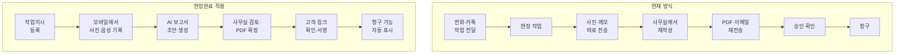
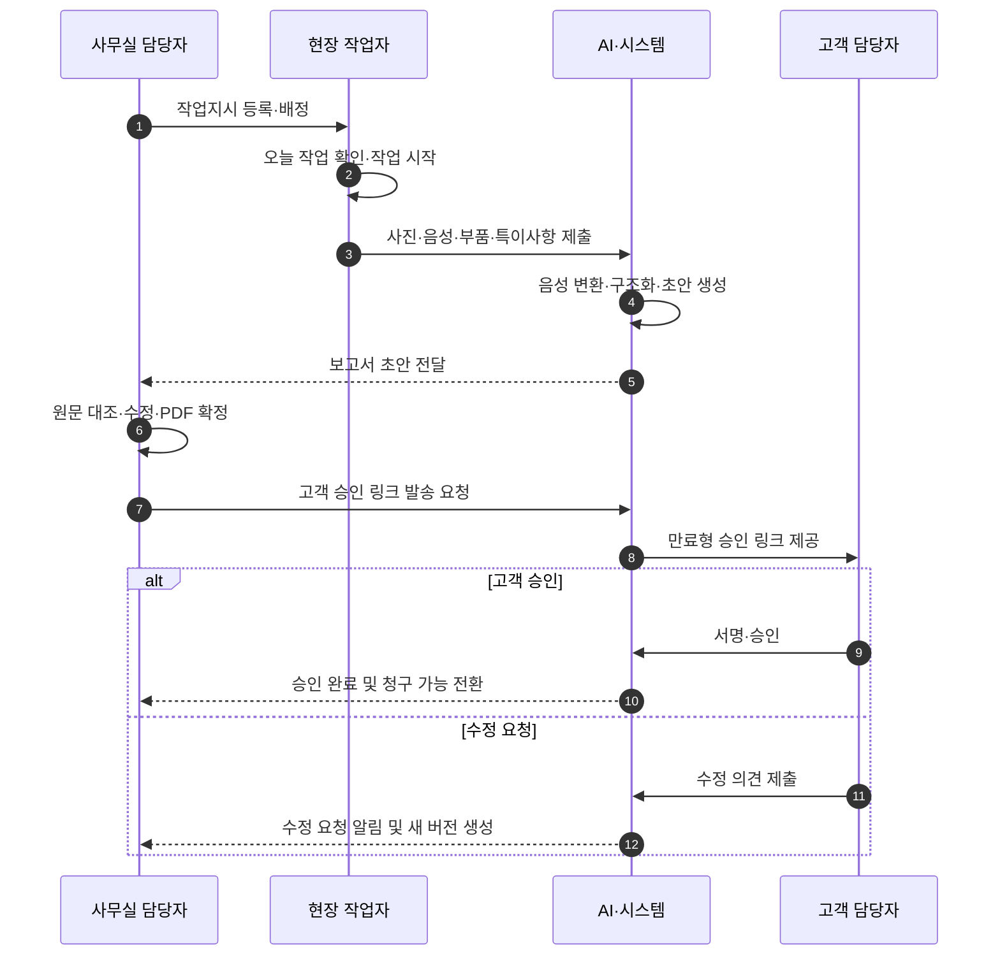
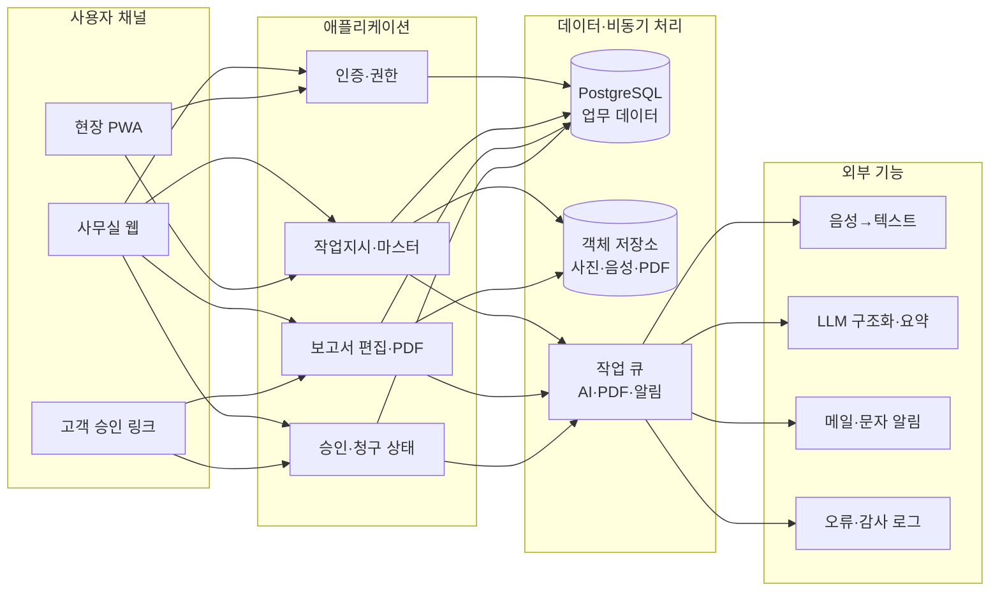

# 현장완료

**B2B FIELD SERVICE SaaS · 현장 작업·완료보고·청구 자동화**

> **사진과 음성만 남기면**
>
> **회사 양식의 작업완료보고서가 만들어집니다.**
>
> 작업지시 → 현장기록 → AI 초안 → 고객 확인·서명 → 청구 가능

| **문서 버전** | v1.0                                                            |
|---------------|-----------------------------------------------------------------|
| **작성일**    | 2026.07.22                                                      |
| **1차 타깃**  | 산업설비·공조 유지보수 업체 / 직원 3~30명                       |
| **제품 형태** | 반응형 웹 + PWA / 조직별 구독형 SaaS                            |
| **MVP 목표**  | 작업보고서 작성시간 단축, 승인 누락 감소, 청구 가능 시점 가시화 |
| **핵심 원칙** | 범용 현장관리 ERP를 만들지 않고 보고서·승인·청구 흐름에 집중    |

제품·사업·개발 의사결정을 위한 기준 문서

## 바이브코딩 사용 지침

이 파일을 저장소의 `PRD.md` 또는 `docs/PRD.md`에 두고 제품 요구사항의 **단일 기준(Source of Truth)** 으로 사용합니다.

- 최초 구현 범위는 **P0 기능과 B-01~B-17 백로그**로 제한합니다.
- 넓은 기능을 동시에 만들지 말고, **조직·권한 → 고객사·현장·장비 → 작업지시 → 현장 기록 → AI 초안 → PDF → 고객 승인 → 청구 가능** 순서로 한 건의 작업이 끝까지 흐르는 수직 슬라이스를 완성합니다.
- P1·P2·OUT 기능은 별도 범위 변경 전에는 구현하지 않습니다.
- 각 기능은 해당 `FR`의 완료 기준과 `19.2 공통 Definition of Done`을 모두 만족해야 완료로 처리합니다.
- 불명확한 부분에서 대형 기능을 임의로 추가하지 말고, `C.3 개발 착수 전 최종 결정 8가지`와 가장 단순한 MVP 원칙을 적용합니다.
- 요구사항을 변경할 때는 코드보다 먼저 이 문서의 범위, 상태 모델, 데이터 모델, 수용 기준을 갱신합니다.

### 코딩 에이전트 시작 프롬프트

```text
이 PRD를 제품 요구사항의 단일 기준으로 읽어라.
먼저 P0 수직 흐름, 역할별 권한, 상태 전이, 핵심 데이터 모델을 요약하라.
그다음 B-01부터 구현 가능한 작은 작업으로 분해하고 각 작업에 관련 FR ID,
수용 기준, 테스트 항목, 완료 조건을 연결하라.
P1·P2·OUT 범위는 구현하지 말고, 한 단계가 검증되기 전 다음 단계로 넘어가지 마라.
```

---

# 0. 문서 요약
무엇을 만들고, 누구에게 팔며, 어디까지를 MVP로 볼지 한 페이지에 고정합니다.

> **제품 한 문장 정의**
>
> 사무실에서 등록한 작업지시를 현장 작업자가 모바일로 수행하고, 사진·음성 기록을 AI가 회사 양식의 보고서 초안으로 바꾸며, 고객 확인·서명 후 청구 가능 상태까지 연결하는 B2B SaaS입니다.

## 0.1 핵심 의사결정
| **항목**       | **기획 결정**                           | **이유**                                                          |
|----------------|-----------------------------------------|-------------------------------------------------------------------|
| 초기 업종      | 산업설비·공조 유지보수                  | 반복 점검·수리, 사진 증빙, 고객별 보고서, 정기 방문이 동시에 존재 |
| 초기 고객 규모 | 직원 3~30명 / 월 작업 30건 이상         | 대표 또는 사무실 담당자가 재작성·청구까지 직접 관리하는 구간      |
| 핵심 사용자    | 사무실 담당자, 현장 작업자, 고객 승인자 | 각 역할의 입력·확인 동선을 최소화해야 사용성이 생김               |
| 핵심 제품 약속 | 사진+음성 → 회사 양식 보고서            | 기능 설명보다 구매 이유가 분명하고 데모가 쉬움                    |
| MVP 채널       | 반응형 웹 + PWA                         | 설치 장벽을 낮추고 1인 개발 범위를 통제                           |
| 수익모델       | 월 구독 + 양식 초기 설정비              | 반복 매출과 초기 현금흐름, 고객 업무 이해를 함께 확보             |
| 중요 비목표    | ERP·재고·급여·세금계산서 직접 발행      | 범위 폭증과 규제·지원 부담을 방지                                 |

## 0.2 MVP 성공 판정
- [ ] 고객 인터뷰 15곳에서 실제 최근 작업보고서·사진·청구 흐름을 확보한다.
- [ ] 최소 5개 업체가 파일럿을 사용하고, 그중 3개 업체가 설정비 또는 월 사용료를 지불한다.
- [ ] 현장 작업자가 별도 교육 없이 첫 작업을 완료하고 보고서 초안을 제출한다.
- [ ] 작업 종료 후 보고서 초안 생성까지의 중앙값이 3분 이내다.
- [ ] AI 초안의 70% 이상이 핵심 내용 누락 없이 경미한 수정만으로 확정된다.
- [ ] 고객 승인 완료 건이 사무실에서 즉시 청구 가능 목록으로 식별된다.

## 0.3 문서 목차
| **구성** | **핵심 내용**                                   |
|----------|-------------------------------------------------|
| 1~4      | 배경, 타깃 고객, 문제 정의, 가치제안과 차별화   |
| 5~8      | 사용자 흐름, MVP 범위, 기능 요구사항, 화면 구조 |
| 9~12     | 상태 모델, 데이터 구조, AI 설계, PDF·서명 설계  |
| 13~16    | 기술·보안, 가격, 시장 진입, KPI                 |
| 17~20    | 개발 로드맵, 백로그, 위험관리, 검증 인터뷰 부록 |

# 1. 프로젝트 개요
현장완료가 해결하는 업무 구간과 제품의 경계를 명확히 합니다.

## 1.1 비전과 미션
| **비전**               | 현장 서비스 회사가 작업 기록을 다시 정리하지 않아도, 수행 사실이 곧 보고서와 매출 흐름이 되게 한다.                |
|------------------------|--------------------------------------------------------------------------------------------------------------------|
| **미션**               | 현장 작업 종료 후 발생하는 사진 정리, 메모 해석, 보고서 재작성, 승인 추적, 청구 누락을 하나의 서비스에서 제거한다. |
| **북극성 지표**        | 활성 조직당 주간 고객 승인 완료 보고서 수                                                                          |
| **초기 제품 카테고리** | 현장 서비스 관리 전체가 아닌 “작업 완료 증빙·보고·승인·청구 전환” 도구                                             |

## 1.2 제품 포지셔닝
현장완료는 일정·GPS·근태·재고를 모두 제공하는 범용 FSM(Field Service Management)이 아닙니다. 초기에는 고객이 돈을 지불할 가장 선명한 구간인 “작업이 끝난 뒤 보고서와 청구가 늦어지는 문제”만 해결합니다.

> **포지셔닝 문장**
>
> “현장관리 프로그램”이 아니라 “작업완료보고서 자동화와 청구 누락 방지 도구”로 판매합니다.

## 1.3 서비스 범위
| **포함**                     | **조건부·후속**         | **명시적 제외**                |
|------------------------------|-------------------------|--------------------------------|
| 고객사·현장·장비 등록        | 정기점검 자동 작업 생성 | 급여·근태·차량 GPS             |
| 작업지시·담당자 배정         | 미수금 알림 고도화      | 재고·구매·원가 ERP             |
| 사진·음성·부품·특이사항 기록 | 회계·세금계산서 연동    | 세금계산서 직접 발행           |
| AI 보고서 초안·PDF           | 고객 포털·통계          | 법률상 공인전자서명 보증       |
| 고객 확인·간편 서명          | 오프라인 모드 고도화    | 모든 업종용 자유형 양식 편집기 |
| 작업·승인·청구 상태 관리     | API·웹훅                | 네이티브 iOS·Android 앱        |

# 2. 시장 문제와 현재 업무
고객이 실제로 겪는 손실을 업무 흐름 기준으로 정의합니다.

## 2.1 현재 업무 시나리오
사무실 담당자가 전화·카카오톡으로 작업을 전달하고, 현장 직원은 사진과 짧은 메모를 다시 사무실에 보냅니다. 이후 사무실에서 한글·엑셀·PDF 양식으로 내용을 재작성하고 고객에게 발송합니다. 고객의 확인 여부는 전화나 메시지로 추적하며, 승인 완료 사실이 청구 담당자에게 늦게 전달되거나 누락됩니다.



*그림 1. 현재 방식과 현장완료 적용 후 업무 흐름 비교*

## 2.2 핵심 문제
| **ID** | **문제**       | **현재 현상**                                | **사업 영향**                    |
|--------|----------------|----------------------------------------------|----------------------------------|
| P-01   | 이중 입력      | 현장 메모를 사무실이 다시 보고서로 작성      | 사무실 시간 낭비, 오기재         |
| P-02   | 증빙 분산      | 사진·음성·문서가 카톡, 휴대폰, 폴더에 흩어짐 | 분실, 검색 지연, 고객 분쟁       |
| P-03   | 양식 의존      | 고객사·업종마다 다른 보고서 형식             | 담당자 의존, 신규 직원 교육 부담 |
| P-04   | 승인 불투명    | 고객이 문서를 봤는지·누가 확인했는지 모름    | 재촉 업무, 청구 지연             |
| P-05   | 청구 연결 단절 | 작업 완료와 청구 대기 목록이 별도 관리       | 청구 누락, 미수금 증가           |
| P-06   | 장비 이력 부재 | 과거 작업·부품·사진을 현장에서 찾기 어려움   | 진단 반복, 서비스 품질 편차      |
| P-07   | 정기점검 누락  | 다음 방문일이 개인 캘린더·엑셀에 의존        | 재계약·반복매출 손실             |

## 2.3 고객이 구매하는 결과
| **고객이 원하는 결과** | **측정 방법**            | **영업 메시지 예시**                                       |
|------------------------|--------------------------|------------------------------------------------------------|
| 보고서 작성시간 감소   | 작업 종료~PDF 확정 시간  | “건당 10분의 재작성을 1~3분 검토로 줄입니다.”              |
| 승인 누락 감소         | 발송 대비 승인 완료율    | “누가 언제 확인했는지 한 화면에서 봅니다.”                 |
| 청구 시점 단축         | 작업일~청구 가능일       | “서명이 끝난 작업은 자동으로 청구 대기 목록에 들어갑니다.” |
| 이력 검색 단축         | 장비 과거 기록 조회 시간 | “장비별 사진·부품·특이사항을 바로 찾습니다.”               |
| 정기점검 유지          | 예정 대비 수행률         | “다음 점검일을 작업 완료 시 바로 등록합니다.”              |

# 3. 타깃 고객과 사용자
누구의 문제부터 해결할지, 누가 구매하고 누가 매일 사용하는지 구분합니다.

## 3.1 이상적 고객 프로필(ICP)
| **업종**          | 산업설비 유지보수, 냉난방·공조, 건물 설비 점검 중 한 가지로 시작                       |
|-------------------|----------------------------------------------------------------------------------------|
| **기업 규모**     | 직원 3~30명, 현장 인력 2명 이상                                                        |
| **작업량**        | 월 현장 작업 30~500건                                                                  |
| **현재 도구**     | 카카오톡·전화·엑셀·한글·공유폴더를 혼합 사용                                           |
| **구매 신호**     | 사진 포함 보고서 제출, 고객 확인 후 청구, 정기점검 계약, 사무실 재작성 인력 존재       |
| **비구매 가능성** | 월 작업 10건 미만, 보고서 제출 불필요, 대형 ERP에 이미 정착, 모든 기능을 맞춤개발 요구 |

## 3.2 사용자·구매자 페르소나
| **페르소나**  | **역할**    | **현재 고통**                          | **기대 가치**                       | **주요 화면**                    |
|---------------|-------------|----------------------------------------|-------------------------------------|----------------------------------|
| 대표/관리자   | 구매 결정자 | 청구 누락·인건비·고객 대응             | 매출 누락 감소, 전 직원 업무 표준화 | 대시보드, 통계, 요금·권한        |
| 사무실 담당자 | 핵심 운영자 | 작업 전달, 사진 정리, 보고서 재작성    | 검토 중심 업무, 승인·청구 가시화    | 작업지시, 보고서 검토, 승인·청구 |
| 현장 작업자   | 핵심 입력자 | 긴 문서 입력, 중복 보고, 불안정한 통신 | 사진·음성 중심, 최소 입력           | 오늘 작업, 카메라, 음성, 제출    |
| 고객 담당자   | 외부 승인자 | 첨부파일 다운로드, 서명 회신 번거로움  | 로그인 없이 링크 확인·서명          | 모바일 보고서, 수정 요청, 서명   |
| 서비스 운영자 | 내부 운영   | 양식 요청, 장애·비용 관리              | 표준 온보딩과 안전한 지원           | 조직 관리, 템플릿 배포, 로그     |

## 3.3 Jobs To Be Done
> **사무실 담당자의 핵심 작업**
>
> 현장 작업이 끝났을 때, 전달받은 사진과 메모를 다시 정리하지 않고 고객에게 보낼 수 있는 보고서를 빠르게 확정하여 청구를 진행하고 싶다.

> **현장 작업자의 핵심 작업**
>
> 작업이 끝났을 때, 긴 보고서를 휴대폰으로 작성하지 않고 사진과 말로 수행 내용을 남겨 업무를 마치고 싶다.

> **고객 담당자의 핵심 작업**
>
> 보고서를 받았을 때, 별도 계정 생성이나 파일 편집 없이 작업 결과를 확인하고 승인 또는 수정 요청을 남기고 싶다.

# 4. 가치제안과 차별화
기능 목록이 아니라 고객이 돈을 내는 이유를 정의합니다.

## 4.1 핵심 가치제안
| **가치 축** | **현재**                     | **현장완료**                          | **고객 효익**    |
|-------------|------------------------------|---------------------------------------|------------------|
| 입력        | 사진·메모를 여러 채널로 전달 | 사진·음성·체크리스트를 한 작업에 저장 | 중복 전달 제거   |
| 작성        | 사무실에서 한글·엑셀 재작성  | AI가 회사 양식 초안 생성              | 작성시간 단축    |
| 검토        | 담당자 경험에 의존           | 원문·사진과 초안을 나란히 확인        | 누락·오류 감소   |
| 발송        | PDF 첨부, 회신 추적          | 만료형 링크 발송, 열람·서명 상태 표시 | 승인 추적 단순화 |
| 청구        | 엑셀·메신저로 수동 전달      | 승인 완료 시 청구 가능 목록 전환      | 청구 누락 감소   |
| 이력        | 폴더·휴대폰 검색             | 고객·현장·장비 기준으로 축적          | 재방문 품질 향상 |

## 4.2 차별화 원칙
1. 양식 자동화가 첫 진입점이다. 일정·근태보다 “우리 회사 보고서가 그대로 나온다”가 구매를 만든다.
2. 현장 입력은 텍스트가 아니라 사진·음성 중심이다. 현장에서 문서를 쓰게 만들면 사용률이 떨어진다.
3. AI는 최종 작성자가 아니라 초안 작성자다. 원문과 불확실 항목을 보여주고 사람이 확정한다.
4. 승인과 청구를 분리하지 않는다. 고객 승인 완료가 청구 가능 상태로 연결되어야 매출 효과가 보인다.
5. 자유형 양식 편집기를 MVP에서 만들지 않는다. 제한된 슬롯형 템플릿과 유료 초기 설정으로 범위를 통제한다.

## 4.3 ROI 계산 방식
영업 시에는 “AI”보다 현재 소요시간과 청구 지연을 숫자로 비교합니다. 아래 계산식은 고객 인터뷰에서 실제 값을 받아 데모 전후 효과를 보여주는 용도입니다.

> **월 절감효과 예시**
>
> 월 작업 150건 × 건당 재작성 절감 8분 = 월 1,200분(20시간) 절감. 사무직 시급을 20,000원으로 보면 직접 시간비용만 약 400,000원입니다. 여기에 청구 누락·지연 감소 효과가 추가됩니다.

| **변수**         | **계산식**                                    | **인터뷰에서 받을 값**            |
|------------------|-----------------------------------------------|-----------------------------------|
| 보고서 시간 절감 | 월 작업건수 × 건당 절감분                     | 작업건수, 현재 작성시간, 목표시간 |
| 승인 추적 절감   | 월 발송건수 × 평균 재촉시간                   | 전화·메시지 횟수, 건당 시간       |
| 청구 지연 개선   | 평균 청구액 × 단축일수 × 자금비용 또는 누락률 | 작업일~청구일, 누락 경험          |
| 재방문 효율      | 재방문건수 × 이력검색·진단 절감시간           | 이력 찾는 시간, 중복 점검 빈도    |

# 5. 핵심 사용자 흐름
각 역할이 어떤 화면에서 무엇을 하고, 다음 상태가 어떻게 생기는지 정의합니다.



*그림 2. 사무실 담당자·현장 작업자·시스템·고객 승인자의 핵심 흐름*

## 5.1 정상 흐름(Happy Path)
1. 사무실 담당자가 고객사·현장·장비와 작업일, 작업내용, 담당자를 지정해 작업지시를 등록한다.
2. 현장 작업자는 모바일 홈에서 오늘의 배정 작업을 확인하고 “작업 시작”을 누른다.
3. 작업 전·후 사진, 체크리스트, 사용 부품, 음성 메모, 다음 점검일을 입력한다.
4. 현장 작업자가 “현장 제출”을 누르면 업로드가 완료되고 AI 초안 생성 작업이 시작된다.
5. AI는 음성을 텍스트로 변환하고 작업내용·조치·부품·특이사항·권고사항을 구조화한다.
6. 사무실 담당자가 원문·사진과 초안을 검토해 수정하고 회사 양식 PDF를 확정한다.
7. 고객 담당자에게 만료형 승인 링크를 발송한다.
8. 고객은 보고서를 확인하고 서명하거나 수정 요청을 남긴다.
9. 서명 완료 시 승인본을 잠그고 청구 상태를 “청구 가능”으로 자동 변경한다.
10. 사무실 담당자가 청구일·금액·납기일을 입력하고, 미수 시 알림을 받는다.

## 5.2 예외 흐름
| **상황**                 | **시스템 처리**                                          | **사용자 안내**                            |
|--------------------------|----------------------------------------------------------|--------------------------------------------|
| 현장 통신 불안정         | 로컬 임시저장, 업로드 재시도 큐                          | “기록은 저장됨 / 네트워크 연결 후 전송”    |
| AI 변환 실패             | 원본 음성 보존, 재시도·수동 입력 제공                    | “자동 초안 생성 실패, 직접 작성 가능”      |
| AI가 불확실한 내용 추출  | 해당 필드를 경고 표시하고 빈값 또는 후보로 제공          | “수량·부품명 확인 필요”                    |
| 고객이 수정 요청         | 승인 상태를 수정요청으로 변경, 의견과 함께 사무실에 알림 | 기존 버전 보존 후 새 버전 전송             |
| 승인 링크 만료           | 사무실에서 재발급, 이전 링크 무효화                      | “링크가 만료되었습니다. 담당자에게 재요청” |
| 서명 후 보고서 변경 필요 | 기존 승인본은 보존하고 새 버전 생성                      | 재승인 필요를 명확히 표시                  |
| 작업 취소                | 취소 사유·시간·처리자 기록                               | 청구 대상 제외                             |

# 6. MVP 범위와 우선순위
P0는 유료 파일럿에 반드시 필요한 기능, P1은 반복 사용과 운영 안정화를 위한 기능입니다.

## 6.1 우선순위 정의
| **등급** | **정의**         | **판단 기준**                                                |
|----------|------------------|--------------------------------------------------------------|
| **P0**   | 유료 파일럿 필수 | 핵심 흐름이 끝까지 동작하지 않으면 제품 가치가 성립하지 않음 |
| **P1**   | 파일럿 안정화    | 반복 사용·운영 효율·고객 유지에 중요하지만 수동 대체 가능    |
| **P2**   | 확장 기능        | 유료 고객 증가 후 개발해도 핵심 검증에 영향이 적음           |
| **OUT**  | 명시적 제외      | 1인 개발 범위를 깨거나 다른 제품 카테고리로 확장             |

| **등급** | **기능군**              | **범위**                                               |
|----------|-------------------------|--------------------------------------------------------|
| P0       | 계정·조직·역할          | 이메일 로그인, 조직 생성, 관리자·사무실·현장 권한      |
| P0       | 고객사·현장·장비        | 등록·수정·검색, 고객 담당자 연락처                     |
| P0       | 작업지시                | 일정, 작업내용, 담당자, 현장·장비 연결                 |
| P0       | 모바일 현장기록         | 작업 시작/완료, 사진, 음성, 체크리스트, 부품, 특이사항 |
| P0       | AI 보고서 초안          | 음성 변환, 구조화, 원문 대조, 사용자 검토              |
| P0       | 보고서 PDF              | 조직 로고·고정 슬롯 템플릿, 사진 배치, 버전            |
| P0       | 고객 확인·서명          | 로그인 없는 만료형 링크, 승인/수정요청, 서명           |
| P0       | 상태 대시보드           | 현장 제출, 검토, 발송, 승인, 청구 가능 분류            |
| P0       | 수동 청구 상태          | 청구일·금액·납기일·입금완료 입력                       |
| P0       | 기본 알림               | 담당자 배정, 현장 제출, 고객 승인·수정요청             |
| P1       | 정기점검                | 다음 점검일 등록, 예정 알림, 반복 작업 복제            |
| P1       | 미수금 알림             | 납기 경과 표시, 담당자 알림                            |
| P1       | CSV 가져오기            | 고객사·현장·장비 초기 데이터 업로드                    |
| P1       | 오프라인·재시도         | 네트워크 단절 시 임시저장과 안정적 업로드              |
| P1       | 감사 로그               | 중요 상태·버전·승인 변경 이력                          |
| P1       | 조직별 템플릿 2종       | 고객 또는 작업유형별 선택                              |
| P2       | 고객 포털               | 고객 로그인, 이력·보고서 조회                          |
| P2       | 고급 통계               | 작업량, 승인시간, 청구주기, 작업자별 지표              |
| P2       | 회계 연동               | 세금계산서·회계 서비스와 API 연계                      |
| P2       | API·웹훅                | 외부 ERP·CRM 연결                                      |
| OUT      | 근태·급여·GPS           | 근태·노무 제품 범위로 확장하지 않음                    |
| OUT      | 완전 자유형 양식 편집기 | 초기에는 내부 템플릿 정의·유료 설정으로 운영           |
| OUT      | 재고·구매 ERP           | 부품 사용 메모만 제공, 수불·원가 계산 제외             |
| OUT      | 네이티브 앱             | PWA 검증 후 필요성이 확인될 때만 검토                  |

# 7. 기능 요구사항
개발 중 “완료” 여부를 판단할 수 있도록 기능과 수용 기준을 함께 정의합니다.

## 7.1 계정·조직·권한
| **ID** | **기능**    | **요구사항**                                         | **등급** | **완료 기준**                                      |
|--------|-------------|------------------------------------------------------|----------|----------------------------------------------------|
| FR-001 | 조직 생성   | 관리자가 회사명·로고·사업정보를 등록하고 조직을 생성 | P0       | 조직별 데이터가 분리되고 기본 관리자 권한이 생성됨 |
| FR-002 | 사용자 초대 | 이메일로 사용자를 초대하고 역할 지정                 | P0       | 초대 만료·재발송·취소 가능                         |
| FR-003 | 역할 권한   | 관리자/사무실/현장 역할별 조회·수정 범위 제한        | P0       | 현장 사용자는 본인 배정 작업만 조회                |
| FR-004 | 비활성화    | 퇴사자를 비활성화하되 과거 작업 이력 보존            | P1       | 로그인 차단, 작성자 표시는 유지                    |

## 7.2 고객사·현장·장비
| **ID** | **기능**        | **요구사항**                                        | **등급** | **완료 기준**               |
|--------|-----------------|-----------------------------------------------------|----------|-----------------------------|
| FR-010 | 고객사 관리     | 회사명, 사업번호(선택), 주소, 담당자, 메모 관리     | P0       | 이름·전화·담당자 검색 가능  |
| FR-011 | 현장 관리       | 고객사 하위에 여러 현장·출입정보·지도 링크 저장     | P0       | 작업지시에서 현장 선택 가능 |
| FR-012 | 장비 관리       | 현장 하위 장비명, 모델, 제조번호, 설치일, 사진 저장 | P0       | 장비별 작업 이력 조회 가능  |
| FR-013 | 데이터 가져오기 | CSV 템플릿으로 고객·현장·장비 일괄 등록             | P1       | 오류 행과 원인을 별도 표시  |

## 7.3 작업지시·배정
| **ID** | **기능**      | **요구사항**                                      | **등급** | **완료 기준**                     |
|--------|---------------|---------------------------------------------------|----------|-----------------------------------|
| FR-020 | 작업지시 생성 | 작업일, 시간, 유형, 고객·현장·장비, 요청사항 입력 | P0       | 필수값 검증 후 임시저장·배정 가능 |
| FR-021 | 담당자 배정   | 한 명 이상 배정하고 알림 발송                     | P0       | 배정 변경 이력 보존               |
| FR-022 | 반복 작업     | 주기와 종료일로 정기 작업 생성                    | P1       | 다음 작업이 중복 생성되지 않음    |
| FR-023 | 상태 변경     | 예약, 진행, 제출, 검토, 발송, 승인, 완료, 취소    | P0       | 허용된 전이만 가능하고 시간 기록  |

## 7.4 모바일 현장기록
| **ID** | **기능**      | **요구사항**                                     | **등급** | **완료 기준**                             |
|--------|---------------|--------------------------------------------------|----------|-------------------------------------------|
| FR-030 | 오늘 작업     | 날짜·상태 기준 배정 목록과 상세 조회             | P0       | 2~3번 탭 안에 작업 시작 가능              |
| FR-031 | 사진 촬영     | 전/후/기타 구분, 카메라·갤러리 업로드            | P0       | 압축 후 원본 연결, 업로드 진행률 표시     |
| FR-032 | 음성 메모     | 녹음 시작·일시정지·재생·삭제·업로드              | P0       | 녹음 실패 시 텍스트 입력 대체 제공        |
| FR-033 | 작업 입력     | 작업내용, 사용 부품, 수량, 특이사항, 다음 점검일 | P0       | 부품 수량 등 구조화 필드는 직접 수정 가능 |
| FR-034 | 임시저장      | 제출 전 자동 저장 및 다시 열기                   | P0       | 브라우저 종료 후에도 서버 저장본 복구     |
| FR-035 | 업로드 재시도 | 실패한 사진·음성을 재전송                        | P1       | 중복 파일 생성 없이 이어서 처리           |

## 7.5 AI 초안·검토
| **ID** | **기능**    | **요구사항**                                      | **등급** | **완료 기준**                             |
|--------|-------------|---------------------------------------------------|----------|-------------------------------------------|
| FR-040 | 음성 변환   | 업로드 음성을 텍스트로 변환                       | P0       | 원본 음성과 변환문을 함께 보존            |
| FR-041 | 구조화 추출 | 작업·조치·부품·특이·권고·다음점검을 스키마로 추출 | P0       | 스키마 검증 실패 시 재시도 또는 수동 작성 |
| FR-042 | 초안 생성   | 회사 문체와 항목 순서에 맞춘 초안 작성            | P0       | AI 결과는 자동 확정되지 않음              |
| FR-043 | 불확실 표시 | 수량·모델명 등 불확실 필드에 확인 배지            | P0       | 사용자가 확인해야 확정 가능               |
| FR-044 | 원문 대조   | 사진·음성문·현장입력과 초안을 한 화면에서 확인    | P0       | 수정 후 변경사항 저장                     |
| FR-045 | 재생성      | 선택 항목만 다시 생성하거나 직접 입력 유지        | P1       | 사용자 수정값을 무단 덮어쓰지 않음        |

## 7.6 PDF·승인·청구
| **ID** | **기능**       | **요구사항**                            | **등급** | **완료 기준**                      |
|--------|----------------|-----------------------------------------|----------|------------------------------------|
| FR-050 | PDF 미리보기   | 조직 템플릿으로 A4 보고서 생성          | P0       | 페이지 잘림 없이 사진·서명·표 표시 |
| FR-051 | 버전 관리      | 확정·발송·승인 시 버전과 생성자를 기록  | P0       | 서명된 버전은 수정 불가            |
| FR-052 | 승인 링크      | 만료시간이 있는 고유 링크 발급·재발급   | P0       | 재발급 시 이전 링크 무효화 선택    |
| FR-053 | 고객 서명      | 이름·직책·동의·서명 입력 후 승인        | P0       | 승인 시각과 보고서 버전 연결       |
| FR-054 | 수정 요청      | 고객이 의견을 남기고 승인 거절          | P0       | 사무실 알림 및 새 버전 생성 가능   |
| FR-055 | 청구 가능 전환 | 고객 승인 완료 시 청구 상태 자동 변경   | P0       | 대시보드 청구 가능 건수 즉시 반영  |
| FR-056 | 청구 기록      | 금액, 청구일, 납기일, 입금일, 메모 입력 | P0       | 미청구·청구·미수·완료 필터 가능    |
| FR-057 | 미수 알림      | 납기 경과 시 배지·알림                  | P1       | 입금 완료 처리 시 알림 종료        |

# 8. 정보구조와 화면 목록
데스크톱, 현장 모바일, 고객 링크의 화면을 역할별로 분리합니다.

## 8.1 전체 정보구조
| **영역**  | **화면**                         | **핵심 기능**                                 | **주 사용자** |
|-----------|----------------------------------|-----------------------------------------------|---------------|
| 인증      | 로그인·비밀번호 재설정·초대 수락 | 조직 선택, 계정 복구                          | 전체          |
| 홈        | 운영 대시보드                    | 오늘 작업, 미검토, 승인 대기, 청구 가능, 미수 | 대표·사무실   |
| 작업      | 작업 목록·캘린더·상세·등록       | 필터, 배정, 상태, 기록, 보고서                | 사무실        |
| 현장      | 오늘 작업·작업 상세·기록·제출    | 사진, 음성, 체크리스트, 임시저장              | 현장 작업자   |
| 보고서    | 검토·미리보기·버전·전송          | AI 원문 대조, PDF, 승인 링크                  | 사무실        |
| 고객 승인 | 보고서 보기·서명·수정 요청       | 로그인 없는 모바일 승인                       | 고객 담당자   |
| 마스터    | 고객사·현장·장비·담당자          | 등록, 검색, 이력                              | 사무실        |
| 청구      | 청구 가능·청구완료·미수·입금     | 금액·날짜·메모, 필터                          | 대표·사무실   |
| 정기점검  | 예정 목록·반복 설정              | 다음 점검, 작업 생성                          | 사무실        |
| 설정      | 회사·사용자·권한·템플릿·알림     | 조직 운영                                     | 관리자        |

## 8.2 우선 제작 화면
| **순서** | **화면**         | **핵심 CTA**                  | **모바일 원칙**                       |
|----------|------------------|-------------------------------|---------------------------------------|
| 1        | 현장 작업 상세   | 작업 시작                     | 주소·연락처·요청사항을 첫 화면에 표시 |
| 2        | 현장 기록        | 사진 추가 / 음성 녹음         | 하단 고정 버튼, 한 손 조작            |
| 3        | 현장 제출 확인   | 제출                          | 누락 항목을 제출 전 한 번에 확인      |
| 4        | 사무실 작업 등록 | 배정 및 저장                  | 반복 입력 최소화, 최근값 추천         |
| 5        | 보고서 검토      | PDF 확정                      | 왼쪽 원문·오른쪽 초안 또는 탭 방식    |
| 6        | 고객 승인 링크   | 승인하고 서명                 | 로그인 없음, 다운로드 없이 확인       |
| 7        | 운영 대시보드    | 미검토/승인대기/청구가능 이동 | 숫자 카드가 실제 목록 필터로 연결     |
| 8        | 청구 목록        | 청구 처리                     | 승인일·금액·납기일 중심               |

## 8.3 현장 모바일 UX 원칙
- 첫 화면에는 오늘 배정 작업만 보여주고 복잡한 메뉴를 숨긴다.
- 사진 촬영과 음성 녹음을 하단 고정 주요 버튼으로 제공한다.
- 긴 텍스트 입력을 강요하지 않고 선택·체크·말하기로 대체한다.
- 업로드 중에도 화면 이탈이 가능하고 실패 파일만 다시 전송한다.
- 현장 제출 이후 사무실 검토 중임을 명확히 표시한다.
- 브라우저 카메라 권한 거부, iOS 백그라운드 중단, 저용량 저장공간을 오류 시나리오에 포함한다.

# 9. 업무 상태 모델
작업 상태, 승인 상태, 청구 상태를 분리해 복잡한 예외를 줄입니다.

## 9.1 상태 분리 원칙
하나의 거대한 상태값으로 모든 업무를 표현하면 수정요청·재승인·청구완료 같은 조합이 복잡해집니다. 작업 진행, 고객 승인, 청구 진행을 별도 상태로 관리하고 대시보드에서 조합해 보여줍니다.

| **상태 축** | **값**                                                   | **변경 주체** | **핵심 규칙**                                 |
|-------------|----------------------------------------------------------|---------------|-----------------------------------------------|
| 작업 상태   | 초안 → 예정 → 진행중 → 현장제출 → 검토완료 → 완료 / 취소 | 사무실·현장   | 현장제출 후 현장 작업자는 핵심 기록 수정 제한 |
| 승인 상태   | 미발송 → 승인대기 → 승인완료 / 수정요청 / 만료           | 사무실·고객   | 승인완료는 특정 보고서 버전에 귀속            |
| 청구 상태   | 준비전 → 청구가능 → 청구완료 → 미수 → 입금완료           | 사무실        | 승인완료 시 청구가능 자동 전환                |
| AI 상태     | 대기 → 처리중 → 초안완료 / 실패                          | 시스템        | 실패해도 수동 보고서 작성 가능                |
| 파일 상태   | 로컬 → 업로드중 → 업로드완료 / 실패                      | 현장·시스템   | 재시도 시 중복 생성 방지                      |

## 9.2 주요 상태 전이 규칙
| **이벤트**     | **사전조건**                     | **변경**                     | **부가 처리**                |
|----------------|----------------------------------|------------------------------|------------------------------|
| 현장 작업 시작 | 예정 상태, 담당자 권한           | 작업=진행중                  | 시작시각 기록                |
| 현장 제출      | 필수 기록 완료, 파일 업로드 완료 | 작업=현장제출, AI=대기       | 사무실 알림, AI 작업 큐 등록 |
| 보고서 확정    | AI 초안 또는 수동 내용 검토      | 작업=검토완료                | PDF 버전 생성                |
| 고객 전송      | 확정 PDF 존재                    | 승인=승인대기                | 만료형 링크·발송시각 기록    |
| 고객 승인      | 유효 링크, 동의·서명 완료        | 승인=승인완료, 청구=청구가능 | 승인본 잠금, 사무실 알림     |
| 수정 요청      | 유효 링크, 의견 입력             | 승인=수정요청                | 기존 버전 보존, 새 버전 작업 |
| 청구 처리      | 청구가능, 금액·청구일 입력       | 청구=청구완료                | 납기일 알림 예약             |
| 납기 경과      | 입금일 없음, 납기일 지남         | 청구=미수                    | 대시보드 경고·알림           |
| 입금 완료      | 입금일 입력                      | 청구=입금완료                | 미수 알림 종료               |

# 10. 데이터 모델
조직별 격리, 보고서 버전, 승인 증빙을 중심으로 핵심 엔터티를 정의합니다.

## 10.1 핵심 엔터티
| **엔터티**          | **역할**              | **주요 속성**                                  |
|---------------------|-----------------------|------------------------------------------------|
| Organization        | 구독 고객 조직        | 이름, 로고, 설정, 요금제, 상태                 |
| User / Membership   | 사용자와 조직 내 역할 | 이메일, 이름, 역할, 활성 여부                  |
| CustomerCompany     | 서비스를 받는 고객사  | 회사명, 주소, 담당자, 메모                     |
| Site                | 작업 현장             | 주소, 출입정보, 고객사 연결                    |
| Asset               | 장비                  | 장비명, 모델, 제조번호, 설치일, 현장 연결      |
| WorkOrder           | 작업지시              | 일정, 유형, 요청사항, 상태, 고객·현장·장비     |
| Assignment          | 작업자 배정           | 작업, 사용자, 배정·수락·완료 시각              |
| FieldRecord         | 현장 입력 묶음        | 작업내용, 체크리스트, 부품, 특이사항, 다음점검 |
| MediaAsset          | 사진·음성·파일        | 종류, 저장 위치, 업로드 상태, 메타데이터       |
| Transcript          | 음성 변환문           | 원문, 구간, 언어, 처리상태                     |
| Report              | 논리적 보고서         | 작업 연결, 현재 버전, 상태                     |
| ReportVersion       | 불변 보고서 버전      | 구조화 내용, PDF, 생성자, 생성시각             |
| ReportTemplate      | 조직별 양식 정의      | 슬롯, 스타일, 로고, 버전                       |
| ApprovalRequest     | 고객 승인 요청        | 토큰 해시, 만료일, 발송·열람 상태              |
| Signature           | 고객 확인 증빙        | 이름, 직책, 서명 이미지, 동의, 시각            |
| BillingRecord       | 청구 관리             | 금액, 청구일, 납기일, 입금일, 상태             |
| MaintenanceSchedule | 정기점검              | 주기, 다음 예정일, 연결 장비                   |
| AuditEvent          | 중요 변경 이력        | 행위자, 이벤트, 대상, 시간, 변경 요약          |

## 10.2 관계·무결성 규칙
- 모든 업무 엔터티는 organization_id를 가져야 하며, 요청마다 조직 경계를 검증한다.
- 한 고객사는 여러 현장을, 한 현장은 여러 장비를 가질 수 있다.
- 작업지시는 장비 없이 현장 단위로도 생성할 수 있다.
- 보고서는 여러 버전을 갖지만 승인과 서명은 정확히 한 ReportVersion에 연결한다.
- 서명 완료 버전의 구조화 내용과 PDF는 변경하지 않고, 수정 시 새 버전을 만든다.
- 파일 삭제는 즉시 물리 삭제 대신 보존정책과 감사기록을 고려한 논리 삭제를 우선한다.

# 11. AI 보고서 생성 설계
AI는 현장 기록을 구조화하는 도구이며, 사실을 확정하거나 자동 청구하지 않습니다.

## 11.1 처리 파이프라인
| **단계**           | **입력**                     | **처리**                       | **출력**                 | **실패 대안**         |
|--------------------|------------------------------|--------------------------------|--------------------------|-----------------------|
| 1\. 수집           | 음성, 사진, 체크리스트, 부품 | 파일 검증·압축·메타데이터 저장 | 정규화된 현장기록        | 수동 텍스트 입력      |
| 2\. 음성 변환      | 음성 파일                    | STT, 구간·화자 정보(선택)      | 변환문                   | 원본 재생·재시도      |
| 3\. 구조화         | 변환문+직접입력              | 정해진 JSON 스키마로 추출      | 작업·조치·부품·특이·권고 | 스키마 검증 후 재생성 |
| 4\. 사실 검증 보조 | 구조화 결과+원문             | 숫자·모델·부품명 불확실도 표시 | 확인 필요 필드           | 빈값 유지             |
| 5\. 문장화         | 확정 구조화 값+회사 문체     | 보고서 항목별 초안 작성        | 편집 가능한 초안         | 표준 문구 사용        |
| 6\. 사람 검토      | 초안+사진+원문               | 수정·확인                      | 확정 데이터              | AI 없이 수동 확정     |
| 7\. PDF            | 확정 데이터+템플릿           | HTML/CSS 렌더링                | 버전 PDF                 | 오류 로그·재생성      |

## 11.2 구조화 출력 예시
```json
{
  "work_summary": "냉각수 순환펌프 이상 소음 점검",
  "actions": ["커플링 정렬 확인", "베어링 교체", "시운전"],
  "used_parts": [
    {
      "name": "6204 베어링",
      "quantity": 2,
      "unit": "EA"
    }
  ],
  "issues": ["기존 베어링 마모", "축 정렬 오차"],
  "recommendations": ["3개월 후 진동 재점검"],
  "next_inspection_date": "2026-10-22",
  "uncertain_fields": ["used_parts[0].model"]
}
```

## 11.3 AI 안전 원칙
| **원칙**        | **제품 처리**                                                            |
|-----------------|--------------------------------------------------------------------------|
| 사실 미생성     | 원문에 없는 부품·수량·원인·날짜를 만들지 않도록 프롬프트와 스키마를 제한 |
| 불확실성 노출   | 모델명·숫자·전문용어가 불명확하면 후보 또는 확인 필요로 표시             |
| 사람 최종확정   | AI 결과만으로 PDF 발송·서명 요청·청구 전환을 수행하지 않음               |
| 원문 추적       | 각 주요 필드에서 근거 음성문 또는 직접입력으로 이동 가능하도록 설계      |
| 개인정보 최소화 | AI 처리에 필요하지 않은 고객 연락처·계약금액 등은 모델 입력에서 제외     |
| 비용 통제       | 음성 길이 제한, 이미지 비전 분석은 후순위, 재생성 횟수·사용량 기록       |
| 실패 허용       | AI 장애 시 수동 보고서 작성으로 핵심 업무가 중단되지 않음                |

## 11.4 품질 평가 지표
| **지표**    | **정의**                                   | **초기 목표**      |
|-------------|--------------------------------------------|--------------------|
| 필드 정확도 | 정답이 있는 작업·부품·수량 필드 일치율     | 핵심 필드 90% 이상 |
| 누락률      | 원문에 있는 핵심 작업이 초안에 빠진 비율   | 10% 미만           |
| 경미 수정률 | 문구·띄어쓰기 수준 수정만으로 확정된 비율  | 70% 이상           |
| 재생성률    | 사용자가 전체 또는 항목 재생성을 누른 비율 | 20% 미만           |
| 처리 성공률 | STT→구조화→초안 완료 비율                  | 95% 이상           |
| 처리 시간   | 현장 제출부터 초안 생성까지 중앙값         | 60초 이내 목표     |

*※ 초기 목표는 파일럿 데이터로 조정하며, 전문용어·소음·사투리·여러 작업자의 발화가 정확도에 미치는 영향을 별도 측정합니다.*

# 12. 보고서 템플릿·PDF·전자서명
양식 커스터마이징 비용을 통제하면서 고객이 “우리 양식”이라고 느끼게 만드는 설계입니다.

## 12.1 MVP 템플릿 전략
> **가장 중요한 범위 통제**
>
> 사용자가 직접 모든 요소를 배치하는 자유형 편집기를 만들지 않습니다. 2~3개의 표준 레이아웃과 고정 슬롯을 제공하고, 초기 설정비를 받고 기존 보고서를 템플릿 정의로 변환합니다.

| **구성** | **MVP 지원**                                     | **후속 지원**                  |
|----------|--------------------------------------------------|--------------------------------|
| 브랜딩   | 로고, 회사명, 대표 연락처, 강조색                | 고객사별 브랜딩                |
| 기본정보 | 보고서 번호, 작업일, 고객사, 현장, 장비, 담당자  | 추가 사용자 정의 필드          |
| 작업내용 | 요청사항, 작업요약, 조치내역, 특이사항, 권고사항 | 업종별 체크리스트 섹션         |
| 부품     | 부품명, 모델, 수량, 단위                         | 단가·원가·재고 연결            |
| 사진     | 작업 전/후/기타, 캡션, 2열 배치                  | 사진 주석·도면 마킹            |
| 승인     | 고객 이름·직책·서명·시각                         | 다단계 결재                    |
| 출력     | A4 세로 PDF, 자동 페이지 나눔                    | A4 가로·엑셀 출력·전자문서 API |

## 12.2 PDF 생성 규칙
- 확정된 구조화 데이터와 템플릿 버전을 입력으로 사용해 동일 결과를 재생성할 수 있어야 한다.
- 사진은 업로드 원본이 아니라 보고서용 리사이즈본을 사용하되 원본 링크를 보존한다.
- 긴 작업내용과 많은 사진에서 표·서명이 페이지 밖으로 잘리지 않도록 페이지 분할 테스트를 포함한다.
- 보고서 번호, 버전, 생성일시, 페이지 번호를 표시한다.
- 고객 승인 후 최종본에는 승인자·승인시각·서명을 표시하고 변경 불가 버전으로 보관한다.

## 12.3 고객 확인·간편 전자서명
| **항목**        | **MVP 결정**                                                                             |
|-----------------|------------------------------------------------------------------------------------------|
| 접근            | 로그인 없는 고유 링크, 기본 유효기간 7일, 재발급 가능                                    |
| 확인            | 모바일 화면에서 PDF와 핵심 요약을 바로 열람                                              |
| 행동            | 승인·서명 또는 수정 요청 중 하나 선택                                                    |
| 서명 정보       | 이름, 직책(선택), 서명 캔버스, 동의 체크, 승인시각                                       |
| 감사 메타데이터 | 링크 발송·열람·승인 이벤트, 필요 시 최소 접속정보                                        |
| 변경 원칙       | 서명된 버전은 잠금. 내용 변경 시 새 버전과 재승인                                        |
| 법적 범위       | 작업 완료 확인을 위한 간편 서명. 공인·인증 전자서명이나 계약 체결 보증으로 과장하지 않음 |

# 13. 기술 아키텍처와 비기능 요구사항
1인 개발자가 운영 가능한 단순한 모듈형 구조와 안정적인 파일 처리를 우선합니다.



*그림 3. 현장완료 MVP 참조 아키텍처*

> **공통 원칙:** 조직별 데이터 격리 · 최소권한 · 만료형 링크 · 업로드 재시도 · 버전·감사 기록 · 자동 백업

## 13.1 권장 구조
| **영역**    | **역할**                              | **구현 원칙**                                          |
|-------------|---------------------------------------|--------------------------------------------------------|
| 프론트엔드  | 사무실 웹, 현장 PWA, 고객 승인 링크   | 하나의 웹 코드베이스, 역할별 라우팅과 모바일 우선 화면 |
| 백엔드 API  | 권한, 업무 규칙, 상태 전이, 링크 검증 | 조직 경계 검증을 공통 미들웨어로 강제                  |
| 관계형 DB   | 고객·작업·보고서·승인·청구 데이터     | 트랜잭션과 버전 관계를 명확히 관리                     |
| 객체 저장소 | 사진, 음성, PDF                       | 직접 공개 URL 금지, 만료형 접근과 파일 메타데이터 관리 |
| 비동기 작업 | STT, LLM, PDF, 알림                   | 큐 기반 재시도, 멱등성 키, 실패 상태 표시              |
| 관측성      | 오류, 성능, AI 비용, 감사 이벤트      | 조직·작업 ID로 추적 가능하게 로그 구조화               |
| 백업·복구   | DB·파일 보존                          | 자동 백업, 복구 절차와 보존 기간 문서화                |

## 13.2 비기능 요구사항
| **분류**    | **요구사항**                          | **초기 기준**                            |
|-------------|---------------------------------------|------------------------------------------|
| 성능        | 현장 목록·작업 상세의 빠른 응답       | 일반 네트워크에서 주요 화면 2초 내 목표  |
| 파일        | 사진 압축, 업로드 진행률, 실패 재시도 | 사진 20장·음성 10분 작업을 안정 처리     |
| 호환성      | 모바일 브라우저 카메라·녹음           | 최근 iOS Safari·Android Chrome 우선 지원 |
| 가용성      | AI 실패가 전체 업무를 막지 않음       | 수동 작성·재시도 제공                    |
| 확장성      | 조직·작업량 증가 시 비동기 작업 분리  | API와 워커를 독립 확장 가능              |
| 감사성      | 승인·버전·청구 상태 변경 추적         | 행위자·시각·대상·변경값 기록             |
| 접근성      | 명확한 라벨, 키보드 조작, 대비        | 고객 승인 화면부터 기본 접근성 적용      |
| 데이터 이동 | 고객 해지 시 데이터 제공              | CSV·PDF·파일 묶음 내보내기 정책 마련     |

## 13.3 핵심 API 개요
| **도메인** | **예시 동작**                     | **주의사항**                           |
|------------|-----------------------------------|----------------------------------------|
| 작업       | 작업 생성·배정·시작·현장제출·취소 | 상태 전이 검증, 조직 권한              |
| 파일       | 업로드 URL 발급·완료 통지·삭제    | 파일 소유권, 크기·형식 검증, 멱등성    |
| AI         | 초안 생성·상태 조회·항목 재생성   | 비동기 큐, 비용 기록, 사용자 수정 보존 |
| 보고서     | 버전 생성·PDF 렌더·확정·발송      | 확정본 불변, 템플릿 버전 저장          |
| 승인       | 링크 검증·열람·서명·수정요청      | 토큰 해시 저장, 만료·재사용 방지       |
| 청구       | 청구 가능 목록·상태·금액·입금일   | 회계 원장 아님을 명확히                |
| 마스터     | 고객·현장·장비 CRUD·검색          | 삭제보다 비활성화, 이력 보존           |

# 14. 보안·개인정보·운영 원칙
고객사 정보와 현장 사진을 다루는 B2B SaaS의 최소 안전 기준을 제품 설계에 포함합니다.

## 14.1 보안 요구사항
| **영역**  | **필수 통제**                                         | **검증 방법**                           |
|-----------|-------------------------------------------------------|-----------------------------------------|
| 조직 격리 | 모든 조회·수정에서 organization_id 검증               | 다른 조직 ID로 API 호출하는 자동 테스트 |
| 인증·세션 | 안전한 비밀번호 정책, 세션 만료, 초대 링크 만료       | 로그인·초대·탈퇴 시나리오 테스트        |
| 권한      | 역할별 최소권한, 현장 사용자는 배정 작업만            | 역할별 API·화면 권한 테스트             |
| 파일 접근 | 비공개 저장, 만료형 다운로드 URL, 파일 형식·크기 제한 | 직접 URL·타 조직 접근 차단 테스트       |
| 승인 링크 | 고엔트로피 토큰, 서버에는 해시 저장, 만료·재발급      | 추측·재사용·만료 테스트                 |
| 버전·감사 | 서명본 불변, 주요 변경 이벤트 기록                    | 서명 후 수정 시 새 버전 생성 확인       |
| 전송·저장 | TLS, 관리형 저장소 암호화, 비밀정보 환경 분리         | 배포 설정·비밀키 노출 점검              |
| 백업      | DB·파일 백업과 복구 훈련                              | 샘플 조직 복구 테스트                   |

## 14.2 개인정보·데이터 정책
- 업무에 필요하지 않은 주민등록번호·개인 민감정보 입력을 제품에서 요구하지 않는다.
- 고객 담당자 이름·연락처·서명 등 처리 목적과 보존기간을 조직 관리자에게 명확히 안내한다.
- AI 처리 입력은 업무내용에 필요한 범위로 제한하고 연락처·청구금액 등 불필요한 데이터를 제외한다.
- 사진 EXIF 위치정보는 필요성 검토 후 제거 또는 별도 동의 하에 보관한다.
- 조직 해지·계약 종료 시 내보내기와 삭제 유예기간을 정책화한다.
- 법률·공인전자서명·세무 기능을 보장하는 표현은 전문가 검토 없이 사용하지 않는다.

## 14.3 운영자 도구
| **도구**        | **목적**                        | **MVP 범위**                     |
|-----------------|---------------------------------|----------------------------------|
| 조직 조회       | 고객 지원·상태 확인             | 읽기 중심, 민감정보 마스킹       |
| 템플릿 배포     | 양식 초기 설정                  | 조직별 템플릿 버전 업로드·활성화 |
| 작업 재처리     | AI·PDF 실패 복구                | 멱등 재시도와 결과 로그          |
| 사용량 조회     | AI·파일 원가와 요금제 한도 관리 | 조직별 작업·음성분·저장량        |
| 감사 조회       | 고객 문의·분쟁 대응             | 중요 이벤트 검색                 |
| 데이터 내보내기 | 해지·이관 지원                  | CSV·PDF·파일 묶음 생성           |

# 15. 가격·패키징·단위경제
초기에는 기능 차이보다 사용자·작업량·템플릿·운영 지원으로 요금제를 구분합니다.

## 15.1 제안 요금제
| **요금제**  | **월 가격**       | **사용자** | **작업량** | **핵심 구성**                                          | **대상**                       |
|-------------|-------------------|------------|------------|--------------------------------------------------------|--------------------------------|
| Starter     | 59,000원          | 3명        | 월 100건   | 기본 템플릿 1종, AI 초안, PDF, 승인 링크               | 소규모 수리·점검 업체          |
| Team        | 149,000원         | 10명       | 월 500건   | 템플릿 2종, 서명, 정기점검, 미수 알림                  | 사무실 담당자가 있는 성장 업체 |
| Pro         | 299,000원         | 30명       | 월 2,000건 | 고객 포털, 권한 고도화, 통계, 우선 지원                | 다팀·다현장 운영 업체          |
| 초기 설정비 | 200,000~500,000원 | \-         | \-         | 기존 한글·엑셀·PDF 보고서 1~2종 변환, 초기 데이터 지원 | 모든 유료 고객                 |

*※ 작업량·AI 음성분·저장용량 한도는 파일럿의 실제 원가를 측정한 뒤 조정합니다. 초기에 복잡한 초과요금보다 “한도 접근 알림 + 상위 요금제 안내”가 운영하기 쉽습니다.*

## 15.2 초기 판매 제안
> **유료 파일럿 패키지**
>
> 4주 사용 + 보고서 양식 1종 설정 + 초기 교육 + 개선 인터뷰를 묶어 100,000~300,000원에 판매합니다. 무료 의향이 아니라 실제 결제와 반복 사용을 검증합니다.

| **과금 요소** | **받는 이유**                              | **범위 통제**                          |
|---------------|--------------------------------------------|----------------------------------------|
| 월 구독       | 지속적인 업무 데이터·알림·보고서 생성 가치 | 사용자·작업량 기준                     |
| 초기 설정비   | 기존 양식 분석·템플릿 변환·데이터 정리     | 기본 양식 수와 수정 횟수 명시          |
| 추가 양식비   | 고객사별 별도 양식 요구 대응               | 양식당 견적 또는 상위 요금제           |
| 맞춤 개발비   | 표준 제품 범위를 벗어난 요구               | 제품 로드맵과 분리, 유지보수 조건 명시 |
| 데이터 이관비 | 대량 엑셀·파일 정리 필요 시                | 표준 CSV는 무료, 비정형 자료는 별도    |

## 15.3 원가 추적 항목
- 조직별 음성 처리 분, LLM 요청 수·토큰, PDF 생성 횟수
- 사진·음성·PDF 저장용량과 다운로드 트래픽
- 메일·문자 발송량
- 양식 설정·고객 지원에 사용한 운영시간
- 작업 1건당 변동원가와 요금제별 총이익률

# 16. 시장 진입과 판매 전략
첫 10개 고객은 광고보다 좁은 업종의 직접 인터뷰·유료 파일럿으로 확보합니다.

## 16.1 초기 시장 진입 순서
| **단계**           | **대상**                | **목표**                      | **산출물**                       |
|--------------------|-------------------------|-------------------------------|----------------------------------|
| 1\. 문제 인터뷰    | 산업설비·공조 업체 15곳 | 현재 업무·손실·결재 구조 확인 | 실제 보고서 30건, 작업 흐름 지도 |
| 2\. 클릭형 데모    | 문제가 강한 5곳         | 사진·음성→보고서 가치 검증    | 데모 피드백, 양식 우선순위       |
| 3\. 유료 파일럿    | 3~5곳                   | 실제 작업에 주 3회 이상 사용  | 사용 로그, 결제, 개선 목록       |
| 4\. 사례화         | 성과가 큰 2곳           | 영업 신뢰 확보                | 전후 시간, 승인·청구 개선 사례   |
| 5\. 같은 업종 확장 | 유사 규모 30곳          | 반복 가능한 판매 방식 확인    | 업종별 랜딩페이지·데모           |
| 6\. 인접 업종 복제 | 소방·시설·방역 등       | 템플릿·용어 재사용성 검증     | 업종별 패키지                    |

## 16.2 리드 발굴 기준
- [ ] 웹사이트나 블로그에 정기점검·유지보수·A/S 서비스를 명시한다.
- [ ] 현장 사진이 포함된 작업사례 또는 점검보고서를 고객에게 제공한다.
- [ ] 직원 3명 이상이며 사무실 번호와 현장 담당자 채용 흔적이 있다.
- [ ] 공장·빌딩·상업시설을 반복 방문한다.
- [ ] 견적·작업보고·세금계산서가 분리된 업무 흐름을 가진다.
- [ ] 대표가 직접 보고서를 만들거나 사무실 직원이 사진을 다시 정리한다.

## 16.3 영업 메시지
> **첫 연락 문장**
>
> “현장 직원이 작업 후 사진과 음성만 남기면 귀사 양식의 완료보고서가 자동으로 만들어지고, 고객 서명 후 청구 대기까지 연결되는 서비스를 만들고 있습니다. 최근 보고서 1건을 기준으로 10분짜리 데모를 보여드리고 현재 방식과 시간을 비교하고 싶습니다.”

## 16.4 온보딩 체크리스트
- [ ] 최근 사용한 작업완료보고서 원본 3건 수집
- [ ] 필수·선택 항목과 고객사별 차이 표시
- [ ] 작업 유형 5개 이내로 정리
- [ ] 고객사·현장·장비 기본 데이터를 CSV로 준비
- [ ] 관리자·사무실·현장 사용자 초대
- [ ] 샘플 작업 1건을 함께 등록하고 현장 제출까지 테스트
- [ ] 고객 승인 링크를 내부 담당자에게 먼저 발송해 검수
- [ ] 첫 실제 보고서 승인 완료를 활성화 기준으로 기록

# 17. 지표와 분석 계획
기능 사용량보다 고객의 업무 결과가 개선되는지를 측정합니다.

## 17.1 핵심 지표 체계
| **단계** | **지표**           | **정의**                                | **초기 목표**        |
|----------|--------------------|-----------------------------------------|----------------------|
| 획득     | 유효 인터뷰 수     | 실제 보고서와 프로세스를 공유한 업체 수 | 15곳                 |
| 획득     | 유료 파일럿 전환율 | 데모 업체 중 결제한 비율                | 30% 이상             |
| 활성화   | 첫 승인 완료 시간  | 조직 생성~첫 고객 승인 보고서           | 24시간 이내          |
| 활성화   | 현장 제출 성공률   | 시작 작업 중 현장 제출 완료 비율        | 80% 이상             |
| 가치     | 보고서 확정 시간   | 현장 제출~PDF 확정 중앙값               | 3분 이내             |
| 가치     | 승인 완료율        | 고객 발송 건 중 승인 완료 비율          | 80% 이상             |
| AI       | 경미 수정률        | 큰 수정 없이 확정된 초안 비율           | 70% 이상             |
| 유지     | 4주 조직 유지율    | 4주 후 주간 1건 이상 사용 조직          | 70% 이상             |
| 매출     | 유료 전환          | 파일럿 종료 후 구독 전환                | 60% 이상             |
| 원가     | 작업당 변동원가    | AI·저장·알림 비용 합계                  | 요금의 20% 미만 목표 |

## 17.2 필수 이벤트 로그
| **이벤트**             | **필수 속성**                | **활용**              |
|------------------------|------------------------------|-----------------------|
| organization_created   | 조직, 요금제, 업종           | 활성화 퍼널 시작      |
| work_order_created     | 조직, 작업유형, 담당자수     | 작업 생성량           |
| field_work_started     | 작업, 사용자, 시각           | 작업 수행 퍼널        |
| media_uploaded         | 종류, 크기, 재시도수         | 파일 안정성·원가      |
| field_submitted        | 입력항목수, 사진수, 음성길이 | 현장 제출 성공률      |
| ai_draft_completed     | 처리시간, 비용, 실패횟수     | AI 품질·원가          |
| report_finalized       | 수정량, 생성시간, 템플릿     | 보고서 시간·AI 수정률 |
| approval_link_sent     | 채널, 만료일                 | 승인 퍼널             |
| report_viewed          | 첫 열람시간                  | 발송~열람 시간        |
| report_approved        | 승인자, 승인시간, 버전       | 북극성·청구 전환      |
| revision_requested     | 사유, 버전                   | 보고서 품질           |
| billing_status_changed | 이전·신규 상태, 금액         | 청구 주기·미수        |

# 18. 개발 로드맵과 빌드 순서
가장 위험한 양식·모바일 업로드·AI 초안부터 기술 검증하고, 끝까지 연결되는 얇은 흐름을 먼저 만듭니다.

## 18.1 권장 12주 로드맵
| **기간** | **초점**      | **주요 산출물**                                       | **완료 기준**              |
|----------|---------------|-------------------------------------------------------|----------------------------|
| 1~2주    | 문제 검증     | 15개 인터뷰, 보고서 30건 수집, 3개 파일럿 의향        | 실제 업무와 결제 의사 확인 |
| 3주      | 기술 스파이크 | 모바일 사진·음성, STT, JSON 구조화, A4 PDF, 서명 링크 | 가장 큰 기술 위험 제거     |
| 4주      | 기반          | 인증, 조직, 권한, 고객·현장·장비                      | 조직 분리와 마스터 데이터  |
| 5주      | 작업지시      | 등록·배정·목록·상태                                   | 사무실→현장 전달           |
| 6주      | 현장 PWA      | 오늘 작업, 사진, 음성, 임시저장, 제출                 | 실제 현장 입력             |
| 7주      | AI 검토       | STT, 구조화, 초안, 원문 대조                          | 보고서 초안 가치           |
| 8주      | PDF 템플릿    | 표준 양식 1종, 사진, 버전, 미리보기                   | 회사 양식 결과물           |
| 9주      | 고객 승인     | 만료 링크, 열람, 서명, 수정 요청                      | 외부 고객 흐름             |
| 10주     | 청구·대시보드 | 청구 가능 전환, 수동 청구, 알림                       | 매출 연결                  |
| 11주     | 안정화        | 권한·업로드·상태·PDF·보안 테스트                      | 파일럿 장애 감소           |
| 12주     | 유료 파일럿   | 온보딩, 실제 사용, 관찰, 긴급 수정                    | 지불·반복 사용 검증        |

## 18.2 구현 순서 원칙
1. 화면을 넓게 만들기 전에 “한 작업이 고객 승인과 청구 가능까지 끝나는 수직 흐름”을 완성한다.
2. PDF 템플릿과 모바일 업로드는 뒤로 미루지 않고 3주 차에 기술 스파이크로 확인한다.
3. AI 모델 교체가 가능하도록 STT·구조화·문장화 인터페이스를 분리한다.
4. 보고서 원문 데이터와 PDF 렌더링을 분리하여 템플릿 변경에도 과거 버전을 보존한다.
5. 파일럿 요청은 P0 결함, 반복 고객 공통요구, 개별 맞춤요구로 분류하고 맞춤요구는 별도 견적한다.

## 18.3 릴리스 게이트
| **게이트**  | **필수 검증**                                                             |
|-------------|---------------------------------------------------------------------------|
| 내부 알파   | 샘플 작업 20건에서 사진·음성·AI·PDF 흐름 성공, 타 조직 접근 차단          |
| 파일럿 시작 | 고객 양식 1종 정확히 출력, iOS·Android 실기기 테스트, 승인 링크 만료 동작 |
| 유료 베타   | 백업·복구, 감사 로그, 결제·사용량 제한, 해지·데이터 내보내기 정책         |
| 정식 판매   | 온보딩 문서, 장애 대응, 개인정보·약관 검토, 3개 이상 유료 사례            |

# 19. MVP 백로그와 완료 기준
개발 작업을 바로 이슈로 옮길 수 있는 수준의 우선순위 백로그입니다.

## 19.1 우선순위 백로그

| **ID** | **백로그**               | **등급** | **완료 기준**                             |
|--------|--------------------------|----------|-------------------------------------------|
| B-01   | 조직·역할 기반 인증      | P0       | 타 조직 데이터가 API·화면에서 보이지 않음 |
| B-02   | 고객사·현장·장비 CRUD    | P0       | 검색·비활성화·이력 연결                   |
| B-03   | 작업지시 생성·배정       | P0       | 사무실 등록 후 현장 사용자 홈에 표시      |
| B-04   | 현장 작업 시작·완료 상태 | P0       | 허용된 전이와 시간 기록                   |
| B-05   | 사진 촬영·업로드         | P0       | 20장 업로드와 실패 재시도                 |
| B-06   | 음성 녹음·업로드         | P0       | 재생·삭제·수동 텍스트 대체                |
| B-07   | 현장 입력·임시저장       | P0       | 브라우저 재접속 후 복구                   |
| B-08   | STT 비동기 처리          | P0       | 상태 조회·재시도·원본 보존                |
| B-09   | 구조화 JSON·스키마 검증  | P0       | 실패 시 수동 입력 가능                    |
| B-10   | 보고서 초안 편집기       | P0       | 원문 대조, 사용자 수정 보존               |
| B-11   | 템플릿 1종 PDF           | P0       | A4·사진·서명·페이지 번호                  |
| B-12   | 보고서 버전 관리         | P0       | 서명본 불변, 수정 시 새 버전              |
| B-13   | 고객 승인 링크           | P0       | 만료·재발급·열람 상태                     |
| B-14   | 간편 서명·수정요청       | P0       | 승인자·시각·버전 연결                     |
| B-15   | 청구 가능 자동 전환      | P0       | 승인 직후 대시보드 반영                   |
| B-16   | 청구 기록·필터           | P0       | 금액·청구일·납기일·입금일                 |
| B-17   | 기본 알림                | P0       | 배정·제출·승인·수정요청                   |
| B-18   | 정기점검·다음 방문       | P1       | 작업 완료 시 예정 등록                    |
| B-19   | CSV 가져오기             | P1       | 오류 행 보고서                            |
| B-20   | 감사·운영 로그           | P1       | 조직·작업·사용자 단위 검색                |
| B-21   | 사용량·원가 집계         | P1       | AI 분·파일 용량·보고서 건수               |
| B-22   | 데이터 내보내기          | P1       | CSV·PDF 목록 제공                         |

## 19.2 공통 Definition of Done
- [ ] 역할·조직 권한 테스트가 존재하고 통과한다.
- [ ] 정상·오류·빈 상태 화면을 제공한다.
- [ ] 모바일 화면에서 주요 기능을 실제 기기로 검증한다.
- [ ] 사용자에게 노출되는 오류 메시지가 다음 행동을 안내한다.
- [ ] 중요 상태 변경과 실패가 구조화 로그에 남는다.
- [ ] 업로드·AI·PDF 비동기 작업은 재시도해도 중복 결과를 만들지 않는다.
- [ ] 이벤트 분석 로그와 핵심 비용 지표가 기록된다.
- [ ] 고객용 문구와 보고서 출력에서 오탈자·잘림이 없다.

# 20. 위험요인과 대응 전략
파일럿 이전에 실패 가능성이 높은 지점을 선제적으로 통제합니다.

## 20.1 주요 위험요인

| **ID** | **위험**                  | **영향** | **대응**                                                           |
|--------|---------------------------|----------|--------------------------------------------------------------------|
| R-01   | 양식 커스터마이징 폭증    | 높음     | 템플릿 2~3종·고정 슬롯, 설정 범위·수정 횟수 계약, 추가 양식 유료화 |
| R-02   | 현장 작업자 사용 거부     | 높음     | 사진·음성 중심, 필수 입력 최소화, 실제 현장 동행 관찰              |
| R-03   | AI 오기재                 | 높음     | 불확실 표시, 원문 대조, 사람 확정, 숫자·부품명 직접 확인           |
| R-04   | 통신 불안정·업로드 실패   | 높음     | 자동저장, 압축, 재시도 큐, 실패 파일 명시                          |
| R-05   | 고객 승인 링크 보안       | 높음     | 토큰 해시, 만료, 재발급, 보고서 버전 고정                          |
| R-06   | ERP 기능 요구로 범위 확대 | 중간     | 비목표 공개, API는 후순위, 맞춤 개발 별도 계약                     |
| R-07   | AI·저장 원가 상승         | 중간     | 사용량 계측, 음성 제한, 이미지 분석 후순위, 요금제 한도            |
| R-08   | 법률·전자서명 오해        | 중간     | 작업확인용 간편서명으로 표현, 약관·개인정보 전문가 검토            |
| R-09   | 고객별 데이터 이관 부담   | 중간     | 표준 CSV, 템플릿, 유료 이관 서비스                                 |
| R-10   | 1인 운영 지원 병목        | 중간     | 업종 단일화, 온보딩 체크리스트, 운영자 도구, 장애 재처리 자동화    |
| R-11   | 기존 솔루션과 가격 비교   | 중간     | 범용 기능 경쟁 대신 보고서 시간·청구 효과를 ROI로 제시             |
| R-12   | 낮은 반복 사용            | 높음     | 월 작업 30건 이상만 타깃, 정기점검·장비이력으로 습관 형성          |

## 20.2 즉시 중단 또는 방향전환 신호
- 15개 인터뷰 중 실제 보고서 재작성에 주당 3시간 이상 쓰는 업체가 3곳 미만이다.
- 유료 파일럿 제안에 1곳도 설정비·사용료를 지불하지 않는다.
- 현장 작업자가 사진·음성 입력도 거부하고 사무실 대행을 요구한다.
- 고객 가치보다 고객별 완전 다른 양식 제작 요청이 대부분을 차지한다.
- 승인과 청구가 실제로 연결되지 않아 청구 지연 문제를 측정할 수 없다.
- AI 초안 수정량이 커서 수동 작성보다 시간이 줄지 않는다.

# A. 고객 인터뷰 가이드
기능 선호가 아니라 현재 행동, 비용, 결제 의사를 확인합니다.

## A.1 인터뷰 전 요청 자료
- [ ] 최근 작업완료보고서 3건(서로 다른 작업 유형)
- [ ] 현장 직원이 사무실에 보내는 실제 사진·메모 예시
- [ ] 작업지시를 전달하는 메시지·엑셀·문서 예시
- [ ] 고객 승인 또는 회신 방식 예시
- [ ] 청구 대기·미수 관리 엑셀 또는 화면 예시
- [ ] 정기점검 일정 관리 방식 예시

## A.2 핵심 질문 15개
1. 가장 최근 작업 1건이 접수되고 청구되기까지 실제로 어떤 사람이 무엇을 했나요?
2. 현장 직원은 작업 후 무엇을, 누구에게, 어떤 채널로 보냅니까?
3. 사무실에서 보고서 한 건을 만드는 데 몇 분이 걸립니까?
4. 보고서의 어떤 항목이 가장 자주 누락되거나 잘못 적힙니까?
5. 고객사마다 양식이 얼마나 다르며, 반드시 지켜야 하는 부분은 무엇입니까?
6. 사진이 많을 때 누가 선택·정렬·캡션 작성합니까?
7. 고객이 보고서를 확인했는지 어떻게 알며 몇 번 재촉합니까?
8. 작업 완료 후 청구 가능하다는 사실은 누구에게 어떻게 전달됩니까?
9. 지난 6개월 동안 청구 지연 또는 누락 사례가 있었나요? 금액과 원인은 무엇인가요?
10. 재방문 시 과거 장비 이력을 찾는 데 얼마나 걸립니까?
11. 정기점검 다음 일정을 누가 어디에 등록합니까?
12. 현재 도구에서 절대 바꾸기 어려운 부분은 무엇입니까?
13. 사진과 음성만으로 보고서 초안이 나오면 누가 최종 검토해야 합니까?
14. 월 5만·15만·30만 원 중 어느 가격에서 어떤 결과가 있어야 결제할 수 있습니까?
15. 4주 유료 파일럿을 진행한다면 내부 승인자는 누구이며 언제 결정할 수 있습니까?

## A.3 인터뷰 판정표
| **신호**    | **강함**                       | **약함**                  |
|-------------|--------------------------------|---------------------------|
| 문제 빈도   | 주 3회 이상 반복               | 월 1~2회                  |
| 시간 손실   | 주 3시간 이상 재작성           | 건당 몇 분 수준           |
| 매출 영향   | 청구 지연·누락 금액을 기억     | 불편하지만 금전 영향 없음 |
| 사용자 의지 | 실제 현장 작업자가 테스트 참여 | 대표만 관심               |
| 데이터 제공 | 실제 문서·사진을 공유          | 말로만 설명               |
| 결제 의사   | 파일럿 비용·설정비 지불        | 무료라면 사용             |
| 반복성      | 월 작업 30건 이상·정기계약     | 일회성 프로젝트 중심      |

# B. 샘플 보고서 데이터 정의
첫 템플릿을 만들 때 고객 양식을 표준 데이터로 매핑하기 위한 기준입니다.

## B.1 보고서 필드
| **구역** | **필드키**                      | **표시명**            | **데이터 출처** |
|----------|---------------------------------|-----------------------|-----------------|
| 기본     | report_number                   | 보고서 번호           | 시스템 생성     |
| 기본     | work_date                       | 작업일                | 작업지시        |
| 기본     | customer_name                   | 고객사                | 고객 마스터     |
| 기본     | site_name/address               | 현장·주소             | 현장 마스터     |
| 기본     | asset_name/model/serial         | 장비 정보             | 장비 마스터     |
| 기본     | worker_names                    | 작업자                | 배정            |
| 작업     | request_summary                 | 요청·고장 내용        | 작업지시        |
| 작업     | work_summary                    | 작업 요약             | AI 초안+검토    |
| 작업     | actions                         | 조치 내역             | AI 초안+검토    |
| 작업     | issues                          | 발견 문제             | AI 초안+검토    |
| 작업     | recommendations                 | 권고·주의사항         | AI 초안+검토    |
| 부품     | used_parts\[\]                  | 부품명·모델·수량·단위 | 현장 입력+AI    |
| 일정     | next_inspection_date            | 다음 점검일           | 현장 입력+검토  |
| 사진     | before/after/other\[\]          | 사진·캡션·촬영시각    | 현장 업로드     |
| 승인     | approver_name/title             | 고객 승인자           | 고객 입력       |
| 승인     | signature/approved_at           | 서명·시각             | 고객 승인       |
| 버전     | template_version/report_version | 템플릿·보고서 버전    | 시스템          |

## B.2 템플릿 설정 요청서
- [ ] 용지 방향과 여백
- [ ] 회사 로고·회사 정보 위치
- [ ] 보고서 제목과 번호 규칙
- [ ] 필수·선택 항목
- [ ] 사진 전·후 배치 수와 캡션 방식
- [ ] 부품 표의 열과 단위
- [ ] 고객 서명 위치
- [ ] 페이지 번호·푸터 문구
- [ ] 고객사별 예외 양식 여부
- [ ] 수정 가능 횟수와 완료 승인자

# C. 제품 메시지와 데모 시나리오
초기 영업에서 기능을 나열하지 않고, 문제와 결과를 10분 안에 보여줍니다.

## C.1 랜딩페이지 핵심 카피
> **헤드라인**
>
> 현장 사진과 음성만으로, 귀사 양식의 작업완료보고서를 만드세요.

> **서브카피**
>
> 현장 직원은 사진과 말로 기록하고, 사무실은 AI 초안을 검토합니다. 고객 서명이 끝나면 청구 가능한 작업이 자동으로 정리됩니다.

| **문제 카피**                                   | **결과 카피**                                        |
|-------------------------------------------------|------------------------------------------------------|
| 카톡 사진을 다시 내려받고 한글에 붙이고 있나요? | 사진이 작업과 장비 이력에 자동으로 연결됩니다.       |
| 현장 메모를 사무실이 다시 쓰고 있나요?          | 음성 기록이 회사 양식의 초안으로 바뀝니다.           |
| 고객이 보고서를 확인했는지 전화로 묻나요?       | 열람·수정요청·서명 상태를 바로 확인합니다.           |
| 작업은 끝났는데 청구가 빠지나요?                | 승인 완료 작업이 청구 가능 목록으로 자동 전환됩니다. |

## C.2 10분 데모 흐름
1. 0~1분: 고객이 사용하는 실제 보고서 양식을 화면에 보여주고 현재 작성시간을 확인한다.
2. 1~3분: 사무실에서 작업지시를 만들고 현장 담당자에게 배정한다.
3. 3~5분: 모바일에서 전·후 사진과 30초 음성 메모를 남긴다.
4. 5~7분: AI 초안을 생성하고 원문과 비교하여 한두 곳을 수정한다.
5. 7~8분: 회사 양식 PDF를 확정하고 고객 승인 링크를 보낸다.
6. 8~9분: 고객 화면에서 서명하고 청구 가능 상태로 변하는 것을 보여준다.
7. 9~10분: 월 작업건수와 현재 시간을 넣어 예상 절감효과를 계산하고 유료 파일럿을 제안한다.

## C.3 개발 착수 전 최종 결정 8가지
- [ ] 1차 업종을 산업설비와 공조 중 하나로 더 좁힐 것인가?
- [ ] 파일럿 고객 3곳이 공통으로 사용하는 보고서 필수 필드는 무엇인가?
- [ ] 현장 음성 메모의 최대 길이와 사진 수 제한은 얼마인가?
- [ ] 고객 승인 없이도 청구 가능한 예외 업무가 있는가?
- [ ] 회사 양식 1종 설정비에 포함되는 수정 횟수는 몇 회인가?
- [ ] 승인 링크 발송 채널은 이메일부터 시작할지 문자까지 포함할지?
- [ ] 파일·음성·서명 데이터의 기본 보존기간은 얼마인가?
- [ ] 파일럿 종료 후 유료 전환 가격과 데이터 내보내기 조건은 무엇인가?

> **현장완료의 MVP는 “많은 기능”이 아니라 “한 건의 작업이 승인·청구까지 끝나는 경험”입니다.**

> **착수 기준**
>
> 실제 고객 양식으로 만든 보고서 데모를 보여주고, 최소 3개 업체가 유료 파일럿에 동의하면 P0 개발을 시작합니다.

---

`현장완료 서비스 기획서 v1.0 · 2026-07-22`
